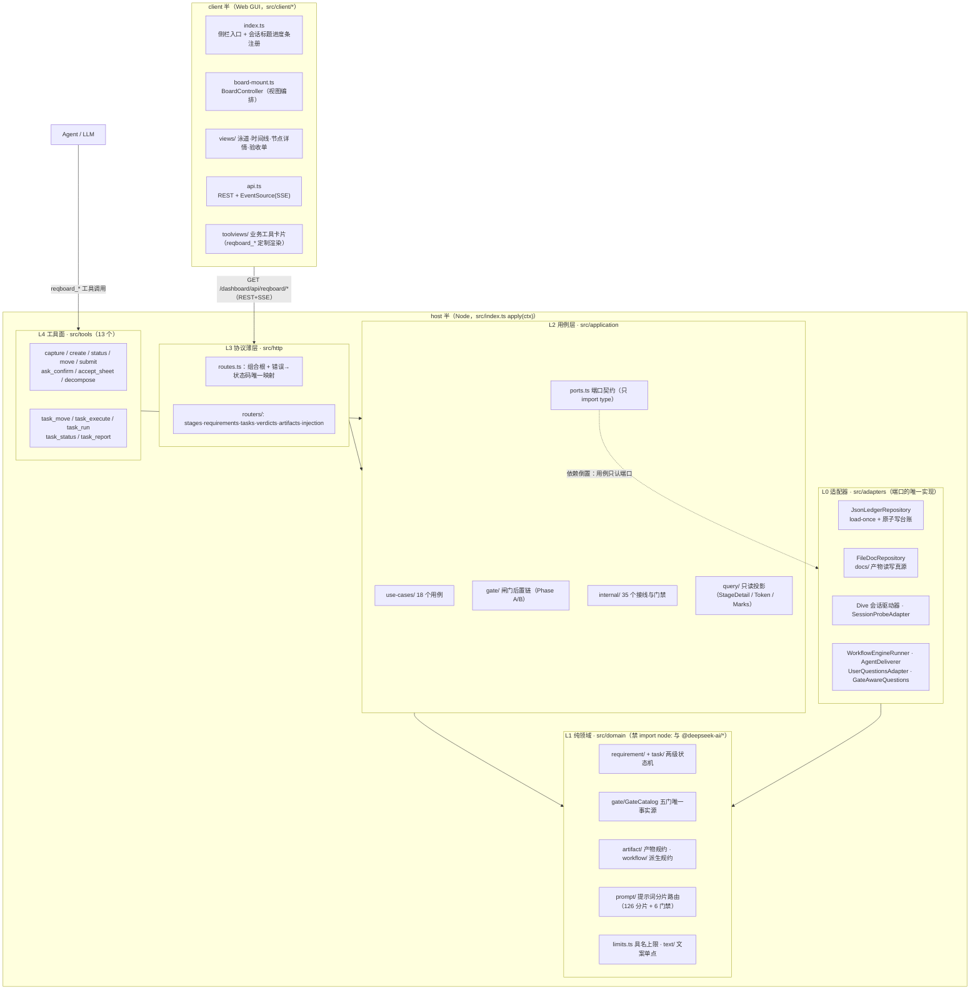
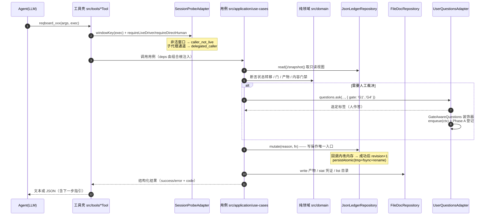
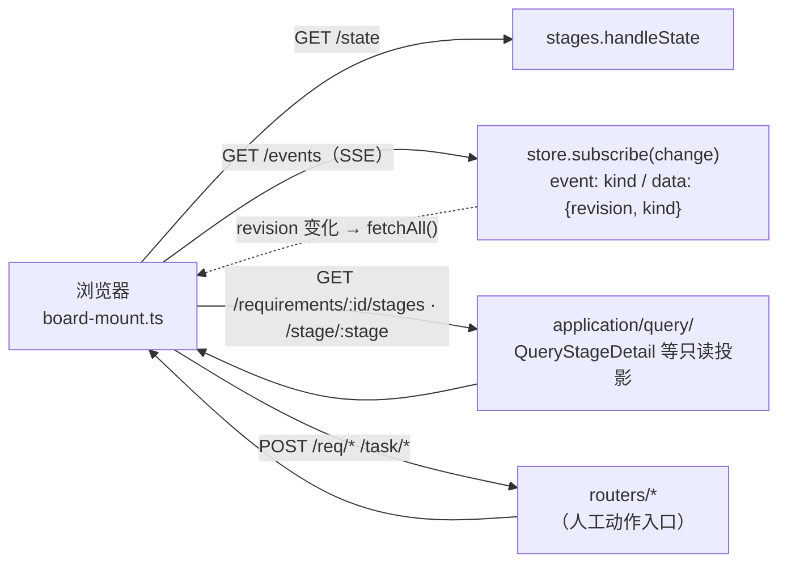
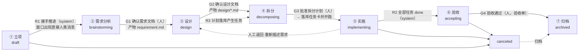
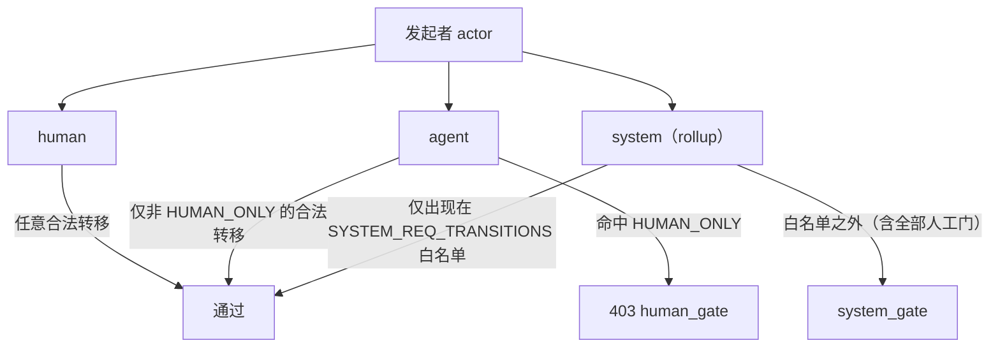
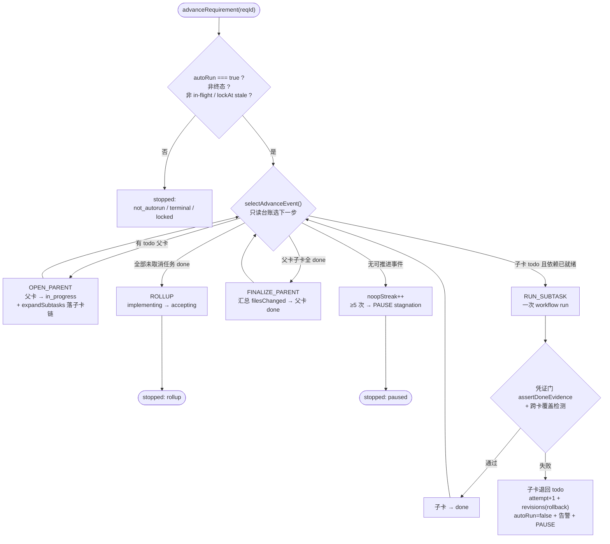
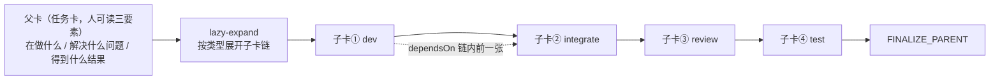
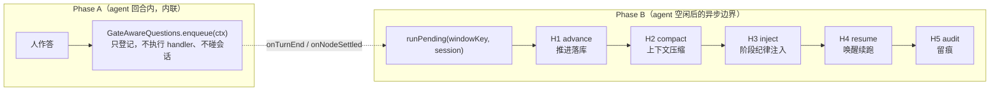
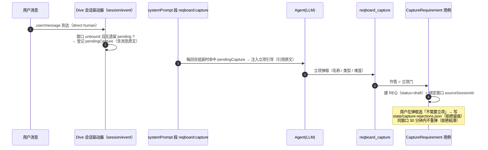
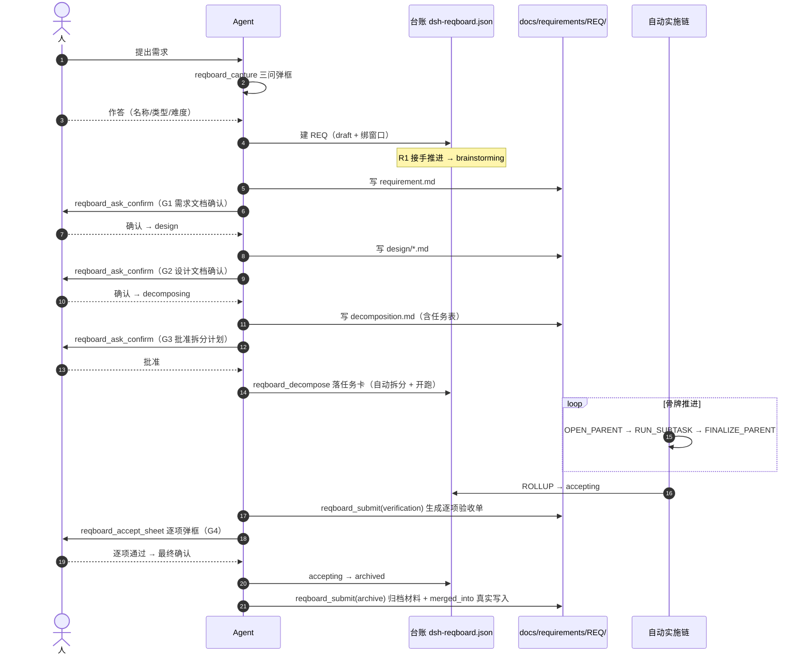

# 项目看板（dsh-pmboard）代码流程与实施流程设计

> **本页是什么**：架构说明（长期有效）。把 `agent-dh/packages/web/dsh-pmboard` 的
> **代码流程**（一次调用怎么从工具走到台账落盘）与**实施流程**（一个需求怎么从立项走到归档）
> 画成图，并给出模块清单、契约与不变量。
>
> **事实时点与来源**（R-013）：2026-09-23 对该包 **源码实读**——`src/` 12 个一级目录、
> 13 个 Agent 工具、6 个 HTTP 资源路由、1 个客户端 bundle。文中每条结论都可用「代码地图」
> 一节的文件定位复核；与既有文档冲突处单列在「§11 读数发现」。
>
> **与既有文档的关系**：流程语义的事实源仍是
> [workflow-stages.md](./workflow-stages.md)（七节点/六要素）与
> [gate-post-chain.md](./gate-post-chain.md)（闸门后置链）；本页是**代码视角的全景图**，
> 把散在多个 REQ 文档里的「怎么实现」收成一张图。
>
> **可视化版本**：[pmboard-code-flow.html](./pmboard-code-flow.html)（浏览器打开，10 张图直接渲染；
> 本页 Markdown 里的 Mermaid 在 GitHub / VS Code 亦可渲染）。

---

## 1. 一句话

dsh-pmboard 是一个 **DSH 双半插件**（host + client）：host 半把「需求流水线」实现成
**两级状态机 + 五道人工门 + 一条骨牌式自动实施链**，client 半把它渲染成**泳道看板 + 节点详情 + 逐项验收弹框**。

三条设计原则（README 与代码一致）：

1. **创建即立项**：没有待归类/建议卡中间态，弹框作答即 `draft`；
2. **人工闸门在关键节点**：立项三问 / 需求文档确认 / 设计文档确认 / 拆分计划批准 / 逐项验收 —— 代码级仅人可越；
3. **一切决策留痕**：台账 `dsh-reqboard.json`（两级状态机）+ 文档 `docs/requirements/<REQ>/` + 运行时 ring buffer 日志。

---

## 2. 总体架构：双半 × 四层

**依赖方向铁律**（`tests/layer-boundary.test.ts` 静态扫描强制）：`tools/http/adapters → application → domain`，
**只许向内**。两个可机械核验的推论：

- `domain/` 里出现 `node:` 或 `@deepseek-ai/*` 的 import = 测试变红；时间/随机数一律由 `Clock`/`IdFactory` 端口注入；
- 状态字面量（`'done'` 之类）不允许出现在 `http/routers/` 与 `tools/` 壳里，一律引用 `domain/` 常量或谓词函数。

---

## 3. 代码流程

### 3.1 一次 Agent 工具调用的完整路径（写路径）

**关键实现约定**：

| 约定 | 代码位置 | 为什么 |
|---|---|---|
| 写操作唯一入口 `mutate(reason, fn)`，`reason` 必填 | `adapters/JsonLedgerRepository.ts` | 审计 + 串行化；回调返回 `undefined` = 无变化，**不 bump revision**（幂等可断言） |
| 读路径**零 legacy 兼容**（`reviewing→brainstorming` 等归一在迁移脚本做） | 同上 | 双入口会静默绕过单点状态机 |
| 错误 → HTTP 状态码**只有一处映射** `fail()` | `http/routes.ts` | human_gate/system_gate → 403；invalid_* / missing_artifact → 400；not_found → 404 |
| 工具壳不做状态判断，只做参数校验 + 调用用例 | `src/tools/**` | `tests/tools-dispatch.test.ts` 禁止壳里出现 `status ===` |
| 弹框通道不可用时返回 `{success:false, fallback:'board'}` | 各交互用例 | **不伪造"已确认"**，改走看板等效通道 |

### 3.2 一次看板读请求（SSE 推送）

**客户端契约纪律**（见 [page-plugin-contract.md](./page-plugin-contract.md)）：
client bundle 的裸 npm 依赖必须 `noExternal` 打进去（DSH shell 的 module-loader 只种子 `react/react-dom/@deepseek-ai/*`），
产物经 `scripts/verify-client-build.mjs` 校验——含 `WRAP_SENTINEL` 哨兵，**禁止对 bundle 做逐行字符串变换**（2026-09-16 事故铁律）。

---

## 4. 实施流程：需求生命周期

### 4.1 七节点 + 五道人工门

- **门 G0～G4 的唯一事实源** = `domain/gate/GateCatalog.ts`（旧的三处 `ADVANCE_MAP`/`ARTIFACT_CONFIRM_GATES`/文案表已收敛到此，`RequirementStatus` 与它**各存一份 + 测试锁相等**，避免值环）。
- **`done` 是 legacy**：REQ-9f4a44 起验收通过**直达 `archived`**，`done` 只用于老台账读取，不在流程图节点里。
- **"拆分计划待批"不是独立状态**：它是 `design` 的子状态（`plan.approvedAt` 未写），看板用卡面 chip 表达。

### 4.2 谁有权推进：actor 三态

`SYSTEM_REQ_TRANSITIONS` 白名单**只有三条**：`draft>brainstorming`（接手）、`design>decomposing`（计划落库）、`implementing>accepting`（全部任务完成）。
2026-09-14 五门裁定后 `decomposing>implementing` 已从白名单移除 —— **自动推进在任何情况下都不可能越过人工门**。

### 4.3 各阶段产物与出口门（读取自代码）

| 节点 | 必备产物 `STAGE_ARTIFACT_REQUIREMENTS` | 出口门 `GATE_CATALOG` | 门的 `humanOnly` | 自动推进 |
|---|---|---|---|---|
| draft | — | G0 立项门（三问弹框） | false | `draft>brainstorming`（R1，system） |
| brainstorming | `requirement` | **G1 确认需求文档** | **true** | 无（等人） |
| design | `design`（`design/*.md`） | G2 确认设计文档 | false（但产物须人确认） | `design>decomposing`（R3，system） |
| decomposing | `decomposition` + 任务卡 | **G3 批准拆分计划** | **true** | 无（等人） |
| implementing | `task_detail`（每任务一份 `tasks/t-xxx.md`） | 无门（凭证门管 done） | — | `implementing>accepting`（R2，system） |
| accepting | `verification`（版本化验收单） | **G4 验收通过** | **true** | 无（等人） |
| archived | `archive` | 材料齐（代码级必填校验） | — | — |

> **口径提示**：G2/G3 在 2026-09-21 用户裁定后**分了家**——设计阶段只写设计文档，
> 拆分计划归拆分阶段。§11 记录了旧文档仍按"设计出口=批准 plan"叙述的漂移。

---

## 5. 自动实施链：骨牌式推进（AdvanceChain）

**机制一句话**：不是"传送带一直转"，而是"推倒第一张骨牌，它自己撞倒下一张" ——
每完成一步自动触发下一步，直到 `ROLLUP`（需求进验收）或 `PAUSE`（失败/停滞/人工关闭）。

**事件与限额**（`domain/limits.ts` + `AdvanceChain.ts`）：

| 项 | 值 | 语义 |
|---|---|---|
| `advanceMaxStepsPerCall` | 20 | 单次调用最多推进 20 步（防一条链占死事件循环） |
| `advanceMaxParallelParents` | 3 | 同时 `in_progress` 的父卡上限 |
| `advanceNoopBreaker` | 5 | 连续 5 次 noop → 判依赖死锁，暂停并置 `autoRun=false` |
| `advanceLockStaleMs` | 15 min | 台账侧单飞锁失效阈值（进程崩溃后可接管） |
| 幂等键 | 台账状态 | 选择依据全部来自台账，重复触发只会 noop |

**四性**（设计要求）：小（一次一事件）/ 幂等 / 可中断（不触发下一步即停）/ 留痕（`req.advance.history` + `docs/requirements/<REQ>/advance-log.md`）。
**失败语义**：失败**不自动重试**——子卡退回 todo、`attempt+1`、写 `revisions(kind=rollback)`、暂停链、发一次告警，等人三选处置（重跑 / 退回上游重述 / 取消）。
**崩溃恢复**：`scheduleStartupScan` 在插件启动时对 `autoRun=true` 且未到终态的需求续跑（`scanAndResume`）。

---

## 6. 任务卡与子卡：一次子卡执行怎么落地

**卡类型 → 子卡链**（`domain/task/SubtaskTemplate.ts`，数据化配置 = 加一行；未映射回退 `dev→review`）：

| 类型 | 子卡链序 |
|---|---|
| feature / refactor | dev → integrate → review → test |
| bug | repro → fix → review → regress |
| doc / chore | dev → review |
| spike | probe → review |
| research / analysis | collect → analyze → review |
| data | prepare → run → verify → review |
| ops | change → dryrun → apply → verify → review |

**子卡执行的宿主/叶子边界**：叶子（真正干活）在 `workflowEngine` 的 worker-thread 子代理里，
**枝干（状态/凭证/台账）必须留在宿主**——脚本运行在 `node:vm`，只注入 5 个 hook
（`agent/parallel/pipeline/phase/log`），没有 `ctx`、不能调工具、读不到台账。
`application/internal/workflow-script.ts` 在**生成阶段**做静态契约门禁（禁 `ctx`/`subagent`/`require`/`process`/`eval` 等），
契约错了在生成时就抛 `workflow_script_contract`，不带着错脚本去跑。

**凭证门（done 不是自报）**：`assertDoneEvidence` 校验汇报 / 真实工具动作 / 非批量关闭 / 构建新鲜度；
`detectCrossCardOverwrite` 用产出文件 mtime 落在另一张在跑父卡窗口内来抓**跨卡覆盖**。

---

## 7. 闸门后置链：人点完弹框之后机器做什么

**唯一点 join point**：`adapters/GateAwareQuestions.ts` 包装所有 `questions.ask(..., {gate})` ——
带 `gate` 的弹框自动获得后置链，**新增弹框入口零成本获得能力**。

**四条纪律**（`GatePostChain.ts` 契约）：

1. **有序**：严格按 `HANDLER_ORDER` 执行，乱序传入也被纠正；
2. **可短路**：`skip` / `degraded` **都不阻断**后续 handler（H2 跳过时 H3 仍要注入）；
3. **可降级**：任一 handler 抛错就地转 `degraded` 计票，**永不冒泡**、不回滚 H1 已落库的裁决；
4. **幂等**：按 `(windowKey, gate, decidedAt)` 去重（ring 容量有界），重复信号记 `deduped` 不重跑。

**为什么必须拆两相**：弹框作答发生在 agent 回合内，而 H2 的 surface 整段替换要求 `idle()`，
且会话 `append` 拒绝"发布中重入"。链的开关与节点隔离同源（默认关；关时 `executed` 恒为 0，可断言）。

---

## 8. 立项捕获管线（capture）

**为什么是确定性 hook + LLM 判定**：hook 只保证"消息到达必触发"，立项与否留给 LLM + 人（弹框作答即确认）。
**拒绝粘滞**（REQ-260922012924-2e29 FR-5）解决的是"调用超时/中断后答复丢失 → 盲目重弹"，用户刚拒绝过就不再弹。

---

## 9. 数据落盘与运行时文件

| 位置 | 载体 | 写入方 | 语义 |
|---|---|---|---|
| `<DSH_HOME>/dsh-reqboard.json` | JSON 台账 | `JsonLedgerRepository` | **两级状态机唯一事实源**（requirements + tasks + triages），load-once + 原子写 |
| `docs/requirements/<REQ>/` | Markdown 文档 | `FileDocRepository` | 产物：requirement.md / design/*.md / decomposition.md / tasks/*.md / verification.md / archive.md |
| `state/prompt-injection-log.json` | ring 500 | `InjectionLogFile` | 每次注入的十字段留痕（stage/routeKey/charCount…），看板只读回查 |
| `state/node-isolation-log.json` | ring | `IsolationTraceFile` | 节点隔离留痕（默认关时零写入） |
| `state/capture-rejections.json` | ring | `CaptureRejectionFile` | 立项拒绝留痕（拒绝粘滞的依据） |
| `state/reqboard-capture-diag.log` | 文件日志 | `diag-log.ts` | 捕获链路诊断（stdout 可能进死管道，文件才是可靠观测面） |

**迁移纪律（硬约束）**：台账是 load-once + 每次 mutate 全量重写，且**没有 reload API** ——
进程存活期间在外部改台账文件，会被内存旧快照在下次写入时静默覆盖。故迁移只能夹在
「进程已停、新进程未起」的窗口内（见 `scripts/migrate-ledger.ts` 编排）。

---

## 10. 实施流程的完整时序（一个 feature 需求的端到端）

---

## 11. 读数发现：文档/注释与代码的漂移（建议同步，非本页结论）

实读时发现 4 处「文档说的和代码做的不一致」。列在这里便于同步，均给出两侧证据：

| # | 位置 | 文档/注释说 | 代码实际 | 影响 |
|---|---|---|---|---|
| 1 | [workflow-stages.md](./workflow-stages.md) §1/§3 | `STAGE_ARTIFACT_REQUIREMENTS.design = ['plan']`、`ARTIFACT_CONFIRM_GATES['design>decomposing'] = 'plan'`、设计出口=批准计划 | `ArtifactSpec.ts`：`design: ['design']`；`GateCatalog.ts`：G2 `design→decomposing` 要 `design`，G3 `decomposing→implementing` 要 `decomposition` | 读者会以为设计阶段该交 plan.md |
| 2 | [workflow-stages.md](./workflow-stages.md) §6 | 「REQ-a8d582 FR-2 起裁决不再自动打回、不再自动建返工卡」 | `application/internal/verdicts.ts` L137-143：failed 时**同笔 mutate 内**自动回退 implementing + 物化返工卡（REQ-308b9a FR-8）；`AcceptSheet.ts` 返回 `rework_tasks` | 验收返工语义两说 |
| 3 | `src/application/internal/verdicts.ts` 头注释 L5 | 「逐项 passed/failed → **只写验收单**」 | 同文件 L137 起实现自动回退 + 返工卡 | 同文件内注释与实现矛盾（最易误导） |
| 4 | 插件 [README.md](../../packages/web/dsh-pmboard/README.md) | 标题「提供的工具（**13** 个）」，表内 **12** 行 | `src/index.ts` 注册 13 个（表漏 `reqboard_task_run`）；`src/tools/index.ts` 头注释仍写「13 → 9 收敛」但导出 13 个 | 工具面清单不完整 |

另有一类**路径漂移**：多处文档仍写 `packages/pages/dsh-pmboard/...`（如 workflow-stages.md 的
引用规范段），而 RFC 015 结构对齐后实际路径是 `packages/web/dsh-pmboard/...`；
`workflow-stages.md` 指向的 `src/constants/workflow.ts` 在现代码里也不存在（对应物是 `src/client/workflow-constants.ts`）。

> 处理建议（不在本页擅自改文档）：漂移 1/2/3 属**流程语义**，按 workflow-stages.md 自己的
> 「变更流程」节先改事实源再同步代码/文档——但这三处是**代码先动、文档没跟上**，故应反向同步文档；
> 漂移 4 是包内 README 漏行，补一行即可。

---

## 12. 代码地图（复核用）

| 关注点 | 入口文件 |
|---|---|
| 插件装配 / 组合根 | `src/index.ts`（`apply()`：注入 agents / sessionProjections / userQuestions / workflowEngine / webServer / tools） |
| 端口契约 | `src/application/ports.ts` |
| 需求状态机 | `src/domain/requirement/RequirementStatus.ts` |
| 任务状态机（含 parent/subtask/legacy 三角色） | `src/domain/task/TaskStatus.ts` |
| 五道门唯一事实源 | `src/domain/gate/GateCatalog.ts` |
| 产物规约 | `src/domain/artifact/ArtifactSpec.ts` |
| 派生推进规约 R1/R2/R3 | `src/domain/workflow/RollupSpec.ts` → `src/application/internal/rollup.ts` |
| 骨牌推进执行器 | `src/application/use-cases/AdvanceChain.ts` |
| 子卡执行 | `src/application/use-cases/ExecuteTask.ts` + `src/application/internal/workflow-script.ts` |
| 拆分与幂等守卫 | `src/application/use-cases/Decompose.ts` + `src/domain/workflow/DecomposeSpec.ts` |
| 验收单 | `src/application/use-cases/AcceptSheet.ts` + `src/domain/workflow/AcceptanceSheetSpec.ts` |
| 闸门后置链 | `src/application/gate/GatePostChain.ts` + `handlers/h1..h5` |
| 会话驱动器（原「捕获 hook」） | `src/application/dive/session-driver.ts`（2026-09-26 由 `adapters/CaptureHook.ts` 迁入，订阅由 ReqboardDiveManager 持有） + `src/application/internal/capture-section.ts`（立项引导节） |
| 台账仓储 | `src/adapters/JsonLedgerRepository.ts` |
| HTTP 面 | `src/http/routes.ts` + `src/http/routers/*` |
| 工具壳 | `src/tools/<Name>Tool/<Name>Tool.ts` |
| 客户端 | `src/client/index.ts` → `board-mount.ts` → `views/*` |
| 层边界/尺寸/文案门禁 | `tests/layer-boundary.test.ts`、`tests/size-budget.test.ts`、`tests/message-hygiene.test.ts` |

**规模**（`wc -l` 实读，2026-09-23）：`src/domain` ≈ 2.9k 行、`src/application` ≈ 10.4k、
`src/adapters` ≈ 2.1k、`src/client` ≈ 9.2k、`src/http` ≈ 1.5k、`src/shared/protocol.ts` 1.57k。
单文件上限 `MAX_FILE_LINES = 400`（尺寸门禁强制拆文件）。

---

## 相关页面

- [需求看板实操（从立项到归档）](../guides/reqboard-workflow.md)
- [闸门确认后置链](./gate-post-chain.md)
- [流程节点定义](./workflow-stages.md)
- [六立项类型的流程差异](./reqboard-category-flows.md)
- [RFC 014 需求看板](../rfcs/014-requirement-board.md)
- [页面插件契约](./page-plugin-contract.md)
