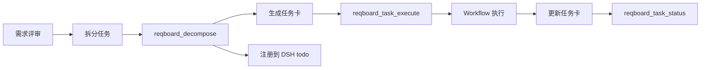

# DSH Workflow 任务执行工具使用指南

本指南说明如何使用基于 DSH Workflow 的新任务执行工具。

## 概述

REQ-327bdf 引入了基于 DSH Workflow 的任务执行流程，用 DSH 原生能力替换自己实现的状态机。

## 新增工具

### 1. reqboard_task_execute

**功能**：使用 DSH Workflow 自动执行任务

**用法**：
```typescript
await tools.reqboard_task_execute({
  task_id: 't-xxxxxx',      // 必填：任务 ID
  resume_from?: 3           // 可选：从第几阶段恢复（1-6）
})
```

**执行流程**：
1. 读取任务卡信息
2. 生成 6 阶段 Workflow 脚本（或 4 阶段，取决于任务类型）
3. 调用 DSH workflow 工具
4. 更新任务卡（添加执行记录）
5. 返回结果

**阶段定义**（后端任务）：
1. 需求分析
2. 方案设计
3. 代码实现
4. 单元测试
5. 集成测试
6. 文档汇报

**失败重试**：
```typescript
// 从第 3 阶段恢复
await tools.reqboard_task_execute({
  task_id: 't-xxxxxx',
  resume_from: 3
})
```

---

### 2. reqboard_task_status

**功能**：查询任务执行状态和进度

**用法**：
```typescript
await tools.reqboard_task_status({
  task_id: 't-xxxxxx'
})
```

**返回**：
```typescript
{
  success: true,
  task_id: 't-xxxxxx',
  status: 'in_progress',     // todo/in_progress/testing/done
  progress: 45,              // 0-100
  workflow?: {
    run_id: 'workflow-123',
    status: 'running',
    stages: [
      { stage: 1, name: '需求分析', status: 'completed' },
      { stage: 2, name: '方案设计', status: 'completed' },
      { stage: 3, name: '代码实现', status: 'running' }
    ]
  }
}
```

---

### 3. reqboard_decompose 增强

**变更**：拆分任务后自动调用 `todo_write`，将任务注册到 DSH todo 系统

**效果**：
- 任务在 DSH todo 列表中可见
- 用户可以看到任务进度
- 不再是黑盒

---

## 工作流程

### 典型流程



### 使用示例

```typescript
// 1. 拆分需求
await tools.reqboard_decompose({
  requirement_id: 'REQ-xxxxxx',
  tasks: [/* 任务列表 */]
})

// 2. 执行任务
await tools.reqboard_task_execute({
  task_id: 't-xxxxxx'
})

// 3. 查询状态
const status = await tools.reqboard_task_status({
  task_id: 't-xxxxxx'
})

console.log(`进度: ${status.progress}%`)
```

---

## 任务卡格式

执行后的任务卡会自动添加 Workflow 执行记录：

```markdown
## Workflow 执行记录

**Workflow Run ID**: `workflow-abc123`  
**状态**: ✅ 已完成  
**执行时间**: 2026-09-19 23:45:00  
**Sub-agents**: 6 个

### 阶段执行详情

#### ✅ 阶段 1：需求分析
<details>
<summary>查看输出</summary>
...
</details>

#### ✅ 阶段 2：方案设计
...
```

---

## 注意事项

1. **任务类型**：后端任务 6 阶段，文档任务 4 阶段
2. **失败重试**：使用 `resume_from` 从失败阶段恢复
3. **进度查询**：随时用 `reqboard_task_status` 查看进度
4. **并发限制**：避免同时执行多个大任务

---

## 故障排查

### Workflow 执行失败

**症状**：`reqboard_task_execute` 返回 `success: false`

**排查**：
1. 查看 `error` 字段
2. 检查任务卡的实施方案是否完整
3. 使用 `resume_from` 从失败阶段重试

### 进度不更新

**症状**：`reqboard_task_status` 显示进度不变

**原因**：
- 任务卡未更新（`updateTaskCard` 失败）
- Workflow 还在执行中

**解决**：
- 检查任务卡文件是否存在
- 等待 Workflow 完成

---

## 相关文档

- [REQ-327bdf 需求文档](../requirements/REQ-327bdf/requirement.md)
- [DSH Workflow 文档](https://docs.deepseek.com/dsh/workflow)
- [项目看板使用指南](./reqboard-guide.md)
