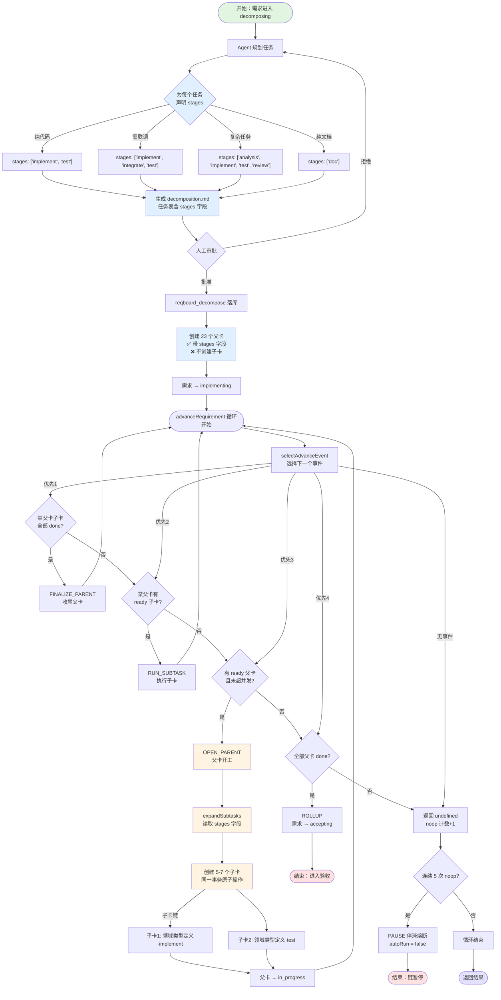

# 方案C（混合模式）：子卡拆分流程图



## 关键时间点对比

### 拆分阶段（decomposing）
- ✅ **声明 stages**：Agent 在规划时确定每个任务的阶段
- ✅ **人工审批**：能看到每个任务的 stages 划分
- ✅ **落库父卡**：reqboard_decompose 创建 23 个父卡（带 stages 字段）
- ❌ **不创建子卡**：此时子卡还不存在

### 实施阶段（implementing）
- ✅ **懒展开**：父卡开工时才创建子卡
- ✅ **原子操作**：父卡状态变更 + 子卡创建在同一事务
- ✅ **按需创建**：只为需要执行的父卡创建子卡
- ✅ **依赖执行**：子卡按依赖链串行执行

## 数据流示例

```typescript
// 1. 拆分阶段：decomposition.md
const plan = {
  tasks: [
    {
      key: 't1',
      title: '领域类型定义',
      stages: ['implement', 'test'],  // ← 此时声明
      dependsOn: [],
      acceptance: '...',
      implementation: '...'
    }
  ]
}

// 2. reqboard_decompose 落库
const parentTask = {
  id: 't-cda91b',
  title: '领域类型定义',
  stages: ['implement', 'test'],  // ← 写入父卡
  status: 'todo',
  parentId: undefined,  // ← 是父卡
  // ... 其他字段
}

// 3. 实施阶段：OPEN_PARENT
advanceRequirement()
  → selectAdvanceEvent() 
  → OPEN_PARENT(t-cda91b)
  → expandSubtasks(parentTask)  // ← 读取 stages
  → 创建子卡：
    [
      { id: 'sub-1', title: '领域类型定义·implement', parentId: 't-cda91b' },
      { id: 'sub-2', title: '领域类型定义·test', parentId: 't-cda91b' }
    ]

// 4. 执行子卡
RUN_SUBTASK(sub-1) → done
RUN_SUBTASK(sub-2) → done
FINALIZE_PARENT(t-cda91b) → done

// 5. 继续下一个父卡...
```

## 对比当前问题

### 当前问题（REQ-260925110957-552d）
```
拆分时：创建 23 个父卡，❌ 没有 stages 字段
实施时：expandSubtasks 读不到 stages → 返回空数组
结果：父卡开工但没有子卡 → 选择器找不到 RUN_SUBTASK 事件
状态：前 10 个任务莫名其妙完成了，第 11 个开始永久 todo
```

### 方案C 修复后
```
拆分时：创建 23 个父卡，✅ 带 stages: ['implement', 'test']
实施时：expandSubtasks 读取 stages → 创建 2 个子卡
结果：父卡 in_progress + 子卡链 todo → 选择器找到 RUN_SUBTASK
状态：子卡执行 → done → FINALIZE_PARENT → 下一个父卡
```
