# RTM YAML 实施完整流程图

> 创建日期：2026-09-26  
> 目标：从立项到归档的完整 RTM 生命周期

---

## 🎯 总览流程图

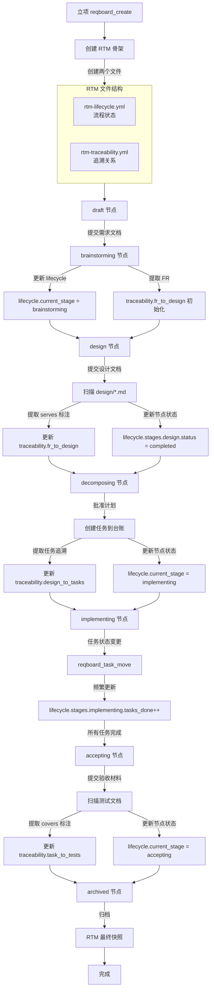

---

## 📊 详细流程：7 个阶段

### 阶段 1：立项（draft）

```mermaid
sequenceDiagram
    participant User as 用户/PM
    participant Agent as Agent
    participant Create as reqboard_create
    participant RTM as RTM Generator
    participant FS as 文件系统
    
    User->>Agent: 立项需求
    Agent->>Create: 调用 reqboard_create
    Create->>RTM: 初始化 RTM
    
    RTM->>FS: 写入 rtm-lifecycle.yml
    Note over FS: current_stage: draft<br/>所有节点 status: pending
    
    RTM->>FS: 写入 rtm-traceability.yml
    Note over FS: 空的追溯映射<br/>fr_to_design: {}<br/>design_to_tasks: {}<br/>task_to_tests: {}
    
    FS-->>RTM: 创建成功
    RTM-->>Create: 初始化完成
    Create-->>Agent: 需求已创建
    Agent-->>User: REQ-xxx 已立项
```

**生成文件**：
- ✅ `rtm-lifecycle.yml`（骨架）
- ✅ `rtm-traceability.yml`（空映射）

---

### 阶段 2：需求分析（brainstorming）

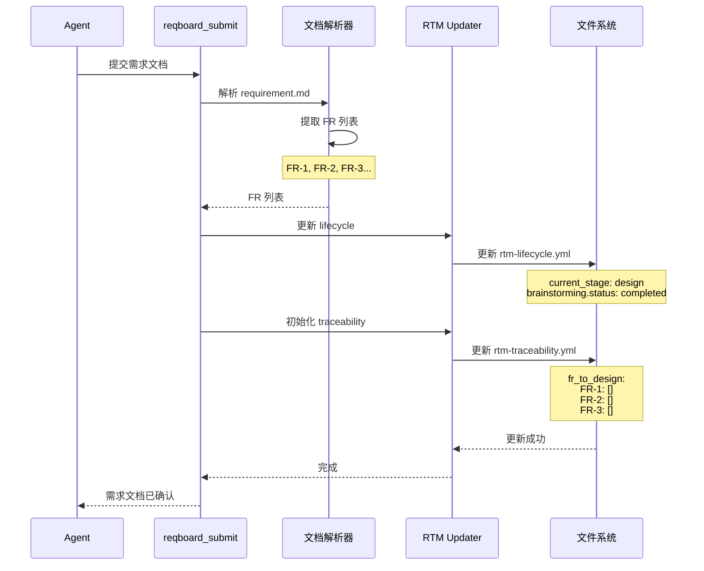

**更新内容**：
- ✅ lifecycle: brainstorming → completed
- ✅ traceability: 初始化 FR 列表（空映射）

---

### 阶段 3：设计（design）

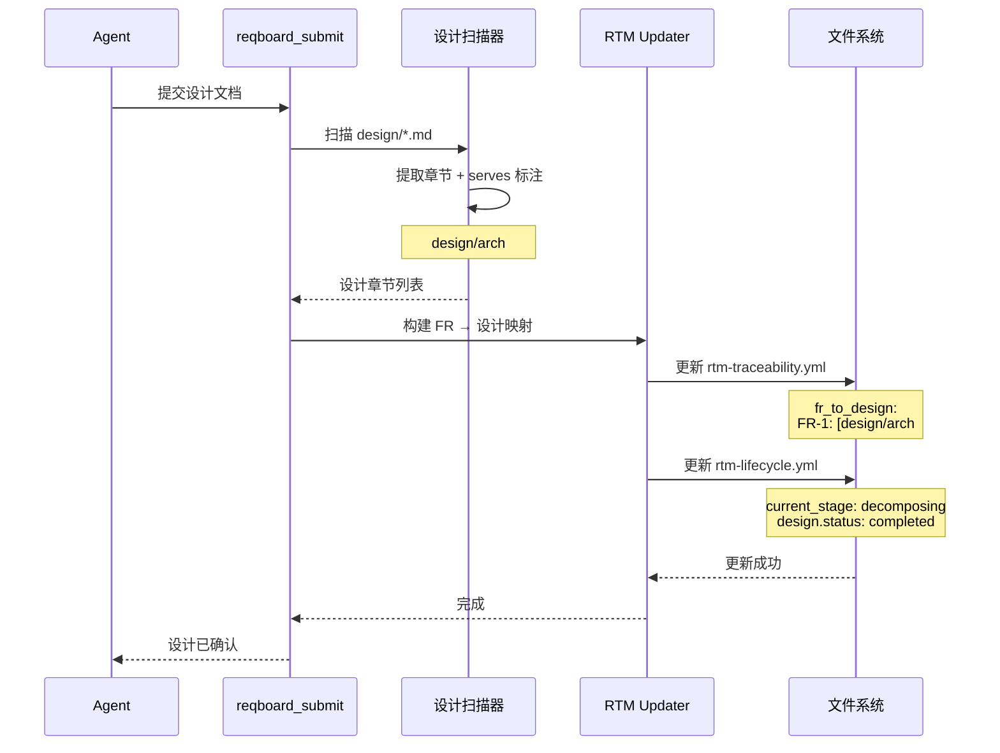

**更新内容**：
- ✅ lifecycle: design → completed
- ✅ traceability: fr_to_design 映射填充

---

### 阶段 4：拆分（decomposing）

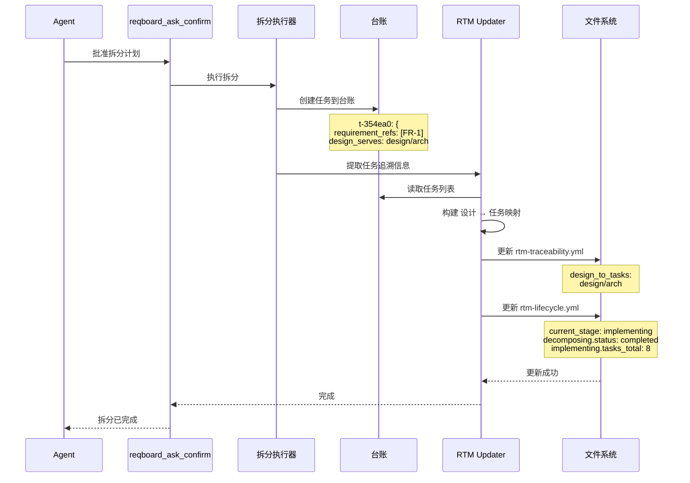

**更新内容**：
- ✅ lifecycle: decomposing → completed, implementing → in_progress
- ✅ traceability: design_to_tasks 映射填充

---

### 阶段 5：实施（implementing）- 频繁更新

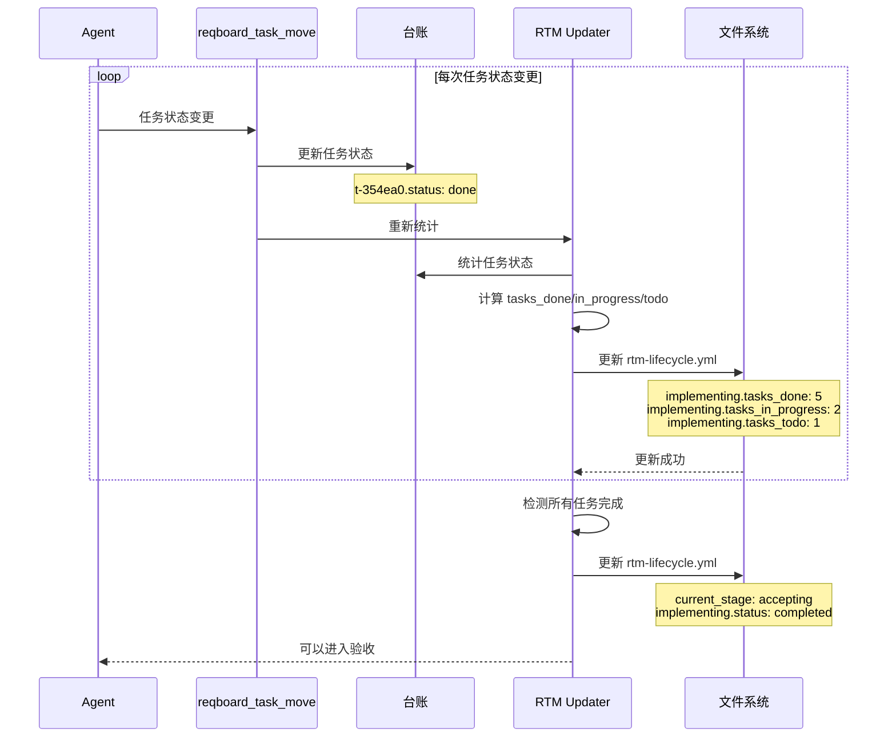

**更新内容**：
- ✅ lifecycle: 频繁更新任务统计（tasks_done/in_progress/todo）
- ⚠️ traceability: 不变

---

### 阶段 6：验收（accepting）

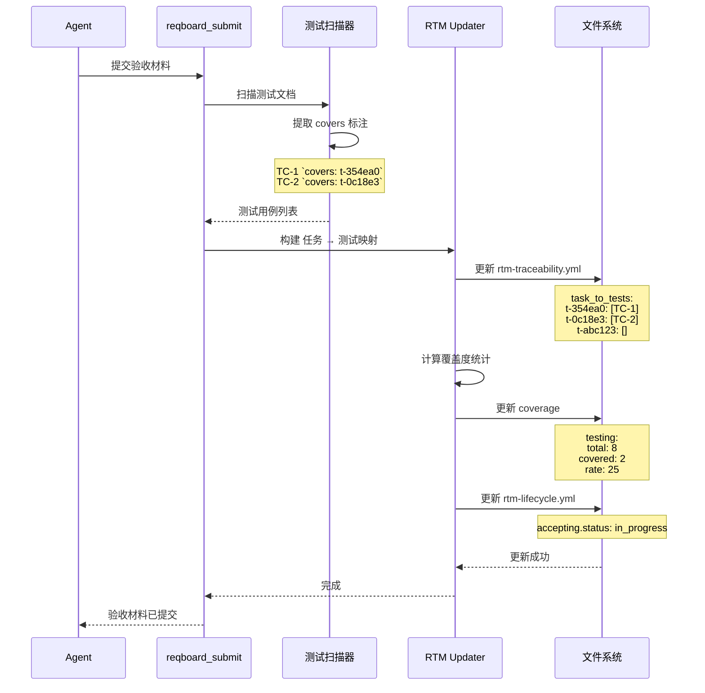

**更新内容**：
- ✅ lifecycle: accepting → in_progress
- ✅ traceability: task_to_tests 映射填充
- ✅ traceability: coverage.testing 统计

---

### 阶段 7：归档（archived）

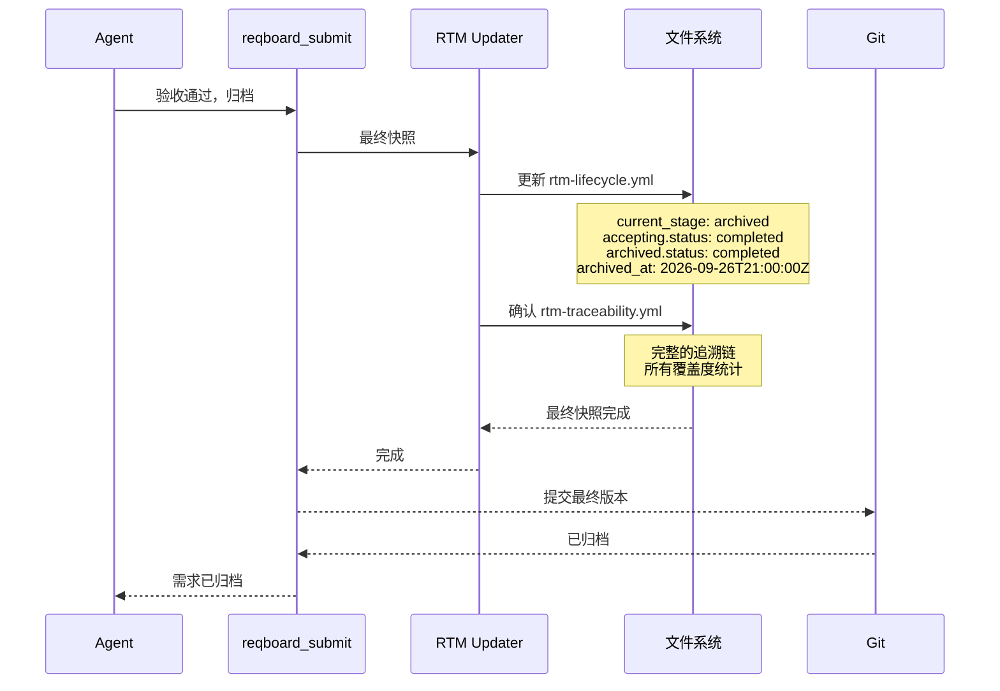

**最终状态**：
- ✅ lifecycle: 所有节点完成
- ✅ traceability: 完整的四级追溯链
- ✅ coverage: 最终覆盖度统计

---

## 🔄 会话节点读取流程

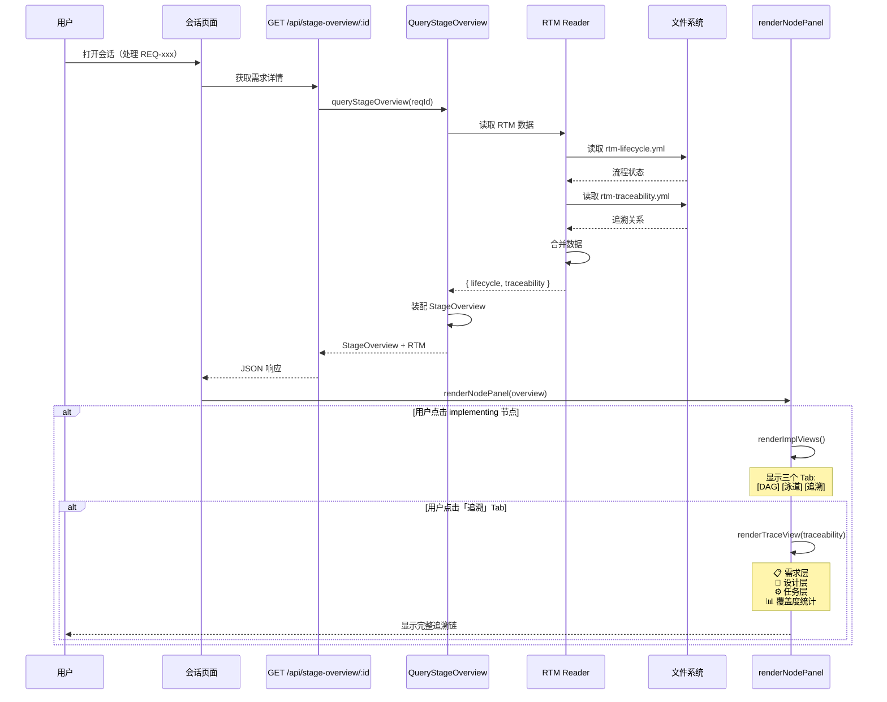

---

## 📊 数据流总览

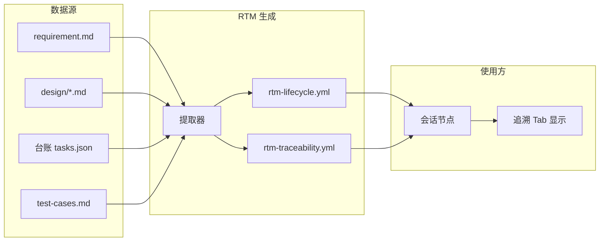

---

## ⏱️ 更新频率对比

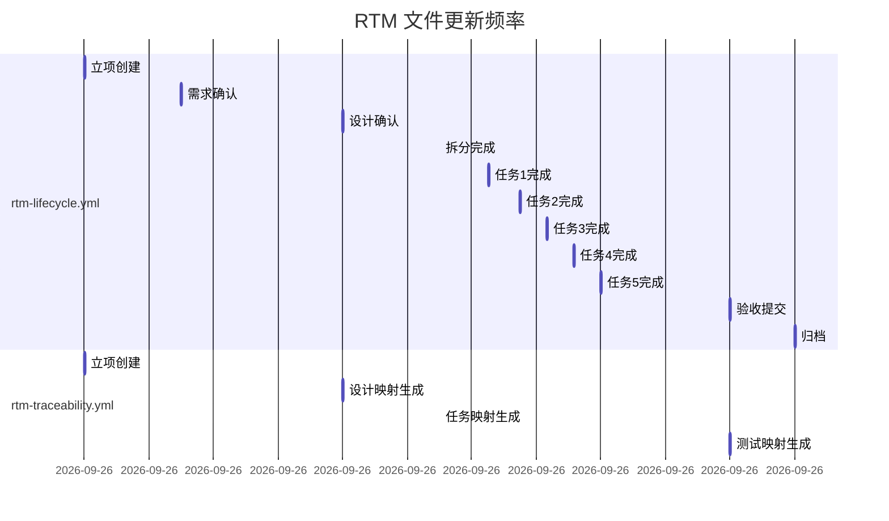

**结论**：
- lifecycle: 11 次更新（频繁）
- traceability: 4 次更新（稳定）

---

## ✅ 实施计划

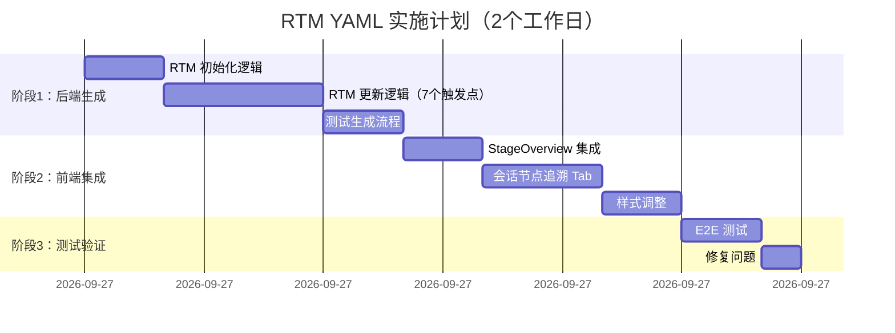

**总工作量**：14-16 小时（2 个工作日）
