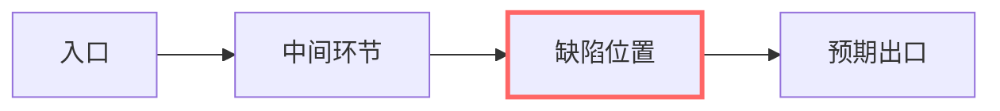

# 需求说明（{{REQ_ID}}）

> 状态：需求分析（brainstorming） · 窗口 {{WINDOW}} · 立据：{{DATE}}
> 宣布路径：Architectural / Bounded / Spike（三选一，写一句分类理由——人可推翻）

## 背景与动机

（为什么现在要做：用户原话用 > 引用块 / 线上现象 / 数据证据。标注来源与时点。）

## 目标

- G1 （做完之后世界有什么不同——每条可证伪）
- G2 …

## 非目标

- N1 （明确排除项，防范围蔓延）

## 边界（不做什么）

（**门禁必填节**：六类型共同。确实不适用某类文档/某条规则时，在此写明理由——
这是正规豁免出口，不要靠删节规避。）

## 验收标准

- [ ] （跑什么命令 / 发起什么请求 / 看到什么算过——可执行，禁"功能正常"空话）

## 改动位置（流程图）

（画出缺陷所在的调用链/流程，缺陷节点用高亮标出——比文字描述复现路径直观。）

## 改动对比

| 项 | 修复前（缺陷行为） | 修复后（预期行为） | 说明 |
|---|---|---|---|
|  |  |  |  |

## 复现步骤

（环境 / 输入 / 预期 vs 实际；最小重现。先确认是缺陷而不是需求变更。条款前缀 BUG-x）

## 根因

（代码级根因：文件:行 / 机制——不是"疏忽"。本节点只定位与划界，不写修复代码。）

## 回归

（将来怎么证明修好了：回归测试必须覆盖这条复现路径。禁止顺手重构。）

## 修订记录

| 日期 | 修改内容 | 修改人 |
|---|---|---|
| {{DATE}} | 初稿 | {{WINDOW}} |
