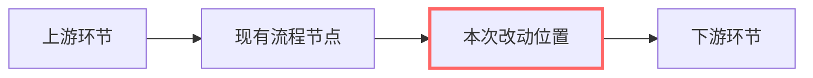
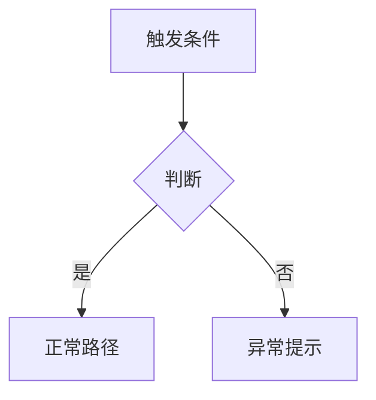

# 需求说明（{{REQ_ID}}）

> 状态：需求分析（brainstorming） · 窗口 {{WINDOW}} · 立据：{{DATE}}
> 宣布路径：Architectural / Bounded / Spike（三选一，写一句分类理由——人可推翻）

## 背景与动机

（为什么现在要做：用户原话用 > 引用块 / 线上现象 / 数据证据。标注来源与时点。）

## 目标

- G1 （做完之后世界有什么不同——每条可证伪）
- G2 …

## 非目标

- N1 （明确排除项，防范围蔓延）

## 边界（不做什么）

（**门禁必填节**：六类型共同。确实不适用某类文档/某条规则时，在此写明理由——
这是正规豁免出口，不要靠删节规避。）

## 验收标准

- [ ] （跑什么命令 / 发起什么请求 / 看到什么算过——可执行，禁"功能正常"空话）

## 改动位置（流程图）

（**一张图标清本次改的是流程中的哪个位置**——画现有流程全图，本次改动的
节点用高亮样式标出；散文能说清时本节可精简，但默认要画。）

## 改动对比

| 项 | 现状（改前） | 改动后 | 说明 |
|---|---|---|---|
| （流程/接口/字段/行为逐项列出） |  |  |  |

## 产品定义

（这是什么产品能力、不是什么）

## 用户与角色

（谁用、各自的诉求与操作路径）

## 功能点

（**功能点清单表**——先列骨架不写细节；逐条编号 FR-x，下游任务卡 requirement_refs
引用它，无人接的条款看板标红。）

| 编号 | 功能点 | 描述 | 优先级 | 备注 |
|---|---|---|---|---|
| FR-1 |  |  | P0 | 新增 |
| FR-2 |  |  | P1 | 新增 |

## 功能点明细

（每个 P0 功能点一组「交互流程图 + 规则 + 异常处理」；P1/P2 可只写规则。）

### FR-1 （功能点名）

- 触发条件：
- 规则与反馈：
- 异常处理：（错误提示 / 无网络 / 边界值——不许只写成功路径）

## 修订记录

| 日期 | 修改内容 | 修改人 |
|---|---|---|
| {{DATE}} | 初稿 | {{WINDOW}} |
