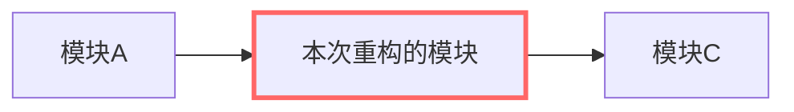

# 需求说明（{{REQ_ID}}）

> 状态：需求分析（brainstorming） · 窗口 {{WINDOW}} · 立据：{{DATE}}
> 宣布路径：Architectural / Bounded / Spike（三选一，写一句分类理由——人可推翻）

## 背景与动机

（为什么**现在**重构：坏味道 / 演进需要，给数据支撑——复杂度、构建耗时、
故障次数、新需求被它卡住的具体例子。没有数据支撑的重构不值得做。）

## 目标

- G1 （做完之后世界有什么不同——每条可证伪）
- G2 …

## 非目标

- N1 （明确排除项，防范围蔓延）

## 边界（不做什么）

（**门禁必填节**：六类型共同。确实不适用某类文档/某条规则时，在此写明理由——
这是正规豁免出口，不要靠删节规避。）

## 验收标准

- [ ] （跑什么命令 / 发起什么请求 / 看到什么算过——可执行，禁"功能正常"空话）

## 改动位置（流程图）

（画出现有结构/流程，本次重构涉及的模块用高亮标出。）

## 改动对比

| 项 | 现状（改前） | 改动后 | 说明 |
|---|---|---|---|
| （结构/接口/依赖逐项列出） |  |  |  |

## 现状

（当前结构什么样、为什么不够用。条款前缀 RF-x）

## 目标结构

（改成什么样——建议配 mermaid 结构图，与「改动位置」的现状图对照）

## 行为不变式

（重构前后必须保持不变的可观测行为——这是重构需求的验收锚点，逐条可验证）

- RF-1 …

## 修订记录

| 日期 | 修改内容 | 修改人 |
|---|---|---|
| {{DATE}} | 初稿 | {{WINDOW}} |
