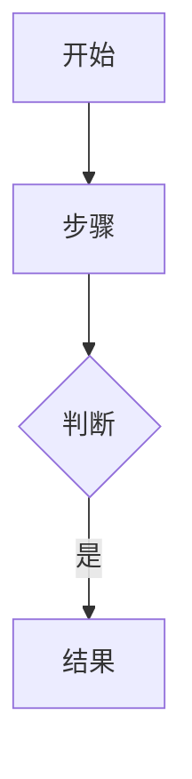

# 架构设计（{{REQ_ID}}）

> 每章标题行必须带 `serves: FR-x` 标注（缺标注 = 孤儿章节被门禁拦）。
> **标注格式**：`## 章节标题 \`serves: FR-1, FR-2\`` 或 `<!-- serves: FR-1 -->`（两种都支持）
> **什么时候不交本份**：单文件小改（无新组件/新依赖/新接口，改动 <50 行）——
> 把「TL;DR + 改动点」并进 requirement.md 的改动位置节即可，不另开本文档。

## 目标与总体方案 `serves: FR-1`

**问题**：（本设计要解决什么问题——需求条款里的哪一条）

**当前状况**：（现在怎么做的）

**设计方案**：（改成怎么做）

**不这么做的后果**：（为什么必须这么改）

## 模块改动地图 `serves: FR-1`

**图示**：
```
（文本 ASCII 图或 mermaid 图：哪些模块被改 / 新增 / 删除 / 重连）
```

**改动清单**：

| 模块/文件 | 类型 | 改动内容 | 原因（serves哪条FR） | 影响范围 |
|---|---|---|---|---|
|  |  |  |  |  |

## 数据结构变更 `serves: FR-1` (When Needed)

（只写真实改动的字段/类型/表结构——没改就写「无变更」，别凑字数。）

### 新增/修改的数据结构

```typescript
interface NewOrChangedType {
  // 注明：新增 / 改类型 / 改含义
}
```

### 兼容性分析

| 变更项 | 旧版本行为 | 新版本行为 | 迁移方案 |
|---|---|---|---|
|  |  |  |  |

## 接口变更 `serves: FR-1` (When Needed)

（真实改的 API / 工具函数签名 / 事件协议——没改就写「无变更」。）

### 修改的接口

```typescript
// Before
function oldSignature() {}

// After
function newSignature() {}
```

**改动原因**：（为什么改签名）  
**影响范围**：（谁在调用，要不要同步改调用方）

## 依赖关系 `serves: FR-1`

**新增依赖**：

| 依赖项 | 版本 | 用途 | 不引入的后果 |
|---|---|---|---|
|  |  |  |  |

**删除依赖**：（写清楚为什么可以删——原功能谁接管了）

| 依赖项 | 原用途 | 替代方案 |
|---|---|---|
|  |  |  |

## 目录结构 `serves: FR-1` (When Needed)

（物理目录/文件有新增/删除/重组时才写——纯逻辑改动不用写这节。）

```
project/
├── src/
│   ├── new-module/        # 新增：原因
│   ├── refactored-module/ # 重组：从哪里来
│   └── deleted/           # 删除：功能迁移到哪里
```

## 关键算法/流程 `serves: FR-1` (When Needed)

（核心逻辑变了才写——没变就写「复用既有逻辑，见 xxx.ts」。）

### 流程图



### 关键决策点

| 决策 | 选项A | 选项B | 选了哪个 | 为什么 |
|---|---|---|---|---|
|  |  |  |  |  |

## 安全/性能考虑 `serves: FR-1` (When Needed)

**安全风险**：（引入了什么新攻击面 / 敏感数据处理变化）

| 风险 | 影响 | 缓解措施 |
|---|---|---|
|  |  |  |

**性能影响**：（变慢了 / 变快了 / 内存增加，量化数据）

| 指标 | 改前 | 改后 | 可接受吗 |
|---|---|---|---|
|  |  |  |  |

## 测试策略 `serves: FR-1`

**必测场景**：（核心路径 / 边界 / 错误处理——骨架只写需求目录内）

| 场景 | 输入 | 预期输出 | 测试用例编号 |
|---|---|---|---|
|  |  |  | TC-x |

## 设计模式 `serves: FR-1` (When Needed)

（真实用到才写——强行套模式是反模式。没用新模式就如实写"未引入"，
并说明复用了哪个既有模式/惯例。）

| 模式 | 用在哪个组件 | 解决什么问题 | 不用会怎样 |
|---|---|---|---|
|  |  |  |  |

## 错误处理 `serves: FR-1`

**新增错误码/异常**：

| 错误码 | 触发条件 | 用户看到什么 | 如何恢复 |
|---|---|---|---|
|  |  |  |  |

## 配置项 `serves: FR-1` (When Needed)

（新增/修改的配置项——没有就写「无新增配置」。）

| 配置项 | 默认值 | 作用 | 改了会怎样 |
|---|---|---|---|
|  |  |  |  |

## 监控埋点 `serves: FR-1` (When Needed)

（需要加日志/指标/告警的地方——不需要就删本节。）

| 埋点 | 触发时机 | 记录内容 | 用于排查什么问题 |
|---|---|---|---|
|  |  |  |  |

## 部署变更 `serves: FR-1` (When Needed)

（环境变量/启动参数/数据库迁移脚本——没有就删本节。）

| 变更项 | 操作步骤 | 回滚步骤 |
|---|---|---|
|  |  |  |

## 文档更新清单 `serves: FR-1`

（本设计落地后，哪些用户文档/开发指南要同步更新。）

| 文档 | 更新内容 | 负责人 |
|---|---|---|
|  |  |  |

## 遗留问题 `serves: FR-1` (When Needed)

（本轮不解决但必须记录的技术债——没有就写「无」。）

| 问题 | 影响 | 计划何时解决 |
|---|---|---|
|  |  |  |
