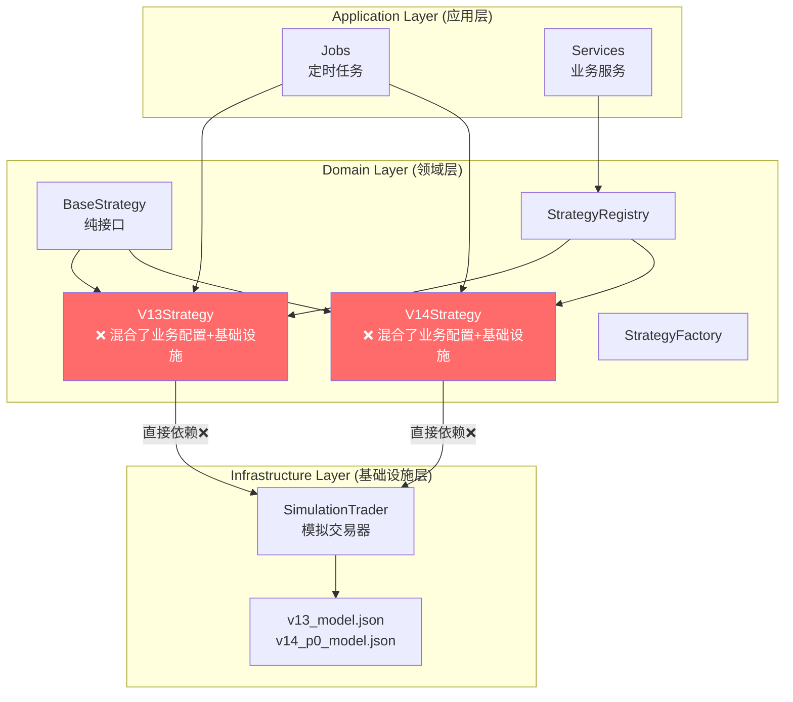
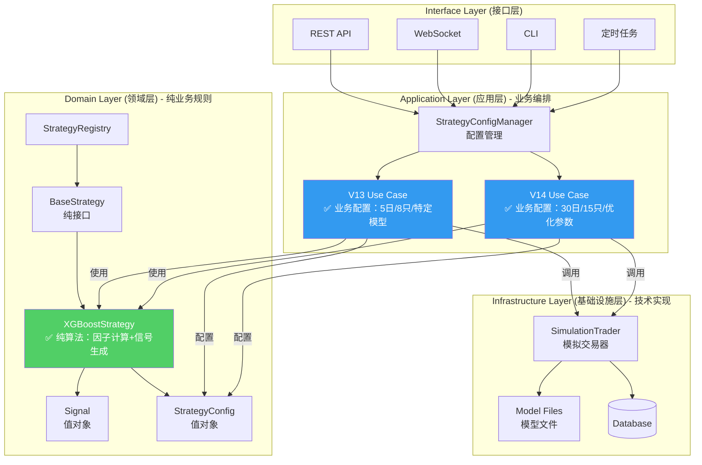
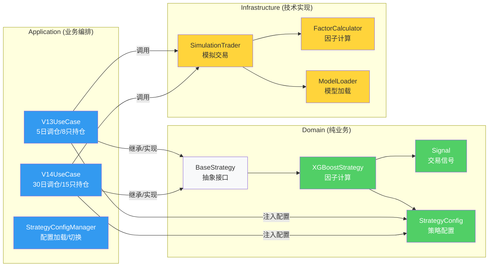
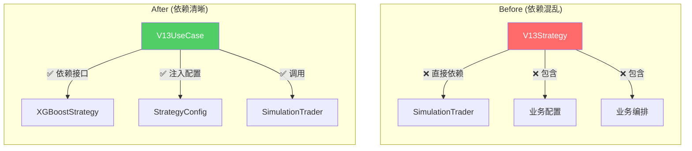
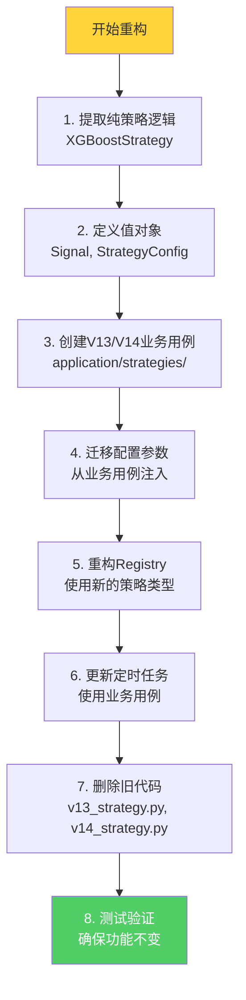

# Strategy Architecture Refactoring

## 当前架构（问题）



## 问题分析

| 层 | V13/V14 当前位置 | 违反原则 |
|---|---|---|
| Domain | ✅ 在这里 | ❌ 但依赖了 Infrastructure |
| Domain | ❌ | ❌ 包含业务配置（调仓天数、持仓数） |
| Domain | ❌ | ❌ 包含业务编排（initialize、run_daily_check） |

---

## 重构后架构（正确）



---

## 详细分层说明



---

## 代码结构对比

```
当前（错误）                          重构后（正确）
══════════════════════════════════════════════════════════════

domain/strategies/                   domain/strategies/
├── __init__.py                      ├── __init__.py
├── base_strategy.py        →        ├── base_strategy.py
├── v13_strategy.py         ✗        ├── xgboost_strategy.py    ← 新增：纯算法
├── v14_strategy.py         ✗        ├── signal.py               ← 新增：值对象
├── strategy_registry.py             ├── strategy_config.py     ← 新增：配置值对象
├── strategy_factory.py              ├── strategy_registry.py
├── strategy_272.py                  └── strategy_factory.py
├── strategy_273.py
├── strategy_274_ml.py        application/strategies/
                              →      ├── __init__.py
live_trading/                        ├── v13_use_case.py        ← 新增：V13业务用例
├── simulation_trader.py             ├── v14_use_case.py        ← 新增：V14业务用例
├── v13_factors.py                   ├── config_manager.py      ← 新增：配置管理
├── v14_factor_calculator.py         └── trading_orchestrator.py ← 新增：交易编排
├── train_v14_model.py
└── ...                       live_trading/
                              (保留，但不再被domain直接依赖)
```

---

## 依赖关系变化



---

## 重构步骤


