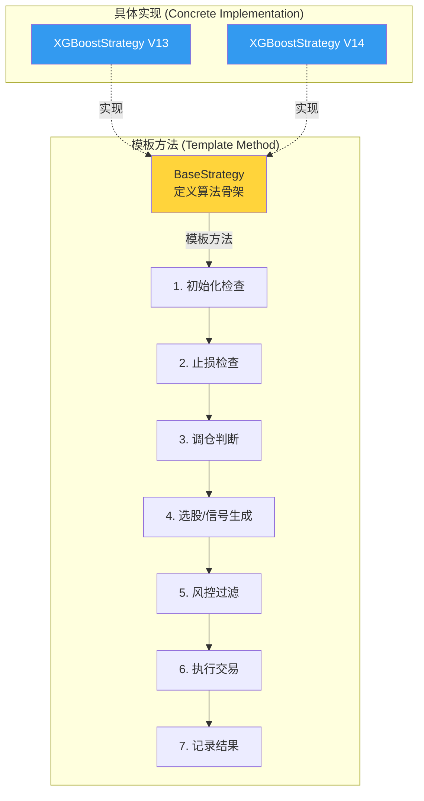
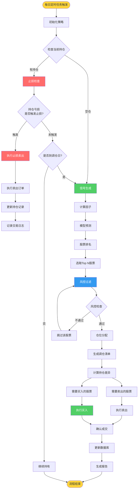
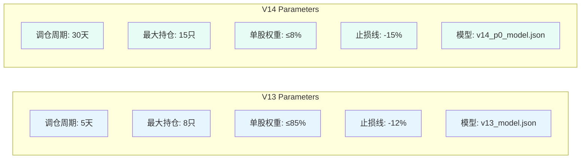
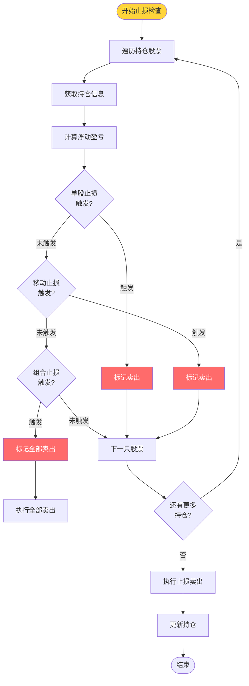
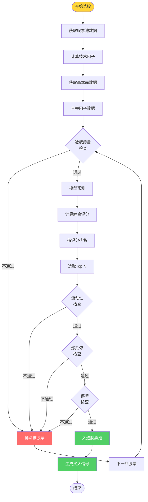
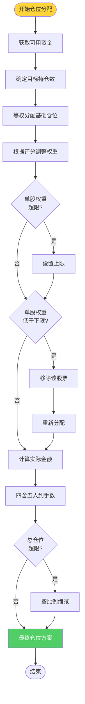
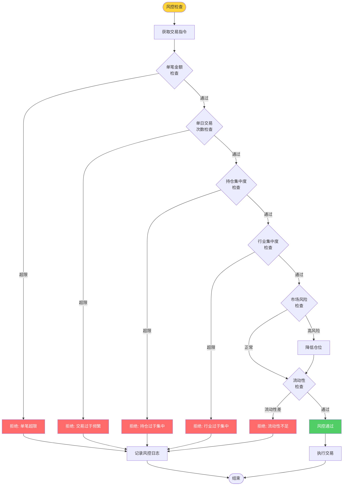
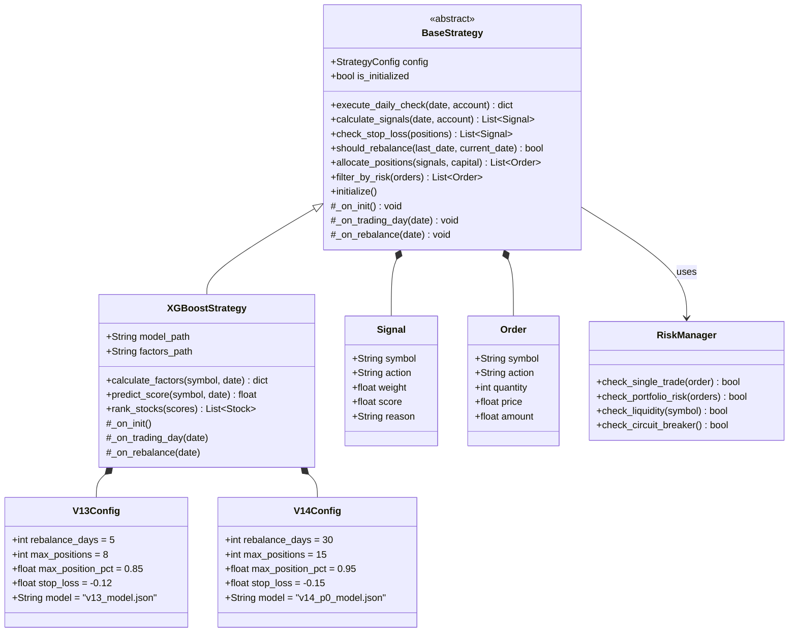
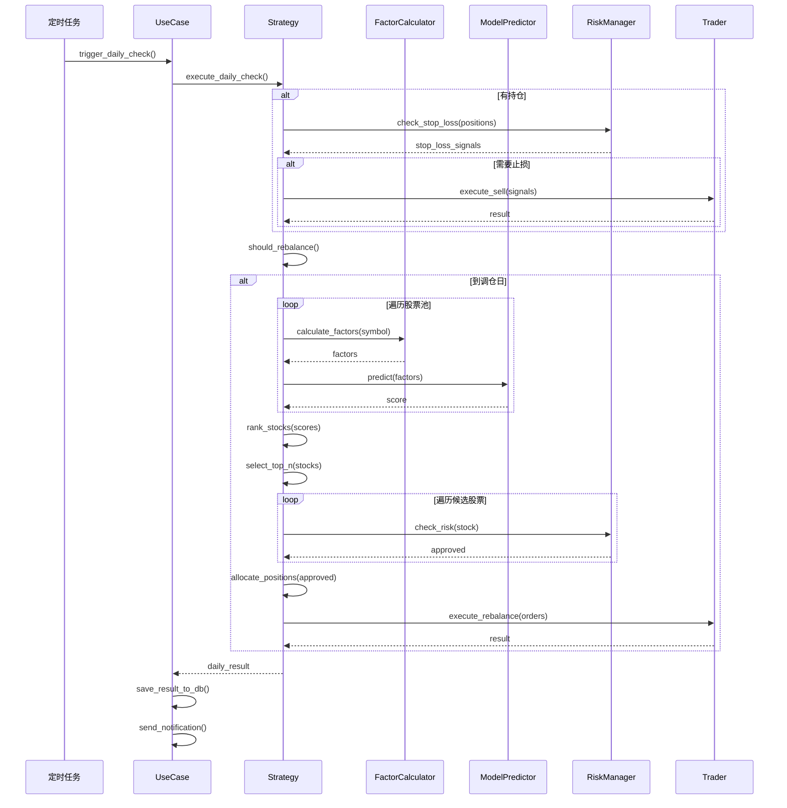

# Strategy Template Pattern Design

## 模板模式核心思想

```mermaid
graph TB
    subgraph "模板方法 (Template Method)"
        BASE[BaseStrategy<br/>定义算法骨架]
        BASE -->|模板方法| STEP1[1. 初始化检查]
        STEP1 --> STEP2[2. 止损检查]
        STEP2 --> STEP3[3. 调仓判断]
        STEP3 --> STEP4[4. 选股/信号生成]
        STEP4 --> STEP5[5. 风控过滤]
        STEP5 --> STEP6[6. 执行交易]
        STEP6 --> STEP7[7. 记录结果]
    end

    subgraph "具体实现 (Concrete Implementation)"
        V13[XGBoostStrategy V13]
        V14[XGBoostStrategy V14]
    end

    V13 -.->|实现| BASE
    V14 -.->|实现| BASE

    style BASE fill:#ffd43b
    style V13 fill:#339af0,color:#fff
    style V14 fill:#339af0,color:#fff
```

---

## 完整交易流程

```mermaid
flowchart TD
    START([每日定时任务触发]) --> INIT[初始化策略]
    
    INIT --> CHECK_POS{检查当前持仓}
    
    CHECK_POS -->|有持仓| STOP_LOSS[止损检查]
    CHECK_POS -->|空仓| SIGNAL[信号生成]
    
    STOP_LOSS --> SL_CHECK{持仓亏损<br/>是否触发止损?}
    
    SL_CHECK -->|触发| SELL止损[执行止损卖出]
    SL_CHECK -->|未触发| REBALANCE_CHECK{是否到调仓日?}
    
    SELL止损 --> SELL_EXEC[执行卖出订单]
    SELL_EXEC --> UPDATE_POS[更新持仓记录]
    UPDATE_POS --> LOG[记录交易日志]
    
    REBALANCE_CHECK -->|是| SIGNAL
    REBALANCE_CHECK -->|否| HOLD[继续持有]
    
    SIGNAL --> FACTOR[计算因子]
    FACTOR --> MODEL[模型预测]
    MODEL --> RANK[股票排名]
    
    RANK --> TOP_N[选取Top N股票]
    TOP_N --> RISK过滤[风控过滤]
    
    RISK过滤 --> RISK检查{风控检查}
    
    RISK检查 -->|通过| ALLOCATE[仓位分配]
    RISK检查 -->|不通过| SKIP[跳过该股票]
    SKIP --> RISK过滤
    
    ALLOCATE --> REBALANCE[生成调仓清单]
    REBALANCE --> DIFF[计算持仓差异]
    
    DIFF --> SELL[需要卖出的股票]
    DIFF --> BUY[需要买入的股票]
    
    SELL --> SELL_ORDER[执行卖出]
    BUY --> BUY_ORDER[执行买入]
    
    SELL_ORDER --> CONFIRM[确认成交]
    BUY_ORDER --> CONFIRM
    
    CONFIRM --> UPDATE_DB[更新数据库]
    UPDATE_DB --> REPORT[生成报告]
    REPORT --> END([流程结束])
    
    HOLD --> END
    
    style START fill:#ffd43b
    style END fill:#ffd43b
    style STOP_LOSS fill:#ff6b6b,color:#fff
    style SELL止损 fill:#ff6b6b,color:#fff
    style SIGNAL fill:#51cf66,color:#fff
    style RISK过滤 fill:#339af0,color:#fff
    style BUY_ORDER fill:#51cf66,color:#fff
```

---

## V13 vs V14 参数对比

```mermaid
graph LR
    subgraph "V13 Parameters"
        V13_1[调仓周期: 5天]
        V13_2[最大持仓: 8只]
        V13_3[单股权重: ≤85%]
        V13_4[止损线: -12%]
        V13_5[模型: v13_model.json]
    end

    subgraph "V14 Parameters"
        V14_1[调仓周期: 30天]
        V14_2[最大持仓: 15只]
        V14_3[单股权重: ≤8%]
        V14_4[止损线: -15%]
        V14_5[模型: v14_p0_model.json]
    end

    style V13_1 fill:#e7f5ff
    style V13_2 fill:#e7f5ff
    style V13_3 fill:#e7f5ff
    style V13_4 fill:#e7f5ff
    style V13_5 fill:#e7f5ff
    style V14_1 fill:#e6fcf5
    style V14_2 fill:#e6fcf5
    style V14_3 fill:#e6fcf5
    style V14_4 fill:#e6fcf5
    style V14_5 fill:#e6fcf5
```

---

## 止损逻辑流程

```mermaid
flowchart TD
    START([开始止损检查]) --> LOOP[遍历持仓股票]
    
    LOOP --> GET_POS[获取持仓信息]
    GET_POS --> CALC_PNL[计算浮动盈亏]
    
    CALC_PNL --> CHECK_SINGLE{单股止损<br/>触发?}
    
    CHECK_SINGLE -->|触发| SELL_SINGLE[标记卖出]
    CHECK_SINGLE -->|未触发| CHECK_TRAIL{移动止损<br/>触发?}
    
    CHECK_TRAIL -->|触发| SELL_TRAIL[标记卖出]
    CHECK_TRAIL -->|未触发| CHECK_PORTFOLIO{组合止损<br/>触发?}
    
    CHECK_PORTFOLIO -->|触发| SELL_ALL[标记全部卖出]
    CHECK_PORTFOLIO -->|未触发| NEXT[下一只股票]
    
    SELL_SINGLE --> NEXT
    SELL_TRAIL --> NEXT
    SELL_ALL --> EXEC_ALL[执行全部卖出]
    
    NEXT --> MORE{还有更多<br/>持仓?}
    MORE -->|是| LOOP
    MORE -->|否| EXEC[执行止损卖出]
    
    EXEC --> UPDATE[更新持仓]
    UPDATE --> END([结束])
    
    style START fill:#ffd43b
    style SELL_SINGLE fill:#ff6b6b,color:#fff
    style SELL_TRAIL fill:#ff6b6b,color:#fff
    style SELL_ALL fill:#ff6b6b,color:#fff
```

---

## 选股与信号生成流程

```mermaid
flowchart TD
    START([开始选股]) --> DATA[获取股票池数据]
    
    DATA --> FACTOR[计算技术因子]
    FACTOR --> FUND[获取基本面数据]
    FUND --> MERGE[合并因子数据]
    
    MERGE --> QUALITY{数据质量<br/>检查}
    
    QUALITY -->|不通过| EXCLUDE[排除该股票]
    QUALITY -->|通过| PREDICT[模型预测]
    
    PREDICT --> SCORE[计算综合评分]
    SCORE --> RANK[按评分排名]
    
    RANK --> TOP[选取Top N]
    
    TOP --> FILTER1{流动性<br/>检查}
    FILTER1 -->|不通过| EXCLUDE
    FILTER1 -->|通过| FILTER2{涨跌停<br/>检查}
    
    FILTER2 -->|不通过| EXCLUDE
    FILTER2 -->|通过| FILTER3{停牌<br/>检查}
    
    FILTER3 -->|不通过| EXCLUDE
    FILTER3 -->|通过| SELECTED[入选股票池]
    
    SELECTED --> SIGNAL[生成买入信号]
    SIGNAL --> END([结束])
    
    EXCLUDE --> NEXT[下一只股票]
    NEXT --> QUALITY
    
    style START fill:#ffd43b
    style SELECTED fill:#51cf66,color:#fff
    style SIGNAL fill:#51cf66,color:#fff
    style EXCLUDE fill:#ff6b6b,color:#fff
```

---

## 仓位分配逻辑

```mermaid
flowchart TD
    START([开始仓位分配]) --> TOTAL[获取可用资金]
    
    TOTAL --> TARGET[确定目标持仓数]
    TARGET --> EQUAL[等权分配基础仓位]
    
    EQUAL --> ADJUST[根据评分调整权重]
    
    ADJUST --> CHECK_MAX{单股权重<br/>超限?}
    
    CHECK_MAX -->|是| CAP[设置上限]
    CHECK_MAX -->|否| CHECK_MIN{单股权重<br/>低于下限?}
    
    CAP --> CHECK_MIN
    CHECK_MIN -->|是| REMOVE[移除该股票]
    CHECK_MIN -->|否| CALC[计算实际金额]
    
    REMOVE --> RECALC[重新分配]
    RECALC --> CALC
    
    CALC --> ROUND[四舍五入到手数]
    ROUND --> CHECK_TOTAL{总仓位<br/>超限?}
    
    CHECK_TOTAL -->|是| SCALE[按比例缩减]
    CHECK_TOTAL -->|否| FINAL[最终仓位方案]
    
    SCALE --> FINAL
    FINAL --> END([结束])
    
    style START fill:#ffd43b
    style FINAL fill:#51cf66,color:#fff
```

---

## 风控检查流程

```mermaid
flowchart TD
    START([风控检查]) --> TRADE[获取交易指令]
    
    TRADE --> CHECK1{单笔金额<br/>检查}
    
    CHECK1 -->|超限| REJECT1[拒绝: 单笔超限]
    CHECK1 -->|通过| CHECK2{单日交易<br/>次数检查}
    
    CHECK2 -->|超限| REJECT2[拒绝: 交易过于频繁]
    CHECK2 -->|通过| CHECK3{持仓集中度<br/>检查}
    
    CHECK3 -->|超限| REJECT3[拒绝: 持仓过于集中]
    CHECK3 -->|通过| CHECK4{行业集中度<br/>检查}
    
    CHECK4 -->|超限| REJECT4[拒绝: 行业过于集中]
    CHECK4 -->|通过| CHECK5{市场风险<br/>检查}
    
    CHECK5 -->|高风险| REDUCE[降低仓位]
    CHECK5 -->|正常| CHECK6{流动性<br/>检查}
    
    REDUCE --> CHECK6
    CHECK6 -->|流动性差| REJECT5[拒绝: 流动性不足]
    CHECK6 -->|通过| APPROVE[风控通过]
    
    REJECT1 --> LOG[记录风控日志]
    REJECT2 --> LOG
    REJECT3 --> LOG
    REJECT4 --> LOG
    REJECT5 --> LOG
    
    APPROVE --> EXEC[执行交易]
    LOG --> END([结束])
    EXEC --> END
    
    style START fill:#ffd43b
    style APPROVE fill:#51cf66,color:#fff
    style REJECT1 fill:#ff6b6b,color:#fff
    style REJECT2 fill:#ff6b6b,color:#fff
    style REJECT3 fill:#ff6b6b,color:#fff
    style REJECT4 fill:#ff6b6b,color:#fff
    style REJECT5 fill:#ff6b6b,color:#fff
```

---

## 类图设计

```mermaid
classDiagram
    class BaseStrategy {
        <<abstract>>
        +StrategyConfig config
        +bool is_initialized
        +execute_daily_check(date, account) dict
        +calculate_signals(date, account) List~Signal~
        +check_stop_loss(positions) List~Signal~
        +should_rebalance(last_date, current_date) bool
        +allocate_positions(signals, capital) List~Order~
        +filter_by_risk(orders) List~Order~
        +initialize()
        #_on_init() void
        #_on_trading_day(date) void
        #_on_rebalance(date) void
    }

    class XGBoostStrategy {
        +String model_path
        +String factors_path
        +calculate_factors(symbol, date) dict
        +predict_score(symbol, date) float
        +rank_stocks(scores) List~Stock~
        #_on_init()
        #_on_trading_day(date)
        #_on_rebalance(date)
    }

    class V13Config {
        +int rebalance_days = 5
        +int max_positions = 8
        +float max_position_pct = 0.85
        +float stop_loss = -0.12
        +String model = "v13_model.json"
    }

    class V14Config {
        +int rebalance_days = 30
        +int max_positions = 15
        +float max_position_pct = 0.95
        +float stop_loss = -0.15
        +String model = "v14_p0_model.json"
    }

    class Signal {
        +String symbol
        +String action
        +float weight
        +float score
        +String reason
    }

    class Order {
        +String symbol
        +String action
        +int quantity
        +float price
        +float amount
    }

    class RiskManager {
        +check_single_trade(order) bool
        +check_portfolio_risk(orders) bool
        +check_liquidity(symbol) bool
        +check_circuit_breaker() bool
    }

    BaseStrategy <|-- XGBoostStrategy
    BaseStrategy *-- Signal
    BaseStrategy *-- Order
    XGBoostStrategy *-- V13Config
    XGBoostStrategy *-- V14Config
    BaseStrategy --> RiskManager : uses
```

---

## 执行流程时序图

```mermaid
sequenceDiagram
    participant Scheduler as 定时任务
    participant UC as UseCase
    participant Strategy as Strategy
    participant Factor as FactorCalculator
    participant Model as ModelPredictor
    participant Risk as RiskManager
    participant Trader as Trader

    Scheduler->>UC: trigger_daily_check()
    
    UC->>Strategy: execute_daily_check()
    
    alt 有持仓
        Strategy->>Risk: check_stop_loss(positions)
        Risk-->>Strategy: stop_loss_signals
        
        alt 需要止损
            Strategy->>Trader: execute_sell(signals)
            Trader-->>Strategy: result
        end
    end
    
    Strategy->>Strategy: should_rebalance()
    
    alt 到调仓日
        loop 遍历股票池
            Strategy->>Factor: calculate_factors(symbol)
            Factor-->>Strategy: factors
            
            Strategy->>Model: predict(factors)
            Model-->>Strategy: score
        end
        
        Strategy->>Strategy: rank_stocks(scores)
        Strategy->>Strategy: select_top_n(stocks)
        
        loop 遍历候选股票
            Strategy->>Risk: check_risk(stock)
            Risk-->>Strategy: approved
        end
        
        Strategy->>Strategy: allocate_positions(approved)
        Strategy->>Trader: execute_rebalance(orders)
        Trader-->>Strategy: result
    end
    
    Strategy-->>UC: daily_result
    UC->>UC: save_result_to_db()
    UC->>UC: send_notification()
```
