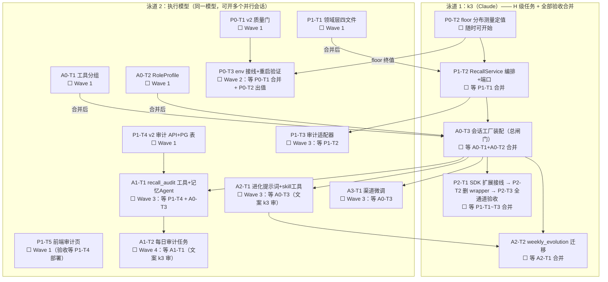

# 全局执行顺序与并行图（召回重设计 + 三 Agent 拆分）

- 日期：2026-08-13
- 适用计划：`2026-08-13-memory-recall-redesign.md`、`2026-08-13-agent-domain-split.md`
- **并行约束：委派任务只用一个执行模型**（同一模型的多个并行会话）；k3 独立一条泳道，负责 H 级任务与全部验收合并。

## 泳道图

## 波次表（按时间推进）

| 波次 | k3 泳道 | 执行模型泳道（同一模型，并行会话数按你的带宽定） |
|---|---|---|
| **Wave 1**（全部无依赖，立即开工） | P0-T2 floor 测量 | P0-T1 ／ P1-T1 ／ P1-T4 ／ P1-T5 ／ A0-T1 ／ A0-T2（6 个任务文件全不相交） |
| **Wave 2**（Wave 1 陆续验收合并后） | 验收合并 → 做 P1-T2、A0-T3 | P0-T3（等 P0-T1+floor 值） |
| **Wave 3** | 验收合并 | P1-T3 ／ A1-T1 ／ A2-T1 ／ A3-T1 |
| **Wave 4** | P2-T1→T2→T3 接线与全通道验收；A2-T2 进化迁移 | A1-T2 每日审计任务 |
| **Wave 5** | P3/A4 观察期：注入率与分账统计一周 → floor 调优定稿 | — |

## 关键路径与建议

1. **总闸门是 A0-T3（k3）**：拆分计划所有后续任务都等它；A0-T1/A0-T2 回来后优先验收合并这两个。
2. **最快可见收益**：P0 线（质量门）——P0-T1 合并 + P0-T2 出值 + P0-T3 重启，噪音召回立刻消失，不依赖任何其他任务。
3. **并行安全约定**（防文件冲突）：
   - P0-T1 独占 `domain/memory/service.py`；P1-T4 禁碰 `service.py`/`hybrid_search.py`；
   - A0-T1 独占 `tools/index.ts` 与 `groups.ts`；A1-T1/A2-T1 因需改这两个文件，被排在 A0-T3 之后；
   - 每个任务独立 worktree，合并统一由 k3 走 merge-back 流程。
4. **每个执行模型任务完成后**：任务标题状态 ⬜→👀，k3 验收通过改 ✅ 并合并；打回改 ❌ 附原因，同一模型会话内返工。
