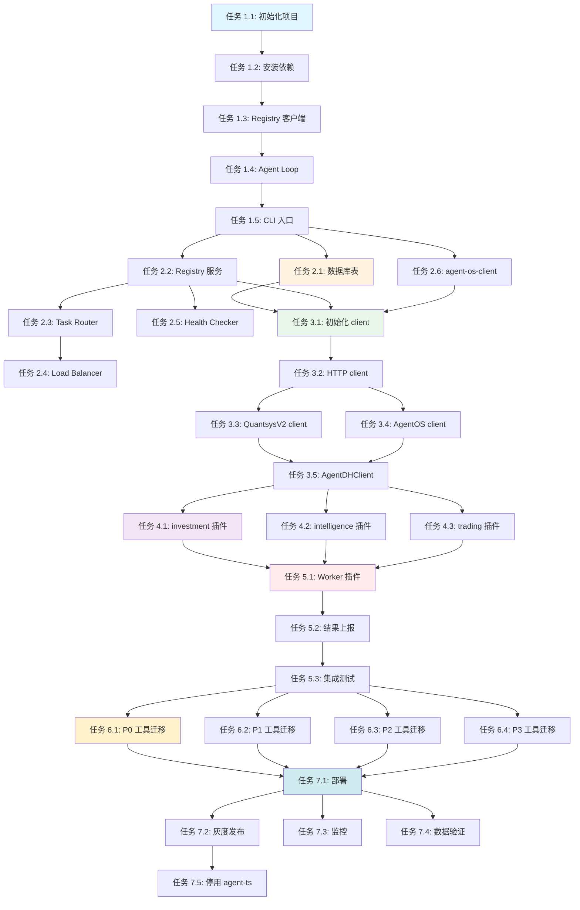

# Agent-DH 实施计划

**版本**: 1.0.0
**日期**: 2026-08-18
**状态**: 待执行
**负责**: 多 Agent 协作

---

## 执行策略

- **串行阶段**: 有依赖关系的任务必须按顺序执行
- **并行阶段**: 无依赖关系的任务可以并行执行
- **里程碑**: 每个阶段完成后需要验收才能进入下一阶段

---

## Phase 1: 框架搭建（Week 1-2）

### 任务 1.1: 初始化 agent-dh 项目结构
**类型**: 串行（必须第一个执行）
**预计时间**: 0.5 天
**负责 Agent**: Agent-Setup
**依赖**: 无

**任务描述**:
1. 创建 `agent-dh/` 目录
2. 初始化 pnpm workspace
3. 配置 TypeScript (tsconfig.json)
4. 配置 tsdown 构建工具
5. 创建基础目录结构（packages/, apps/, skills/）

**验收标准**:
- [ ] `agent-dh/pnpm-workspace.yaml` 存在且配置正确
- [ ] `agent-dh/tsconfig.json` 存在且配置正确
- [ ] `agent-dh/package.json` 存在且包含基础依赖
- [ ] 目录结构完整

**输出文件**:
```
agent-dh/
├── package.json
├── pnpm-workspace.yaml
├── tsconfig.json
├── packages/
├── apps/
└── skills/
```

---

### 任务 1.2: 安装 DSH 核心依赖
**类型**: 串行（依赖任务 1.1）
**预计时间**: 0.5 天
**负责 Agent**: Agent-Setup
**依赖**: 任务 1.1

**任务描述**:
1. 添加 DSH 核心包到 package.json
2. 运行 pnpm install
3. 验证依赖安装成功
4. 记录版本号到 package-lock.json

**依赖包列表**:
```json
{
  "dependencies": {
    "@deepseek-ai/cordis": "^0.1.0-rc.6",
    "@deepseek-ai/dsh-agent": "^0.1.0-rc.6",
    "@deepseek-ai/dsh-session": "^0.1.0-rc.6",
    "@deepseek-ai/dsh-tools": "^0.1.0-rc.6",
    "@deepseek-ai/dsh-llm": "^0.1.0-rc.6",
    "@deepseek-ai/dsh-shell": "^0.1.0-rc.6",
    "@deepseek-ai/dsh-fs": "^0.1.0-rc.6",
    "@deepseek-ai/dsh-skill": "^0.1.0-rc.6"
  }
}
```

**验收标准**:
- [ ] 所有 DSH 包安装成功
- [ ] 无版本冲突
- [ ] `node_modules/` 存在

---

### 任务 1.3: 实现 Registry 客户端
**类型**: 串行（依赖任务 1.2）
**预计时间**: 1 天
**负责 Agent**: Agent-Core
**依赖**: 任务 1.2

**任务描述**:
1. 创建 `packages/investment-agent-loop/` 目录
2. 实现 `registry-client.ts`（Registry 客户端）
   - 注册 Agent
   - 发送心跳
   - 更新状态
   - 注销 Agent
3. 定义类型（types.ts）
4. 编写单元测试

**核心代码**:
```typescript
// packages/investment-agent-loop/src/registry-client.ts
export class RegistryClient {
  constructor(private osClient: AgentOSClient) {}
  
  async register(agentInfo: AgentInfo): Promise<void> {
    await this.osClient.registry.register(agentInfo);
  }
  
  async heartbeat(agentId: string, status: AgentStatus): Promise<void> {
    await this.osClient.registry.heartbeat({ agent_id: agentId, ...status });
  }
  
  async updateStatus(agentId: string, status: AgentStatus): Promise<void> {
    await this.osClient.registry.updateStatus({ agent_id: agentId, ...status });
  }
  
  async unregister(agentId: string): Promise<void> {
    await this.osClient.registry.unregister({ agent_id: agentId });
  }
}
```

**验收标准**:
- [ ] `registry-client.ts` 实现完整
- [ ] 类型定义完整
- [ ] 单元测试通过率 100%

---

### 任务 1.4: 实现自定义 Agent Loop
**类型**: 串行（依赖任务 1.3）
**预计时间**: 2 天
**负责 Agent**: Agent-Core
**依赖**: 任务 1.3

**任务描述**:
1. 实现 `agent-loop.ts`（InvestmentAgentLoop）
   - 实现 create() 方法（集成 Registry 注册）
   - 实现 resume() 方法
   - 实现心跳机制
2. 实现 `agent.ts`（InvestmentAgent）
   - 实现自定义控制流
   - 实现状态管理
   - 实现任务执行
3. 编写单元测试

**核心代码**:
```typescript
// packages/investment-agent-loop/src/agent-loop.ts
export class InvestmentAgentLoop implements AgentLoop {
  constructor(
    private ctx: Context,
    private registryClient: RegistryClient,
    private config: AgentLoopConfig
  ) {}
  
  async create(sessionId: string, options?: AgentOptions): Promise<Agent> {
    // 1. 创建 session
    const session = await this.ctx.sessions.create(sessionId);
    
    // 2. 注册到 Registry
    await this.registryClient.register({
      agent_id: options?.agentId || `agent-${sessionId}`,
      session_id: sessionId,
      type: this.config.agentType,
      capabilities: this.config.capabilities,
      status: 'idle',
    });
    
    // 3. 创建 Agent
    const agent = new InvestmentAgent(this.ctx, session, options, this.registryClient);
    
    // 4. 启动心跳
    this.startHeartbeat(agent.agentId);
    
    return agent;
  }
  
  private startHeartbeat(agentId: string): void {
    setInterval(async () => {
      await this.registryClient.heartbeat(agentId, { status: 'idle' });
    }, 30000);
  }
}
```

**验收标准**:
- [ ] `agent-loop.ts` 实现完整
- [ ] `agent.ts` 实现完整
- [ ] Agent 创建时自动注册到 Registry
- [ ] 心跳机制正常工作
- [ ] 单元测试通过率 > 80%

---

### 任务 1.5: 实现 CLI 启动入口
**类型**: 串行（依赖任务 1.4）
**预计时间**: 1 天
**负责 Agent**: Agent-Core
**依赖**: 任务 1.4

**任务描述**:
1. 创建 `apps/cli/` 目录
2. 实现 `index.ts`（CLI 入口）
   - 初始化 Cordis App
   - 加载 DSH 核心插件
   - 加载自定义 agent-loop 插件
   - 启动 Agent
3. 配置环境变量
4. 编写启动脚本

**核心代码**:
```typescript
// apps/cli/index.ts
import { App } from '@deepseek-ai/cordis';
import investmentAgentLoopPlugin from '@pi-investment/agent-dh-plugin-investment-agent-loop';

const app = new App();

// 加载 DSH 核心插件
app.plugin(require('@deepseek-ai/dsh-agent'));
app.plugin(require('@deepseek-ai/dsh-session'));
app.plugin(require('@deepseek-ai/dsh-tools'));
app.plugin(require('@deepseek-ai/dsh-llm'));

// 加载自定义 agent-loop 插件
app.plugin(investmentAgentLoopPlugin, {
  osClient: new AgentOSClient({ baseURL: process.env.AGENT_OS_BASE_URL }),
  agentType: 'worker',
  capabilities: ['data-analysis', 'backtest'],
});

await app.start();
```

**验收标准**:
- [ ] CLI 能够启动
- [ ] Agent 能够注册到 Registry
- [ ] 能够执行简单的对话

---

### Phase 1 里程碑验收
**验收人**: 项目负责人
**验收标准**:
- [ ] agent-dh 项目结构完整
- [ ] DSH 核心依赖安装成功
- [ ] 自定义 agent-loop 实现完整
- [ ] Agent 能够注册到 Registry
- [ ] Agent 能够发送心跳
- [ ] CLI 能够启动并运行

---

## Phase 2: Agent OS Registry（Week 3）

### 任务 2.1: 创建数据库表
**类型**: 并行（可以与任务 2.2 并行）
**预计时间**: 0.5 天
**负责 Agent**: Agent-Backend
**依赖**: Phase 1 完成

**任务描述**:
1. 创建 migration 文件
2. 实现 agents 表
3. 实现 agent_heartbeats 表
4. 实现 agent_capabilities 表
5. 运行 migration

**SQL 文件**:
```sql
-- migrations/xxx_add_agent_registry.sql
CREATE TABLE agents (...);
CREATE TABLE agent_heartbeats (...);
CREATE TABLE agent_capabilities (...);
```

**验收标准**:
- [ ] 数据库表创建成功
- [ ] 索引创建成功
- [ ] 外键约束正确

---

### 任务 2.2: 实现 Agent Registry 服务
**类型**: 并行（可以与任务 2.1 并行）
**预计时间**: 2 天
**负责 Agent**: Agent-Backend
**依赖**: Phase 1 完成

**任务描述**:
1. 创建 `internal/registry/` 目录
2. 实现 `registry.go`（注册中心）
   - Register()
   - Unregister()
   - FindAvailableAgents()
   - UpdateAgentStatus()
3. 实现 HTTP handler
   - POST /api/v1/registry/agents/register
   - POST /api/v1/registry/agents/unregister
   - GET /api/v1/registry/agents/available
   - POST /api/v1/registry/agents/update-status
   - POST /api/v1/registry/agents/heartbeat
4. 编写单元测试

**验收标准**:
- [ ] Registry 服务实现完整
- [ ] HTTP API 能够正常响应
- [ ] 单元测试通过率 > 80%

---

### 任务 2.3: 实现 Task Router
**类型**: 串行（依赖任务 2.2）
**预计时间**: 1 天
**负责 Agent**: Agent-Backend
**依赖**: 任务 2.2

**任务描述**:
1. 实现 `task_router.go`（任务路由器）
   - RouteTask()
   - 根据能力查询 Agent
   - 更新 Agent 状态
2. 编写单元测试

**验收标准**:
- [ ] Task Router 实现完整
- [ ] 能够根据能力选择 Agent
- [ ] 单元测试通过率 > 80%

---

### 任务 2.4: 实现 Load Balancer
**类型**: 串行（依赖任务 2.3）
**预计时间**: 1 天
**负责 Agent**: Agent-Backend
**依赖**: 任务 2.3

**任务描述**:
1. 实现 `load_balancer.go`（负载均衡器）
   - 最少负载优先
   - 轮询
   - 随机
   - 能力匹配优先
2. 编写单元测试

**验收标准**:
- [ ] Load Balancer 实现完整
- [ ] 支持多种负载均衡策略
- [ ] 单元测试通过率 > 80%

---

### 任务 2.5: 实现 Health Checker
**类型**: 串行（依赖任务 2.2）
**预计时间**: 0.5 天
**负责 Agent**: Agent-Backend
**依赖**: 任务 2.2

**任务描述**:
1. 实现 `health_checker.go`（健康检查器）
   - 定期检查心跳超时
   - 标记离线 Agent
2. 编写单元测试

**验收标准**:
- [ ] Health Checker 实现完整
- [ ] 能够标记离线 Agent
- [ ] 单元测试通过率 > 80%

---

### 任务 2.6: 扩展 agent-os-client
**类型**: 并行（可以与任务 2.2-2.5 并行）
**预计时间**: 1 天
**负责 Agent**: Agent-Client
**依赖**: Phase 1 完成

**任务描述**:
1. 创建 `src/registry/` 目录
2. 实现 `client.ts`（Registry client）
3. 定义类型（types.ts）
4. 编写单元测试

**验收标准**:
- [ ] Registry client 实现完整
- [ ] 类型定义完整
- [ ] 单元测试通过率 > 80%

---

### Phase 2 里程碑验收
**验收人**: 项目负责人
**验收标准**:
- [ ] 数据库表创建成功
- [ ] Agent Registry 服务实现完整
- [ ] Task Router 能够正确路由任务
- [ ] Load Balancer 能够正确选择 Agent
- [ ] Health Checker 能够标记离线 Agent
- [ ] agent-os-client 扩展完成

---

## Phase 3: Client SDK（Week 4）

### 任务 3.1: 初始化 agent-dh-client 项目
**类型**: 串行（必须第一个执行）
**预计时间**: 0.5 天
**负责 Agent**: Agent-Client
**依赖**: Phase 2 完成

**任务描述**:
1. 创建 `agent-dh-client/` 目录
2. 初始化 npm 包
3. 配置 TypeScript

**验收标准**:
- [ ] 项目结构完整
- [ ] package.json 配置正确

---

### 任务 3.2: 实现 HTTP client 基础设施
**类型**: 串行（依赖任务 3.1）
**预计时间**: 1 天
**负责 Agent**: Agent-Client
**依赖**: 任务 3.1

**任务描述**:
1. 实现 `http/client.ts`（BaseHTTPClient）
2. 实现请求拦截器
3. 实现响应拦截器
4. 编写单元测试

**验收标准**:
- [ ] HTTP client 实现完整
- [ ] 拦截器工作正常
- [ ] 单元测试通过率 > 80%

---

### 任务 3.3: 实现 QuantsysV2 client
**类型**: 并行（可以与任务 3.4 并行）
**预计时间**: 2 天
**负责 Agent**: Agent-Client
**依赖**: 任务 3.2

**任务描述**:
1. 实现 `quantsys/client.ts`
   - 封装 REST API（quote/kline/financial/strategy/pool/trade）
   - 封装 WebSocket client
2. 定义类型（types.ts）
3. 编写单元测试

**验收标准**:
- [ ] QuantsysV2 client 实现完整
- [ ] 能够调用所有 API
- [ ] 单元测试通过率 > 80%

---

### 任务 3.4: 实现 AgentOS client
**类型**: 并行（可以与任务 3.3 并行）
**预计时间**: 1 天
**负责 Agent**: Agent-Client
**依赖**: 任务 3.2

**任务描述**:
1. 复用 agent-os-client（包含 Registry client）
2. 添加 Agent DH 特定方法
3. 编写单元测试

**验收标准**:
- [ ] AgentOS client 实现完整
- [ ] 能够调用 Registry API
- [ ] 单元测试通过率 > 80%

---

### 任务 3.5: 实现 AgentDHClient 主入口
**类型**: 串行（依赖任务 3.3 和 3.4）
**预计时间**: 0.5 天
**负责 Agent**: Agent-Client
**依赖**: 任务 3.3, 3.4

**任务描述**:
1. 实现 `client.ts`（AgentDHClient）
2. 整合 QuantsysV2 client 和 AgentOS client
3. 编写单元测试

**验收标准**:
- [ ] AgentDHClient 实现完整
- [ ] 能够统一访问所有 API
- [ ] 单元测试通过率 > 80%

---

### Phase 3 里程碑验收
**验收人**: 项目负责人
**验收标准**:
- [ ] agent-dh-client 项目创建成功
- [ ] HTTP client 基础设施完善
- [ ] QuantsysV2 client 能够调用所有 API
- [ ] AgentOS client 能够调用 Registry API
- [ ] AgentDHClient 整合完成

---

## Phase 4: 核心工具插件（Week 5-6）

### 任务 4.1: 实现 investment 插件包
**类型**: 并行（可以与任务 4.2, 4.3 并行）
**预计时间**: 3 天
**负责 Agent**: Agent-Tools
**依赖**: Phase 3 完成

**任务描述**:
1. 创建 `packages/investment/` 目录
2. 实现工具：
   - quote-tool.ts（实时行情）
   - kline-tool.ts（K线数据）
   - financial-tool.ts（财务数据）
   - pool-list-tool.ts（股票池列表）
   - strategy-list-tool.ts（策略列表）
3. 实现插件入口（index.ts）
4. 编写单元测试

**验收标准**:
- [ ] 所有工具实现完整
- [ ] 工具能够调用 agent-dh-client
- [ ] 单元测试通过率 > 70%

---

### 任务 4.2: 实现 intelligence 插件包
**类型**: 并行（可以与任务 4.1, 4.3 并行）
**预计时间**: 1 天
**负责 Agent**: Agent-Tools
**依赖**: Phase 3 完成

**任务描述**:
1. 创建 `packages/intelligence/` 目录
2. 实现工具：
   - evolution-status-tool.ts（进化状态）
   - watch-list-tool.ts（盯盘规则列表）
3. 实现插件入口（index.ts）
4. 编写单元测试

**验收标准**:
- [ ] 所有工具实现完整
- [ ] 工具能够调用 agent-dh-client
- [ ] 单元测试通过率 > 70%

---

### 任务 4.3: 实现 trading 插件包
**类型**: 并行（可以与任务 4.1, 4.2 并行）
**预计时间**: 1 天
**负责 Agent**: Agent-Tools
**依赖**: Phase 3 完成

**任务描述**:
1. 创建 `packages/trading/` 目录
2. 实现工具：
   - account-info-tool.ts（账户信息）
   - position-list-tool.ts（持仓列表）
3. 实现插件入口（index.ts）
4. 编写单元测试

**验收标准**:
- [ ] 所有工具实现完整
- [ ] 工具能够调用 agent-dh-client
- [ ] 单元测试通过率 > 70%

---

### Phase 4 里程碑验收
**验收人**: 项目负责人
**验收标准**:
- [ ] investment 插件包实现完整
- [ ] intelligence 插件包实现完整
- [ ] trading 插件包实现完整
- [ ] 所有工具能够正常工作

---

## Phase 5: Agent OS 集成（Week 7）

### 任务 5.1: 实现 agent-os-worker 插件
**类型**: 串行（必须第一个执行）
**预计时间**: 2 天
**负责 Agent**: Agent-Integration
**依赖**: Phase 4 完成

**任务描述**:
1. 创建 `packages/agent-os-worker/` 目录
2. 实现 `task-consumer.ts`（任务消费者）
   - 连接 Redis
   - 从队列拉取任务
3. 实现 `task-executor.ts`（任务执行器）
   - 创建 Agent session
   - 执行任务
4. 实现 `session-manager.ts`（Session 管理器）
5. 编写单元测试

**验收标准**:
- [ ] Worker 插件实现完整
- [ ] 能够从 Redis 拉取任务
- [ ] 能够执行任务
- [ ] 单元测试通过率 > 80%

---

### 任务 5.2: 实现结果上报
**类型**: 串行（依赖任务 5.1）
**预计时间**: 1 天
**负责 Agent**: Agent-Integration
**依赖**: 任务 5.1

**任务描述**:
1. 实现结果上报逻辑
2. 更新 execution 状态
3. 上报到 agent-os
4. 编写单元测试

**验收标准**:
- [ ] 结果上报实现完整
- [ ] 能够更新 execution 状态
- [ ] 单元测试通过率 > 80%

---

### 任务 5.3: 集成测试
**类型**: 串行（依赖任务 5.2）
**预计时间**: 2 天
**负责 Agent**: Agent-Integration
**依赖**: 任务 5.2

**任务描述**:
1. 编写端到端测试
2. 测试完整流程：
   - 定时任务触发
   - 任务推送到 Redis
   - Worker 消费任务
   - 执行任务
   - 上报结果
3. 修复发现的问题

**验收标准**:
- [ ] 端到端测试通过
- [ ] 完整流程能够正常运行

---

### Phase 5 里程碑验收
**验收人**: 项目负责人
**验收标准**:
- [ ] agent-os-worker 插件实现完整
- [ ] 结果上报功能正常
- [ ] 端到端测试通过

---

## Phase 6: 工具迁移（Week 8-13）

### 任务 6.1: 迁移 P0 数据访问工具（20个）
**类型**: 并行（可以分多个 Agent 并行迁移）
**预计时间**: 2 周
**负责 Agent**: Agent-Migration-1, Agent-Migration-2
**依赖**: Phase 5 完成

**任务描述**:
迁移以下工具到 agent-dh：
- data_fetch_quote
- data_fetch_kline
- data_fetch_financial
- data_fetch_dividend
- data_fetch_macro
- data_fetch_north_flow
- data_fetch_market_sentiment
- ...

**验收标准**:
- [ ] 所有 P0 工具迁移完成
- [ ] 工具能够正常工作
- [ ] 测试通过率 > 95%

---

### 任务 6.2: 迁移 P1 策略工具（30个）
**类型**: 并行（可以分多个 Agent 并行迁移）
**预计时间**: 2 周
**负责 Agent**: Agent-Migration-3, Agent-Migration-4
**依赖**: Phase 5 完成

**任务描述**:
迁移以下工具到 agent-dh：
- strategy_create
- strategy_execute
- strategy_backtest
- strategy_optimize
- pool_create
- pool_refresh
- ...

**验收标准**:
- [ ] 所有 P1 工具迁移完成
- [ ] 工具能够正常工作
- [ ] 测试通过率 > 95%

---

### 任务 6.3: 迁移 P2 分析工具（25个）
**类型**: 并行（可以分多个 Agent 并行迁移）
**预计时间**: 1.5 周
**负责 Agent**: Agent-Migration-5, Agent-Migration-6
**依赖**: Phase 5 完成

**任务描述**:
迁移以下工具到 agent-dh：
- factor_analysis
- pool_battlefield
- opponent_behavior
- manipulation_detect
- market_style_detect
- ...

**验收标准**:
- [ ] 所有 P2 工具迁移完成
- [ ] 工具能够正常工作
- [ ] 测试通过率 > 95%

---

### 任务 6.4: 迁移 P3 其他工具（15个）
**类型**: 并行（可以分多个 Agent 并行迁移）
**预计时间**: 1 周
**负责 Agent**: Agent-Migration-7
**依赖**: Phase 5 完成

**任务描述**:
迁移以下工具到 agent-dh：
- notification_send
- scheduler_manage
- model_switch
- ...

**验收标准**:
- [ ] 所有 P3 工具迁移完成
- [ ] 工具能够正常工作
- [ ] 测试通过率 > 95%

---

### Phase 6 里程碑验收
**验收人**: 项目负责人
**验收标准**:
- [ ] 所有 110 个工具迁移完成
- [ ] 测试通过率 > 95%
- [ ] 文档完整

---

## Phase 7: 生产切换（Week 14-15）

### 任务 7.1: 部署 agent-dh 到生产环境
**类型**: 串行（必须第一个执行）
**预计时间**: 1 天
**负责 Agent**: Agent-DevOps
**依赖**: Phase 6 完成

**任务描述**:
1. 配置 PM2 或 systemd
2. 配置环境变量
3. 配置日志
4. 启动服务

**验收标准**:
- [ ] agent-dh 能够正常启动
- [ ] 日志正常输出

---

### 任务 7.2: 配置灰度发布
**类型**: 串行（依赖任务 7.1）
**预计时间**: 2 天
**负责 Agent**: Agent-DevOps
**依赖**: 任务 7.1

**任务描述**:
1. 配置 10% 流量
2. 观察 3 天
3. 配置 50% 流量
4. 观察 3 天
5. 配置 100% 流量
6. 观察 7 天

**验收标准**:
- [ ] 灰度发布配置正确
- [ ] 每个阶段无异常

---

### 任务 7.3: 监控运行状态
**类型**: 并行（与任务 7.2 并行）
**预计时间**: 持续
**负责 Agent**: Agent-DevOps
**依赖**: 任务 7.1

**任务描述**:
1. 监控错误率
2. 监控响应时间
3. 监控资源使用
4. 设置告警

**验收标准**:
- [ ] 监控系统正常
- [ ] 告警规则配置正确

---

### 任务 7.4: 验证数据一致性
**类型**: 并行（与任务 7.2 并行）
**预计时间**: 3 天
**负责 Agent**: Agent-QA
**依赖**: 任务 7.1

**任务描述**:
1. 对比 agent-ts 和 agent-dh 的执行结果
2. 验证数据完整性
3. 验证业务逻辑正确性

**验收标准**:
- [ ] 数据一致性验证通过
- [ ] 无数据丢失或错误

---

### 任务 7.5: 逐步停用 agent-ts
**类型**: 串行（依赖任务 7.2 完成）
**预计时间**: 1 天
**负责 Agent**: Agent-DevOps
**依赖**: 任务 7.2

**任务描述**:
1. 停止新任务注册
2. 等待现有任务完成
3. 下线 agent-ts

**验收标准**:
- [ ] agent-ts 安全停用
- [ ] 无任务丢失

---

### Phase 7 里程碑验收
**验收人**: 项目负责人
**验收标准**:
- [ ] agent-dh 稳定运行 1 周
- [ ] 无数据丢失或错误
- [ ] 性能指标达标（响应时间 < 2s，成功率 > 99%）
- [ ] agent-ts 可以安全停用

---

## 任务依赖图



---

## Agent 分配建议

### Agent-Setup（1 个）
- 负责任务：1.1, 1.2
- 技能要求：熟悉 pnpm workspace, TypeScript 配置

### Agent-Core（1 个）
- 负责任务：1.3, 1.4, 1.5
- 技能要求：熟悉 DSH 架构, Cordis 插件开发

### Agent-Backend（1 个）
- 负责任务：2.1, 2.2, 2.3, 2.4, 2.5
- 技能要求：熟悉 Go, PostgreSQL, HTTP API 开发

### Agent-Client（1 个）
- 负责任务：2.6, 3.1, 3.2, 3.3, 3.4, 3.5
- 技能要求：熟悉 TypeScript, HTTP client 开发

### Agent-Tools（2 个）
- 负责任务：4.1, 4.2, 4.3
- 技能要求：熟悉投资业务, 工具开发

### Agent-Integration（1 个）
- 负责任务：5.1, 5.2, 5.3
- 技能要求：熟悉 Redis, 消息队列, 集成测试

### Agent-Migration（7 个）
- 负责任务：6.1, 6.2, 6.3, 6.4
- 技能要求：熟悉投资工具, 代码迁移

### Agent-DevOps（1 个）
- 负责任务：7.1, 7.2, 7.3, 7.5
- 技能要求：熟悉 PM2, 生产部署, 监控

### Agent-QA（1 个）
- 负责任务：7.4
- 技能要求：熟悉测试, 数据验证

---

## 风险与缓解

### 风险 1: DSH API 变更
- **缓解**: 锁定版本号，定期评估升级成本

### 风险 2: 工具迁移工作量大
- **缓解**: 使用多个 Agent 并行迁移，按优先级分批

### 风险 3: Agent 间协调困难
- **缓解**: 明确的任务依赖图，清晰的验收标准

### 风险 4: 集成测试发现问题
- **缓解**: 预留缓冲时间，及时修复问题

---

## 总结

- **总工期**: 15 周（3.5 个月）
- **总任务数**: 30 个
- **串行任务**: 15 个
- **并行任务**: 15 个
- **Agent 数量**: 最多 15 个（高峰期）

**关键路径**: Phase 1 → Phase 2 → Phase 3 → Phase 4 → Phase 5 → Phase 6 → Phase 7

**并行机会**: Phase 2, Phase 3, Phase 4, Phase 6 可以并行执行

---

**计划完成，可以开始分配任务给各个 Agent 执行！**
