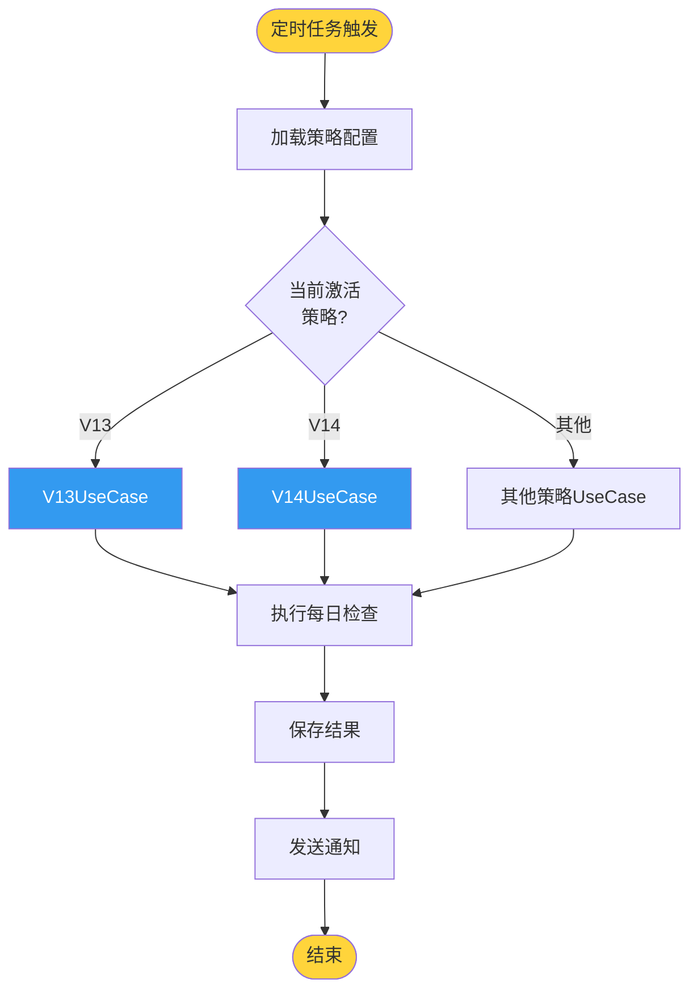
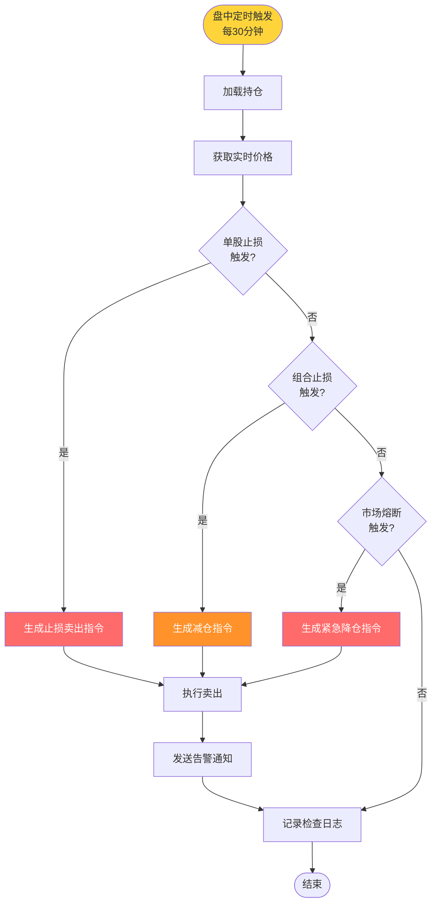
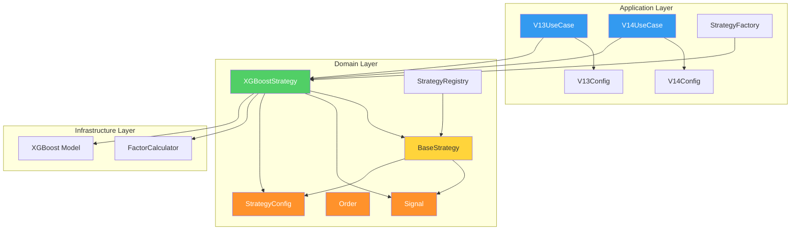

# Strategy Template Pattern Refactor Plan

> **For agentic workers:** REQUIRED SUB-SKILL: Use superpowers:subagent-driven-development (recommended) or superpowers:executing-plans to implement this plan task-by-task. Steps use checkbox (`- [ ]`) syntax for tracking.

**Goal:** 将 V13/V14 从业务硬编码重构为模板模式，分离 Domain（纯算法）和 Application（业务配置）

**Architecture:** BaseStrategy 定义模板方法（算法骨架），XGBoostStrategy 实现纯算法逻辑，V13/V14 作为配置值对象注入到 UseCase 中

**Tech Stack:** Python 3.13, SQLAlchemy, PostgreSQL, XGBoost

---

## Part 0: 现状分析

### 现有数据库表（已存在）

| 表名 | 用途 | 状态 |
|------|------|------|
| `simulation_positions` | 模拟持仓 | ✅ 已有 |
| `simulation_trades` | 模拟交易记录 | ✅ 已有 |
| `simulation_order` | 订单管理 | ✅ 已有 |
| `simulation_pending_orders` | 挂单 | ✅ 已有 |
| `simulation_account` | 模拟账户 | ✅ 已有 |
| `strategy_configs` | 策略配置 | ✅ 已有 |
| `strategy_metadata` | 策略元数据 | ✅ 已有 |
| `strategy_performance` | 策略绩效 | ✅ 已有 |
| `signals` | 交易信号 | ✅ 已有 |
| `signal_executions` | 信号执行 | ✅ 已有 |
| `stop_loss_rules` | 止损规则 | ✅ 已有 |
| `risk_config` | 风险配置 | ✅ 已有 |
| `risk_metrics` | 风险指标 | ✅ 已有 |

### 现有领域层结构

```
domain/
├── strategies/          # 策略层
│   ├── base_strategy.py    # ✅ 模板基类
│   ├── v13_strategy.py     # ❌ 需要重构
│   ├── v14_strategy.py     # ❌ 需要重构
│   └── strategy_registry.py
├── factors/             # 因子库 (13类因子) ✅ 完备
├── risk/                # 风险管理 (VaR/CVaR/压力测试) ✅ 完备
├── trading/             # 交易服务
│   └── services/
│       ├── order_service.py      # ✅ 已有
│       └── trade_guard_service.py # ✅ 已有
└── portfolio/           # 组合管理
    └── services/
        └── position_service.py   # ✅ 已有
```

### 结论

**数据库表完备，无需新增表。** 重构主要是代码层面的分层调整。

---

## Part 1: 值对象提取（Domain Layer）

### Task 1.1: 创建 Signal 值对象

**Files:**
- Create: `domain/strategies/value_objects/signal.py`
- Modify: `domain/strategies/base_strategy.py`

- [ ] **Step 1: 创建 value_objects 目录和 signal.py**

```python
# domain/strategies/value_objects/signal.py
"""交易信号值对象"""
from dataclasses import dataclass, field
from typing import Dict, Any
from enum import Enum


class SignalAction(Enum):
    """信号动作"""
    BUY = "BUY"
    SELL = "SELL"
    HOLD = "HOLD"


@dataclass(frozen=True)
class Signal:
    """交易信号（不可变值对象）"""
    symbol: str
    action: SignalAction
    weight: float  # 目标权重 (0-1)
    score: float   # 预测分数
    reason: str    # 信号原因
    metadata: Dict[str, Any] = field(default_factory=dict)

    def __post_init__(self):
        if not 0 <= self.weight <= 1:
            raise ValueError(f"weight must be in [0, 1], got {self.weight}")
        if self.action not in SignalAction:
            raise ValueError(f"invalid action: {self.action}")
```

- [ ] **Step 2: 运行测试确认失败**

Run: `python -c "from domain.strategies.value_objects.signal import Signal; print('OK')"`
Expected: FAIL with "No module named 'domain.strategies.value_objects'"

- [ ] **Step 3: 创建 `__init__.py`**

```python
# domain/strategies/value_objects/__init__.py
from .signal import Signal, SignalAction

__all__ = ['Signal', 'SignalAction']
```

- [ ] **Step 4: 运行测试确认通过**

Run: `python -c "from domain.strategies.value_objects import Signal, SignalAction; print('OK')"`
Expected: OK

- [ ] **Step 5: Commit**

```bash
git add domain/strategies/value_objects/
git commit -m "feat(domain): add Signal value object"
```

---

### Task 1.2: 创建 Order 值对象

**Files:**
- Create: `domain/strategies/value_objects/order.py`

- [ ] **Step 1: 创建 order.py**

```python
# domain/strategies/value_objects/order.py
"""订单值对象"""
from dataclasses import dataclass, field
from typing import Optional
from enum import Enum
from datetime import datetime


class OrderSide(Enum):
    """订单方向"""
    BUY = "BUY"
    SELL = "SELL"


class OrderStatus(Enum):
    """订单状态"""
    PENDING = "PENDING"
    FILLED = "FILLED"
    PARTIALLY_FILLED = "PARTIALLY_FILLED"
    CANCELLED = "CANCELLED"
    REJECTED = "REJECTED"


@dataclass(frozen=True)
class Order:
    """交易订单（不可变值对象）"""
    symbol: str
    side: OrderSide
    quantity: int
    price: Optional[float] = None
    order_id: Optional[str] = None
    status: OrderStatus = OrderStatus.PENDING
    created_at: datetime = field(default_factory=datetime.now)
    filled_at: Optional[datetime] = None
    filled_price: Optional[float] = None
    filled_quantity: int = 0
    reason: str = ""
    metadata: dict = field(default_factory=dict)

    def __post_init__(self):
        if self.quantity <= 0:
            raise ValueError(f"quantity must be positive, got {self.quantity}")

    @property
    def amount(self) -> float:
        """订单金额"""
        price = self.filled_price or self.price or 0
        return self.quantity * price

    @property
    def is_complete(self) -> bool:
        """订单是否完成"""
        return self.status in (OrderStatus.FILLED, OrderStatus.CANCELLED, OrderStatus.REJECTED)
```

- [ ] **Step 2: 更新 `__init__.py`**

```python
# domain/strategies/value_objects/__init__.py
from .signal import Signal, SignalAction
from .order import Order, OrderSide, OrderStatus

__all__ = ['Signal', 'SignalAction', 'Order', 'OrderSide', 'OrderStatus']
```

- [ ] **Step 3: 运行测试**

Run: `python -c "from domain.strategies.value_objects import Order, OrderSide; print('OK')"`
Expected: OK

- [ ] **Step 4: Commit**

```bash
git add domain/strategies/value_objects/order.py
git commit -m "feat(domain): add Order value object"
```

---

### Task 1.3: 创建 StrategyConfig 值对象

**Files:**
- Create: `domain/strategies/value_objects/strategy_config.py`

- [ ] **Step 1: 创建 strategy_config.py**

```python
# domain/strategies/value_objects/strategy_config.py
"""策略配置值对象"""
from dataclasses import dataclass, field
from typing import Optional, Dict, Any


@dataclass(frozen=True)
class StrategyConfig:
    """策略配置（不可变值对象）"""
    name: str
    version: str
    description: str
    
    # 调仓参数
    rebalance_days: int = 5
    max_positions: int = 8
    max_position_pct: float = 0.85
    
    # 止损参数
    stop_loss_pct: float = -0.12
    trailing_stop_pct: Optional[float] = None
    portfolio_stop_loss_pct: Optional[float] = -0.20
    
    # 模型配置
    model_path: Optional[str] = None
    factors_path: Optional[str] = None
    
    # 其他参数
    params: Dict[str, Any] = field(default_factory=dict)

    def __post_init__(self):
        if not 0 < self.max_position_pct <= 1:
            raise ValueError(f"max_position_pct must be in (0, 1], got {self.max_position_pct}")
        if self.max_positions <= 0:
            raise ValueError(f"max_positions must be positive, got {self.max_positions}")
        if self.rebalance_days <= 0:
            raise ValueError(f"rebalance_days must be positive, got {self.rebalance_days}")

    def get(self, key: str, default: Any = None) -> Any:
        """兼容字典访问"""
        return getattr(self, key, default)
```

- [ ] **Step 2: 更新 `__init__.py`**

```python
# domain/strategies/value_objects/__init__.py
from .signal import Signal, SignalAction
from .order import Order, OrderSide, OrderStatus
from .strategy_config import StrategyConfig

__all__ = [
    'Signal', 'SignalAction',
    'Order', 'OrderSide', 'OrderStatus',
    'StrategyConfig'
]
```

- [ ] **Step 3: 运行测试**

Run: `python -c "from domain.strategies.value_objects import StrategyConfig; print('OK')"`
Expected: OK

- [ ] **Step 4: Commit**

```bash
git add domain/strategies/value_objects/strategy_config.py
git commit -m "feat(domain): add StrategyConfig value object"
```

---

## Part 2: 模板方法重构（Domain Layer）

### Task 2.1: 重构 BaseStrategy 使用值对象

**Files:**
- Modify: `domain/strategies/base_strategy.py`

- [ ] **Step 1: 重写 base_strategy.py**

```python
# domain/strategies/base_strategy.py
"""通用策略基类（模板方法模式）"""
from abc import ABC, abstractmethod
from typing import List, Dict, Any, Optional
from datetime import datetime, date

from domain.strategies.value_objects import Signal, StrategyConfig


class BaseStrategy(ABC):
    """策略基类（模板方法）"""

    def __init__(self, config: StrategyConfig):
        self._config = config
        self._is_initialized = False

    @property
    def config(self) -> StrategyConfig:
        return self._config

    @property
    def is_initialized(self) -> bool:
        return self._is_initialized

    # ========== 模板方法 ==========

    def execute_daily_check(self, date: str, positions: Dict[str, Any] = None) -> Dict[str, Any]:
        """
        每日检查（模板方法）
        
        Args:
            date: 交易日期 YYYY-MM-DD
            positions: 当前持仓 {symbol: {shares, avg_price, ...}}
            
        Returns:
            执行结果
        """
        if not self._is_initialized:
            self.initialize()

        result = {
            'date': date,
            'stop_loss_signals': [],
            'rebalance_needed': False,
            'new_signals': [],
            'orders': [],
        }

        # 1. 止损检查
        if positions:
            result['stop_loss_signals'] = self.check_stop_loss(date, positions)

        # 2. 调仓判断
        last_rebalance = self._get_last_rebalance_date(positions)
        result['rebalance_needed'] = self.should_rebalance(last_rebalance, date, bool(positions))

        # 3. 生成新信号（如果需要调仓）
        if result['rebalance_needed']:
            result['new_signals'] = self.calculate_signals(date)

        # 4. 生成订单
        result['orders'] = self.generate_orders(
            result['stop_loss_signals'] + result['new_signals'],
            positions or {}
        )

        return result

    # ========== 抽象方法（子类必须实现） ==========

    @abstractmethod
    def calculate_signals(self, date: str) -> List[Signal]:
        """计算交易信号"""
        pass

    @abstractmethod
    def check_stop_loss(self, date: str, positions: Dict[str, Any]) -> List[Signal]:
        """检查止损"""
        pass

    # ========== 钩子方法（子类可选实现） ==========

    def initialize(self):
        """初始化策略"""
        self._is_initialized = True
        self._on_init()

    def _on_init(self):
        """初始化钩子"""
        pass

    def _on_trading_day(self, date: str):
        """交易日钩子"""
        pass

    def _on_rebalance(self, date: str):
        """调仓钩子"""
        pass

    # ========== 辅助方法 ==========

    def should_rebalance(self, last_rebalance_date: Optional[str], current_date: str, has_positions: bool = True) -> bool:
        """判断是否需要调仓"""
        if not last_rebalance_date:
            return True

        if not has_positions:
            return True

        last_date = datetime.strptime(last_rebalance_date, '%Y-%m-%d')
        curr_date = datetime.strptime(current_date, '%Y-%m-%d')
        days_diff = (curr_date - last_date).days

        return days_diff >= self.config.rebalance_days

    def validate_signals(self, signals: List[Signal]) -> List[Signal]:
        """验证和过滤信号"""
        from domain.strategies.value_objects import SignalAction
        
        valid_signals = [s for s in signals if s.symbol and s.action in SignalAction]

        buy_signals = [s for s in valid_signals if s.action == SignalAction.BUY]
        if len(buy_signals) > self.config.max_positions:
            buy_signals = sorted(buy_signals, key=lambda x: x.score, reverse=True)[:self.config.max_positions]
            valid_signals = buy_signals + [s for s in valid_signals if s.action == SignalAction.SELL]

        total_weight = sum(s.weight for s in buy_signals)
        if total_weight > self.config.max_position_pct:
            scale = self.config.max_position_pct / total_weight
            buy_signals = [Signal(
                symbol=s.symbol,
                action=s.action,
                weight=s.weight * scale,
                score=s.score,
                reason=s.reason,
                metadata=s.metadata
            ) for s in buy_signals]
            valid_signals = buy_signals + [s for s in valid_signals if s.action == SignalAction.SELL]

        return valid_signals

    def generate_orders(self, signals: List[Signal], positions: Dict[str, Any]) -> List[Dict]:
        """根据信号生成订单"""
        from domain.strategies.value_objects import SignalAction
        
        orders = []
        for signal in signals:
            if signal.action == SignalAction.BUY:
                orders.append({
                    'symbol': signal.symbol,
                    'side': 'BUY',
                    'weight': signal.weight,
                    'score': signal.score,
                    'reason': signal.reason,
                })
            elif signal.action == SignalAction.SELL:
                orders.append({
                    'symbol': signal.symbol,
                    'side': 'SELL',
                    'reason': signal.reason,
                })
        return orders

    def _get_last_rebalance_date(self, positions: Optional[Dict]) -> Optional[str]:
        """从持仓中获取最后调仓日期"""
        if not positions:
            return None
        return positions.get('__meta__', {}).get('last_rebalance_date')

    def get_metadata(self) -> Dict[str, Any]:
        """获取策略元数据"""
        return {
            'name': self.config.name,
            'version': self.config.version,
            'description': self.config.description,
            'rebalance_days': self.config.rebalance_days,
            'max_positions': self.config.max_positions,
            'max_position_pct': self.config.max_position_pct,
            'is_initialized': self._is_initialized,
        }
```

- [ ] **Step 2: 运行测试确认语法正确**

Run: `python -c "from domain.strategies.base_strategy import BaseStrategy; print('OK')"`
Expected: OK

- [ ] **Step 3: Commit**

```bash
git add domain/strategies/base_strategy.py
git commit -m "refactor(domain): BaseStrategy uses value objects"
```

---

### Task 2.2: 创建 XGBoostStrategy 纯算法实现

**Files:**
- Create: `domain/strategies/xgboost_strategy.py`

- [ ] **Step 1: 创建 xgboost_strategy.py**

```python
# domain/strategies/xgboost_strategy.py
"""XGBoost策略 - 纯算法实现"""
import logging
from typing import List, Dict, Any, Optional
from datetime import datetime

from domain.strategies.base_strategy import BaseStrategy
from domain.strategies.value_objects import Signal, SignalAction, StrategyConfig

logger = logging.getLogger(__name__)


class XGBoostStrategy(BaseStrategy):
    """
    XGBoost多因子选股策略
    
    纯算法实现，不包含业务配置和基础设施依赖
    """

    def __init__(self, config: StrategyConfig):
        super().__init__(config)
        self._model = None
        self._factor_calculator = None

    def _on_init(self):
        """初始化模型和因子计算器"""
        # 延迟导入，避免循环依赖
        from live_trading.factor_calculator import V13FactorCalculator
        
        self._factor_calculator = self._create_factor_calculator()
        self._load_model()
        
        logger.info(f"XGBoostStrategy initialized: {self.config.name}")

    def _create_factor_calculator(self):
        """创建因子计算器（工厂方法）"""
        # 默认使用 V13 因子计算器
        # 子类可以覆盖此方法使用不同的因子计算器
        try:
            from live_trading.factor_calculator import V13FactorCalculator
            return V13FactorCalculator()
        except ImportError:
            logger.warning("V13FactorCalculator not available, using stub")
            return StubFactorCalculator()

    def _load_model(self):
        """加载XGBoost模型"""
        if not self.config.model_path:
            logger.warning("No model_path configured")
            return

        try:
            import xgboost as xgb
            self._model = xgb.Booster()
            self._model.load_model(self.config.model_path)
            logger.info(f"Model loaded: {self.config.model_path}")
        except Exception as e:
            logger.error(f"Failed to load model: {e}")
            self._model = None

    def calculate_signals(self, date: str) -> List[Signal]:
        """
        计算交易信号
        
        流程:
        1. 获取股票池
        2. 计算因子
        3. 模型预测
        4. 排名选股
        5. 生成信号
        """
        if not self._model:
            logger.warning("Model not loaded, returning empty signals")
            return []

        # 1. 获取股票池
        stock_pool = self._get_stock_pool(date)
        
        # 2. 计算因子
        factor_data = self._calculate_factors(stock_pool, date)
        
        # 3. 模型预测
        predictions = self._predict(factor_data)
        
        # 4. 排名选股
        ranked_stocks = self._rank_stocks(predictions)
        
        # 5. 生成信号
        signals = self._generate_signals(ranked_stocks, date)
        
        return signals

    def check_stop_loss(self, date: str, positions: Dict[str, Any]) -> List[Signal]:
        """检查止损"""
        signals = []
        
        for symbol, pos in positions.items():
            if symbol.startswith('_'):  # 跳过元数据
                continue
                
            current_price = self._get_current_price(symbol, date)
            if current_price is None:
                continue
                
            avg_price = pos.get('avg_price', 0)
            if avg_price == 0:
                continue
                
            pnl_pct = (current_price - avg_price) / avg_price
            
            # 单股止损
            if pnl_pct <= self.config.stop_loss_pct:
                signals.append(Signal(
                    symbol=symbol,
                    action=SignalAction.SELL,
                    weight=0.0,
                    score=0.0,
                    reason=f"止损触发: {pnl_pct:.2%} <= {self.config.stop_loss_pct:.2%}",
                    metadata={'pnl_pct': pnl_pct, 'type': 'stop_loss'}
                ))
        
        return signals

    # ========== 内部方法 ==========

    def _get_stock_pool(self, date: str) -> List[str]:
        """获取股票池"""
        # TODO: 从数据库或配置获取股票池
        return []

    def _calculate_factors(self, stocks: List[str], date: str) -> Dict[str, Any]:
        """计算因子"""
        if self._factor_calculator:
            return self._factor_calculator.calculate(stocks, date)
        return {}

    def _predict(self, factor_data: Dict[str, Any]) -> Dict[str, float]:
        """模型预测"""
        if not self._model or not factor_data:
            return {}
        
        # TODO: 实现XGBoost预测
        return {}

    def _rank_stocks(self, predictions: Dict[str, float]) -> List[tuple]:
        """排名选股"""
        ranked = sorted(predictions.items(), key=lambda x: x[1], reverse=True)
        return ranked[:self.config.max_positions]

    def _generate_signals(self, ranked_stocks: List[tuple], date: str) -> List[Signal]:
        """生成信号"""
        signals = []
        
        if not ranked_stocks:
            return signals
            
        # 等权分配
        weight_per_stock = self.config.max_position_pct / len(ranked_stocks)
        
        for symbol, score in ranked_stocks:
            signals.append(Signal(
                symbol=symbol,
                action=SignalAction.BUY,
                weight=weight_per_stock,
                score=score,
                reason=f"模型预测分数: {score:.4f}",
                metadata={'date': date}
            ))
        
        return signals

    def _get_current_price(self, symbol: str, date: str) -> Optional[float]:
        """获取当前价格"""
        # TODO: 从数据库获取价格
        return None


class StubFactorCalculator:
    """因子计算器桩"""
    
    def calculate(self, stocks: List[str], date: str) -> Dict[str, Any]:
        return {}
```

- [ ] **Step 2: 运行测试确认语法正确**

Run: `python -c "from domain.strategies.xgboost_strategy import XGBoostStrategy; print('OK')"`
Expected: OK

- [ ] **Step 3: Commit**

```bash
git add domain/strategies/xgboost_strategy.py
git commit -m "feat(domain): add XGBoostStrategy pure algorithm"
```

---

## Part 3: 应用层重构（Application Layer）

### Task 3.1: 创建 V13/V14 配置值对象

**Files:**
- Create: `application/strategies/v13_config.py`
- Create: `application/strategies/v14_config.py`
- Create: `application/strategies/__init__.py`

- [ ] **Step 1: 创建 application/strategies 目录和 __init__.py**

```python
# application/strategies/__init__.py
from .v13_config import V13Config
from .v14_config import V14Config

__all__ = ['V13Config', 'V14Config']
```

- [ ] **Step 2: 创建 v13_config.py**

```python
# application/strategies/v13_config.py
"""V13 策略配置"""
from domain.strategies.value_objects import StrategyConfig


class V13Config:
    """V13 策略配置（业务配置）"""

    @staticmethod
    def create() -> StrategyConfig:
        """创建V13策略配置"""
        return StrategyConfig(
            name="V13 XGBoost Multi-Factor",
            version="1.0.0",
            description="基于XGBoost的多因子选股策略，5日调仓周期，最多持仓8只股票",
            
            # 调仓参数
            rebalance_days=5,
            max_positions=8,
            max_position_pct=0.85,
            
            # 止损参数
            stop_loss_pct=-0.12,
            trailing_stop_pct=-0.08,
            portfolio_stop_loss_pct=-0.20,
            
            # 模型配置
            model_path="live_trading/models/v13_model.json",
            factors_path="live_trading/models/valid_factors.json",
            
            # 其他参数
            params={
                'top_n': 8,
                'position_scale': 0.85,
                'min_score': 0.5,
                'version': 'v13',
            }
        )
```

- [ ] **Step 3: 创建 v14_config.py**

```python
# application/strategies/v14_config.py
"""V14 策略配置"""
from domain.strategies.value_objects import StrategyConfig


class V14Config:
    """V14 策略配置（P0优化版）"""

    @staticmethod
    def create() -> StrategyConfig:
        """创建V14策略配置"""
        return StrategyConfig(
            name="V14 XGBoost Multi-Factor Optimized",
            version="2.1.0",
            description="V14参数优化版：15只持仓，30天调仓，适应牛市环境",
            
            # 调仓参数
            rebalance_days=30,
            max_positions=15,
            max_position_pct=0.95,
            
            # 止损参数
            stop_loss_pct=-0.15,
            trailing_stop_pct=-0.10,
            portfolio_stop_loss_pct=-0.25,
            
            # 模型配置
            model_path="live_trading/models/v14_p0_model.json",
            factors_path="live_trading/models/v14_p0_valid_factors.json",
            
            # 其他参数
            params={
                'top_n': 15,
                'position_scale': 0.95,
                'min_score': 0.5,
                'single_stock_weight': 0.08,
                'single_stock_stop_loss': -0.15,
                'portfolio_stop_loss': -0.20,
                'version': 'v14_optimized',
                'training_samples': 233456,
                'factors': 75,
                'expected_annual_return': 0.35,
                'expected_sharpe': 3.5,
            }
        )
```

- [ ] **Step 4: 运行测试**

Run: `python -c "from application.strategies import V13Config, V14Config; print('OK')"`
Expected: OK

- [ ] **Step 5: Commit**

```bash
git add application/strategies/
git commit -m "feat(application): add V13/V14 config value objects"
```

---

### Task 3.2: 创建策略 UseCase

**Files:**
- Create: `application/strategies/v13_use_case.py`
- Create: `application/strategies/v14_use_case.py`

- [ ] **Step 1: 创建 v13_use_case.py**

```python
# application/strategies/v13_use_case.py
"""V13 策略业务用例"""
import logging
from typing import Dict, Any, Optional
from datetime import datetime

from domain.strategies.xgboost_strategy import XGBoostStrategy
from application.strategies.v13_config import V13Config

logger = logging.getLogger(__name__)


class V13UseCase:
    """
    V13 策略业务用例
    
    职责:
    1. 创建策略实例
    2. 编排交易流程
    3. 持久化结果
    """

    def __init__(self, account_name: str = 'default'):
        self._account_name = account_name
        self._strategy = None

    @property
    def strategy(self) -> XGBoostStrategy:
        if self._strategy is None:
            config = V13Config.create()
            self._strategy = XGBoostStrategy(config)
        return self._strategy

    def execute_daily_check(self, date: Optional[str] = None) -> Dict[str, Any]:
        """
        执行每日检查
        
        Args:
            date: 交易日期，默认今天
            
        Returns:
            执行结果
        """
        if date is None:
            date = datetime.now().strftime('%Y-%m-%d')

        logger.info(f"V13 daily check: {date}")

        # 1. 获取当前持仓
        positions = self._load_positions()

        # 2. 执行策略检查
        result = self.strategy.execute_daily_check(date, positions)

        # 3. 持久化结果
        self._save_result(date, result)

        # 4. 发送通知（可选）
        self._send_notification(result)

        return result

    def _load_positions(self) -> Dict[str, Any]:
        """加载持仓"""
        # TODO: 从数据库加载
        return {}

    def _save_result(self, date: str, result: Dict[str, Any]):
        """保存结果"""
        # TODO: 保存到数据库
        pass

    def _send_notification(self, result: Dict[str, Any]):
        """发送飞书通知"""
        try:
            from utils.feishu_notifier import create_notifier_from_config
            notifier = create_notifier_from_config()
            
            # 如果有调仓操作，发送调仓通知
            if result.get('orders'):
                buy_trades = [o for o in result['orders'] if o.get('side') == 'BUY']
                sell_trades = [o for o in result['orders'] if o.get('side') == 'SELL']
                
                if buy_trades or sell_trades:
                    notification_data = {
                        'date': result.get('date'),
                        'buy_trades': [(t['symbol'], t.get('shares', 0), t.get('price', 0)) for t in buy_trades],
                        'sell_trades': [(t['symbol'], t.get('shares', 0), t.get('price', 0)) for t in sell_trades],
                    }
                    notifier.send_rebalance_notification(notification_data)
            
            # 如果有止损信号，发送风险预警
            if result.get('stop_loss_signals'):
                notifier.send_risk_alert({
                    'trigger': '单股止损触发',
                    'losing_stocks': [s['symbol'] for s in result['stop_loss_signals']],
                })
                
        except Exception as e:
            logger.warning(f"Failed to send notification: {e}")
```

- [ ] **Step 2: 创建 v14_use_case.py**

```python
# application/strategies/v14_use_case.py
"""V14 策略业务用例"""
import logging
from typing import Dict, Any, Optional
from datetime import datetime

from domain.strategies.xgboost_strategy import XGBoostStrategy
from application.strategies.v14_config import V14Config

logger = logging.getLogger(__name__)


class V14UseCase:
    """
    V14 策略业务用例（P0优化版）
    
    与 V13 的区别:
    - 30天调仓周期
    - 15只持仓
    - 优化的止损参数
    """

    def __init__(self, account_name: str = 'default'):
        self._account_name = account_name
        self._strategy = None

    @property
    def strategy(self) -> XGBoostStrategy:
        if self._strategy is None:
            config = V14Config.create()
            self._strategy = XGBoostStrategy(config)
        return self._strategy

    def execute_daily_check(self, date: Optional[str] = None) -> Dict[str, Any]:
        """执行每日检查"""
        if date is None:
            date = datetime.now().strftime('%Y-%m-%d')

        logger.info(f"V14 daily check: {date}")

        positions = self._load_positions()
        result = self.strategy.execute_daily_check(date, positions)
        self._save_result(date, result)
        self._send_notification(result)

        return result

    def _load_positions(self) -> Dict[str, Any]:
        """加载持仓"""
        return {}

    def _save_result(self, date: str, result: Dict[str, Any]):
        """保存结果"""
        pass

    def _send_notification(self, result: Dict[str, Any]):
        """发送飞书通知"""
        try:
            from utils.feishu_notifier import create_notifier_from_config
            notifier = create_notifier_from_config()
            
            # 如果有调仓操作，发送调仓通知
            if result.get('orders'):
                buy_trades = [o for o in result['orders'] if o.get('side') == 'BUY']
                sell_trades = [o for o in result['orders'] if o.get('side') == 'SELL']
                
                if buy_trades or sell_trades:
                    notification_data = {
                        'date': result.get('date'),
                        'buy_trades': [(t['symbol'], t.get('shares', 0), t.get('price', 0)) for t in buy_trades],
                        'sell_trades': [(t['symbol'], t.get('shares', 0), t.get('price', 0)) for t in sell_trades],
                    }
                    notifier.send_rebalance_notification(notification_data)
            
            # 如果有止损信号，发送风险预警
            if result.get('stop_loss_signals'):
                notifier.send_risk_alert({
                    'trigger': '单股止损触发',
                    'losing_stocks': [s['symbol'] for s in result['stop_loss_signals']],
                })
                
        except Exception as e:
            logger.warning(f"Failed to send notification: {e}")
```

- [ ] **Step 3: 运行测试**

Run: `python -c "from application.strategies.v13_use_case import V13UseCase; print('OK')"`
Expected: OK

- [ ] **Step 4: Commit**

```bash
git add application/strategies/v13_use_case.py application/strategies/v14_use_case.py
git commit -m "feat(application): add V13/V14 use cases"
```

---

### Task 3.3: 创建策略工厂

**Files:**
- Create: `application/strategies/strategy_factory.py`

- [ ] **Step 1: 创建 strategy_factory.py**

```python
# application/strategies/strategy_factory.py
"""策略工厂"""
from typing import Dict, Type

from domain.strategies.base_strategy import BaseStrategy
from domain.strategies.value_objects import StrategyConfig


class StrategyFactory:
    """策略工厂"""

    _strategies: Dict[str, Type[BaseStrategy]] = {}

    @classmethod
    def register(cls, name: str, strategy_class: Type[BaseStrategy]):
        """注册策略类"""
        cls._strategies[name] = strategy_class

    @classmethod
    def create(cls, name: str, config: StrategyConfig) -> BaseStrategy:
        """创建策略实例"""
        if name not in cls._strategies:
            raise ValueError(f"Strategy '{name}' not registered")
        
        strategy_class = cls._strategies[name]
        return strategy_class(config)

    @classmethod
    def list_strategies(cls):
        """列出所有已注册策略"""
        return list(cls._strategies.keys())


# 默认注册
def register_default_strategies():
    """注册默认策略"""
    from domain.strategies.xgboost_strategy import XGBoostStrategy
    
    StrategyFactory.register('xgboost', XGBoostStrategy)


# 自动注册
register_default_strategies()
```

- [ ] **Step 2: 运行测试**

Run: `python -c "from application.strategies.strategy_factory import StrategyFactory; print('OK')"`
Expected: OK

- [ ] **Step 3: Commit**

```bash
git add application/strategies/strategy_factory.py
git commit -m "feat(application): add StrategyFactory"
```

---

## Part 4: 统一定时任务设计

### 设计原则

**核心思想**: 定时任务不区分 V13/V14，只区分任务类型。策略选择通过配置决定。

```
当前（错误）                          重构后（正确）
══════════════════════════════════════════════════════════════

v13_daily_check (14:30)           → strategy_daily_check (14:30)
v13_risk_check (16:00)            → strategy_risk_check (16:00)
v13_verification (16:30)          → strategy_verification (16:30)
v14_daily_check (14:30)           → (删除，使用同一个任务)
```

### 统一后的任务流程



### 任务配置表设计

**需要新增/修改的表字段:**

```sql
-- 在 strategy_configs 表中新增 active 字段
ALTER TABLE quant.strategy_configs 
ADD COLUMN IF NOT EXISTS is_active BOOLEAN DEFAULT false;

-- 在 automation_tasks 中使用 strategy_id 关联
-- metadata 中存储 strategy_id，指向 strategy_configs
```

### Task 4.1: 创建策略执行服务

**Files:**
- Create: `application/strategies/strategy_executor.py`

- [ ] **Step 1: 创建 strategy_executor.py**

```python
# application/strategies/strategy_executor.py
"""统一策略执行服务"""
import logging
from typing import Dict, Any, Optional
from datetime import datetime

from application.strategies.v13_use_case import V13UseCase
from application.strategies.v14_use_case import V14UseCase

logger = logging.getLogger(__name__)

# 策略注册表
STRATEGY_REGISTRY = {
    'v13': V13UseCase,
    'v14': V14UseCase,
}


class StrategyExecutor:
    """
    统一策略执行服务
    
    职责:
    1. 根据配置选择策略
    2. 执行每日检查
    3. 统一结果格式
    """

    @staticmethod
    def get_active_strategy() -> str:
        """获取当前激活的策略"""
        # TODO: 从数据库读取激活策略
        # 目前默认返回 v13
        return 'v13'

    @staticmethod
    def execute_daily_check(
        strategy_id: Optional[str] = None,
        date: Optional[str] = None,
        account_name: str = 'default'
    ) -> Dict[str, Any]:
        """
        执行每日检查（统一入口）
        
        Args:
            strategy_id: 策略ID（v13/v14），None则使用激活策略
            date: 交易日期，默认今天
            account_name: 账户名称
            
        Returns:
            执行结果
        """
        # 1. 确定策略
        if strategy_id is None:
            strategy_id = StrategyExecutor.get_active_strategy()
        
        # 2. 获取策略用例
        if strategy_id not in STRATEGY_REGISTRY:
            raise ValueError(f"Unknown strategy: {strategy_id}")
        
        use_case_class = STRATEGY_REGISTRY[strategy_id]
        use_case = use_case_class(account_name=account_name)
        
        # 3. 执行
        logger.info(f"Executing strategy: {strategy_id}")
        result = use_case.execute_daily_check(date)
        
        # 4. 统一结果格式
        result['strategy_id'] = strategy_id
        result['executor'] = 'StrategyExecutor'
        
        return result

    @staticmethod
    def execute_risk_check(
        strategy_id: Optional[str] = None,
        date: Optional[str] = None
    ) -> Dict[str, Any]:
        """
        执行风控检查（统一入口）
        """
        if strategy_id is None:
            strategy_id = StrategyExecutor.get_active_strategy()
        
        logger.info(f"Executing risk check for strategy: {strategy_id}")
        
        # TODO: 调用风控服务
        return {
            'strategy_id': strategy_id,
            'date': date or datetime.now().strftime('%Y-%m-%d'),
            'risk_status': 'ok',
        }

    @staticmethod
    def execute_verification(
        strategy_id: Optional[str] = None,
        date: Optional[str] = None
    ) -> Dict[str, Any]:
        """
        执行交易验证（统一入口）
        """
        if strategy_id is None:
            strategy_id = StrategyExecutor.get_active_strategy()
        
        logger.info(f"Executing verification for strategy: {strategy_id}")
        
        # TODO: 调用验证服务
        return {
            'strategy_id': strategy_id,
            'date': date or datetime.now().strftime('%Y-%m-%d'),
            'verification_status': 'ok',
        }
```

- [ ] **Step 2: 运行测试**

Run: `python -c "from application.strategies.strategy_executor import StrategyExecutor; print('OK')"`
Expected: OK

- [ ] **Step 3: Commit**

```bash
git add application/strategies/strategy_executor.py
git commit -m "feat(application): add unified StrategyExecutor"
```

---

### Task 4.2: 更新定时任务配置

**Files:**
- Modify: `tools/register_jobs_to_agent_os.py`

- [ ] **Step 1: 替换 V13/V14 任务为统一任务**

```python
# tools/register_jobs_to_agent_os.py
# 替换原来的 v13_daily_check, v13_risk_check, v13_verification, v14_daily_check

JOBS = [
    # ... 其他任务保持不变 ...

    # ===== 统一策略任务 =====
    
    # 策略每日检查 (14:30，收盘前)
    {
        "name": "strategy_daily_check",
        "owner": "quantsys-v2",
        "cron": "30 14 * * 1-5",  # 工作日 14:30
        "webhook_url": "http://127.0.0.1:5001/internal/scheduler/webhook",
        "service_name": "quantsys-v2",
        "enabled": True,
        "timeout": 600,
        "retry_count": 1,
        "metadata": {
            "job_type": "strategy_daily_check",
            "description": "统一策略每日检查（自动选择激活策略）"
        }
    },

    # 策略风控检查 (16:00，收盘后)
    {
        "name": "strategy_risk_check",
        "owner": "quantsys-v2",
        "cron": "0 16 * * 1-5",  # 工作日 16:00
        "webhook_url": "http://127.0.0.1:5001/internal/scheduler/webhook",
        "service_name": "quantsys-v2",
        "enabled": True,
        "timeout": 300,
        "retry_count": 1,
        "metadata": {
            "job_type": "strategy_risk_check",
            "description": "统一策略风控检查"
        }
    },

    # 策略交易验证 (16:30)
    {
        "name": "strategy_verification",
        "owner": "quantsys-v2",
        "cron": "30 16 * * 1-5",  # 工作日 16:30
        "webhook_url": "http://127.0.0.1:5001/internal/scheduler/webhook",
        "service_name": "quantsys-v2",
        "enabled": True,
        "timeout": 300,
        "retry_count": 1,
        "metadata": {
            "job_type": "strategy_verification",
            "description": "统一策略交易验证"
        }
    },

    # ... 其他任务保持不变 ...
]
```

- [ ] **Step 2: 删除旧的 V13/V14 任务**

```python
# 删除以下任务
# v13_daily_check
# v13_risk_check
# v13_verification
# v14_daily_check
```

- [ ] **Step 3: Commit**

```bash
git add tools/register_jobs_to_agent_os.py
git commit -m "refactor: unify V13/V14 scheduled tasks"
```

---

### Task 4.3: 创建数据库迁移（添加 active 字段）

**Files:**
- Create: `migrations/add_strategy_active_field.sql`

- [ ] **Step 1: 创建迁移文件**

```sql
-- migrations/add_strategy_active_field.sql
-- 添加策略激活字段，支持策略切换

-- 1. 添加 is_active 字段
ALTER TABLE quant.strategy_configs 
ADD COLUMN IF NOT EXISTS is_active BOOLEAN DEFAULT false;

-- 2. 创建唯一索引（确保只有一个策略激活）
CREATE UNIQUE INDEX IF NOT EXISTS idx_strategy_configs_active 
ON quant.strategy_configs (is_active) 
WHERE is_active = true;

-- 3. 设置 V13 为默认激活策略
UPDATE quant.strategy_configs 
SET is_active = true 
WHERE name LIKE '%V13%' 
LIMIT 1;

-- 注释
COMMENT ON COLUMN quant.strategy_configs.is_active IS '是否为当前激活的策略（同一时间只能有一个激活）';

-- 完成提示
DO $$
BEGIN
    RAISE NOTICE '✓ Strategy active field added';
    RAISE NOTICE '  - is_active field added to strategy_configs';
    RAISE NOTICE '  - Unique index created for active strategy';
END $$;
```

- [ ] **Step 2: Commit**

```bash
git add migrations/add_strategy_active_field.sql
git commit -m "feat(migration): add strategy active field"
```

---

### Task 4.4: 更新 Webhook 处理器

**Files:**
- Modify: `api/routes/scheduler.py` 或相关 webhook 处理器

- [ ] **Step 1: 更新 webhook 处理逻辑**

```python
# api/routes/scheduler.py 或相关文件
from application.strategies.strategy_executor import StrategyExecutor

def handle_scheduler_webhook(job_type: str, metadata: dict) -> dict:
    """处理调度器 webhook"""
    
    if job_type == 'strategy_daily_check':
        return StrategyExecutor.execute_daily_check()
    
    elif job_type == 'strategy_risk_check':
        return StrategyExecutor.execute_risk_check()
    
    elif job_type == 'strategy_verification':
        return StrategyExecutor.execute_verification()
    
    # ... 其他任务处理 ...
```

- [ ] **Step 2: Commit**

```bash
git add api/routes/scheduler.py
git commit -m "refactor(api): use unified StrategyExecutor"
```

---

## Part 5: 盘中风控设计（新增）

### 问题分析

当前风控只在调仓日检查，盘中完全没有风控：

| 风控类型 | 当前状态 | 应有状态 |
|---------|---------|---------|
| 单股止损 | 调仓日检查 | 盘中每30分钟检查 |
| 组合止损 | 调仓日检查 | 盘中每30分钟检查 |
| 紧急止损 | ❌ 无 | 价格触发立即执行 |
| 市场熔断 | ❌ 无 | 大盘暴跌降仓 |

### 盘中风控流程



### Task 5.1: 创建盘中风控服务

**Files:**
- Create: `application/risk/intraday_risk_service.py`

- [ ] **Step 1: 创建 intraday_risk_service.py**

```python
# application/risk/intraday_risk_service.py
"""盘中风控服务"""
import logging
from typing import Dict, List, Any, Optional
from datetime import datetime

logger = logging.getLogger(__name__)


class IntradayRiskService:
    """
    盘中风控服务
    
    职责:
    1. 定期检查持仓盈亏（每30分钟）
    2. 触发止损/减仓指令
    3. 市场熔断检测
    4. 发送风险告警
    """

    def __init__(self, config: Dict[str, Any] = None):
        """
        Args:
            config: 风控配置
                - single_stop_loss: 单股止损线（默认-0.10）
                - portfolio_stop_loss: 组合止损线（默认-0.15）
                - market_circuit_breaker: 大盘熔断线（默认-0.05）
                - check_interval_minutes: 检查间隔（默认30分钟）
        """
        self.config = config or {}
        self.single_stop_loss = self.config.get('single_stop_loss', -0.10)
        self.portfolio_stop_loss = self.config.get('portfolio_stop_loss', -0.15)
        self.market_circuit_breaker = self.config.get('market_circuit_breaker', -0.05)
        self.check_interval = self.config.get('check_interval_minutes', 30)

    def check_intraday_risk(
        self,
        positions: Dict[str, Any],
        current_prices: Dict[str, float],
        market_index_change: float = 0.0
    ) -> Dict[str, Any]:
        """
        盘中风控检查
        
        Args:
            positions: 当前持仓 {symbol: {shares, avg_price, ...}}
            current_prices: 当前价格 {symbol: price}
            market_index_change: 大盘涨跌幅（如-0.03表示-3%）
            
        Returns:
            风控结果
        """
        result = {
            'timestamp': datetime.now().isoformat(),
            'single_stop_loss_triggered': [],
            'portfolio_stop_loss_triggered': False,
            'market_circuit_breaker_triggered': False,
            'risk_actions': [],
        }

        # 1. 单股止损检查
        single_stop = self._check_single_stop_loss(positions, current_prices)
        result['single_stop_loss_triggered'] = single_stop

        # 2. 组合止损检查
        portfolio_stop = self._check_portfolio_stop_loss(positions, current_prices)
        result['portfolio_stop_loss_triggered'] = portfolio_stop

        # 3. 市场熔断检查
        market_break = self._check_market_circuit_breaker(market_index_change)
        result['market_circuit_breaker_triggered'] = market_break

        # 4. 生成风控指令
        result['risk_actions'] = self._generate_risk_actions(
            single_stop, portfolio_stop, market_break, positions
        )

        return result

    def _check_single_stop_loss(
        self,
        positions: Dict[str, Any],
        current_prices: Dict[str, float]
    ) -> List[Dict]:
        """检查单股止损"""
        triggered = []
        
        for symbol, pos in positions.items():
            if symbol.startswith('_'):
                continue
                
            if symbol not in current_prices:
                continue
                
            avg_price = pos.get('avg_price', 0)
            if avg_price == 0:
                continue
                
            current_price = current_prices[symbol]
            pnl_pct = (current_price - avg_price) / avg_price
            
            if pnl_pct <= self.single_stop_loss:
                triggered.append({
                    'symbol': symbol,
                    'avg_price': avg_price,
                    'current_price': current_price,
                    'pnl_pct': pnl_pct,
                    'stop_loss_line': self.single_stop_loss,
                })
                logger.warning(
                    f"单股止损触发: {symbol} "
                    f"盈亏 {pnl_pct:.2%} <= {self.single_stop_loss:.2%}"
                )
        
        return triggered

    def _check_portfolio_stop_loss(
        self,
        positions: Dict[str, Any],
        current_prices: Dict[str, float]
    ) -> bool:
        """检查组合止损"""
        # 获取峰值（从元数据）
        peak_value = positions.get('__meta__', {}).get('peak_value', 0)
        if peak_value == 0:
            return False
        
        # 计算当前总值
        current_value = 0
        for symbol, pos in positions.items():
            if symbol.startswith('_'):
                continue
            shares = pos.get('shares', 0)
            price = current_prices.get(symbol, pos.get('avg_price', 0))
            current_value += shares * price
        
        # 加上现金
        cash = positions.get('__meta__', {}).get('cash', 0)
        current_value += cash
        
        # 计算回撤
        drawdown = (current_value - peak_value) / peak_value
        
        if drawdown <= self.portfolio_stop_loss:
            logger.warning(
                f"组合止损触发: 回撤 {drawdown:.2%} <= {self.portfolio_stop_loss:.2%}"
            )
            return True
        
        return False

    def _check_market_circuit_breaker(self, market_index_change: float) -> bool:
        """检查市场熔断"""
        if market_index_change <= self.market_circuit_breaker:
            logger.warning(
                f"市场熔断触发: 大盘跌幅 {market_index_change:.2%} <= {self.market_circuit_breaker:.2%}"
            )
            return True
        return False

    def _generate_risk_actions(
        self,
        single_stop: List[Dict],
        portfolio_stop: bool,
        market_break: bool,
        positions: Dict[str, Any]
    ) -> List[Dict]:
        """生成风控指令"""
        actions = []
        
        # �股止损指令
        for item in single_stop:
            actions.append({
                'action': 'SELL',
                'symbol': item['symbol'],
                'reason': f"单股止损: {item['pnl_pct']:.2%}",
                'urgency': 'HIGH',
            })
        
        # 组合止损指令（减仓50%）
        if portfolio_stop:
            actions.append({
                'action': 'REDUCE',
                'percentage': 0.5,
                'reason': f"组合止损触发",
                'urgency': 'HIGH',
            })
        
        # 市场熔断指令（清仓）
        if market_break:
            actions.append({
                'action': 'CLEAR',
                'reason': f"市场熔断触发",
                'urgency': 'CRITICAL',
            })
        
        return actions
```

- [ ] **Step 2: 运行测试**

Run: `python -c "from application.risk.intraday_risk_service import IntradayRiskService; print('OK')"`
Expected: OK

- [ ] **Step 3: Commit**

```bash
git add application/risk/intraday_risk_service.py
git commit -m "feat(application): add intraday risk service"
```

---

### Task 5.2: 添加盘中风控定时任务

**Files:**
- Modify: `tools/register_jobs_to_agent_os.py`

- [ ] **Step 1: 添加盘中风控任务**

```python
# tools/register_jobs_to_agent_os.py
# 在 JOBS 列表中添加

    # ===== 盘中风控任务 =====
    
    # 盘中风控检查（交易时间内每30分钟）
    {
        "name": "intraday_risk_check",
        "owner": "quantsys-v2",
        "cron": "0,30 10-14 * * 1-5",  # 工作日 10:00-14:30 每30分钟
        "webhook_url": "http://127.0.0.1:5001/internal/scheduler/webhook",
        "service_name": "quantsys-v2",
        "enabled": True,
        "timeout": 120,
        "retry_count": 1,
        "metadata": {
            "job_type": "intraday_risk_check",
            "description": "盘中风控检查（每30分钟）"
        }
    },
```

- [ ] **Step 2: Commit**

```bash
git add tools/register_jobs_to_agent_os.py
git commit -m "feat: add intraday risk check schedule"
```

---

### Task 5.3: 更新 Webhook 处理器

**Files:**
- Modify: `api/routes/scheduler.py`

- [ ] **Step 1: 添加盘中风控处理**

```python
# api/routes/scheduler.py
from application.risk.intraday_risk_service import IntradayRiskService

def handle_scheduler_webhook(job_type: str, metadata: dict) -> dict:
    """处理调度器 webhook"""
    
    # ... 其他任务处理 ...
    
    elif job_type == 'intraday_risk_check':
        return _handle_intraday_risk_check()
    
    # ... 其他任务处理 ...


def _handle_intraday_risk_check() -> dict:
    """处理盘中风控检查"""
    from application.strategies.strategy_executor import StrategyExecutor
    
    # 获取当前策略
    strategy_id = StrategyExecutor.get_active_strategy()
    
    # 加载持仓
    positions = _load_positions(strategy_id)
    
    # 获取实时价格
    current_prices = _get_current_prices(positions)
    
    # 获取大盘涨跌
    market_index_change = _get_market_index_change()
    
    # 执行风控检查
    risk_service = IntradayRiskService()
    result = risk_service.check_intraday_risk(
        positions=positions,
        current_prices=current_prices,
        market_index_change=market_index_change
    )
    
    # 如果有风控指令，执行卖出并发送通知
    if result['risk_actions']:
        _execute_risk_actions(result['risk_actions'])
        
        # 发送风险告警通知
        try:
            from utils.feishu_notifier import create_notifier_from_config
            notifier = create_notifier_from_config()
            
            # 构建告警消息
            alerts = []
            for action in result['risk_actions']:
                alerts.append(f"{action['action']}: {action.get('symbol', '')} {action.get('reason', '')}")
            
            notifier.send_risk_alert({
                'trigger': '盘中风控触发',
                'losing_stocks': alerts,
            })
        except Exception as e:
            logger.warning(f"Failed to send risk alert: {e}")
    
    return result
```

- [ ] **Step 2: Commit**

```bash
git add api/routes/scheduler.py
git commit -m "feat(api): handle intraday risk check"
```

---

## Part 6: 清理旧代码

### Task 4.1: 归档旧策略文件

**Files:**
- Move: `domain/strategies/v13_strategy.py` → `docs/archive/v13_strategy_legacy.py`
- Move: `domain/strategies/v14_strategy.py` → `docs/archive/v14_strategy_legacy.py`

- [ ] **Step 1: 创建 archive 目录**

```bash
mkdir -p docs/archive
```

- [ ] **Step 2: 移动旧文件**

```bash
git mv domain/strategies/v13_strategy.py docs/archive/v13_strategy_legacy.py
git mv domain/strategies/v14_strategy.py docs/archive/v14_strategy_legacy.py
```

- [ ] **Step 3: Commit**

```bash
git add docs/archive/
git commit -m "chore: archive legacy V13/V14 strategies"
```

---

### Task 4.2: 更新策略注册表

**Files:**
- Modify: `domain/strategies/strategy_registry.py`
- Modify: `domain/strategies/__init__.py`

- [ ] **Step 1: 更新 strategy_registry.py**

```python
# domain/strategies/strategy_registry.py
"""策略注册表"""
from typing import Dict, Optional, List
from .base_strategy import BaseStrategy


class StrategyRegistry:
    """策略注册表（单例）"""

    _instance = None

    def __new__(cls):
        if cls._instance is None:
            cls._instance = super().__new__(cls)
            cls._instance._strategies = {}
        return cls._instance

    def register(self, strategy_id: str, strategy: BaseStrategy):
        """注册策略"""
        if strategy_id in self._strategies:
            raise ValueError(f"Strategy '{strategy_id}' already registered")
        
        self._strategies[strategy_id] = strategy
        print(f"✓ Registered strategy: {strategy_id} ({strategy.config.name} {strategy.config.version})")
    
    def get(self, strategy_id: str) -> Optional[BaseStrategy]:
        """获取策略"""
        return self._strategies.get(strategy_id)
    
    def list_all(self) -> List[Dict]:
        """列出所有策略"""
        result = []
        for strategy_id, strategy in self._strategies.items():
            metadata = strategy.get_metadata()
            metadata['id'] = strategy_id
            result.append(metadata)
        return result
    
    def unregister(self, strategy_id: str):
        """注销策略"""
        if strategy_id in self._strategies:
            del self._strategies[strategy_id]
    
    def clear(self):
        """清空（测试用）"""
        self._strategies.clear()


# 全局单例
registry = StrategyRegistry()


def get_registry() -> StrategyRegistry:
    """获取全局策略注册表"""
    return registry
```

- [ ] **Step 2: 更新 __init__.py**

```python
# domain/strategies/__init__.py
"""策略领域"""
from .base_strategy import BaseStrategy
from .xgboost_strategy import XGBoostStrategy
from .strategy_registry import StrategyRegistry, get_registry
from .value_objects import Signal, SignalAction, StrategyConfig

__all__ = [
    'BaseStrategy',
    'XGBoostStrategy',
    'StrategyRegistry',
    'get_registry',
    'Signal',
    'SignalAction',
    'StrategyConfig',
]
```

- [ ] **Step 3: Commit**

```bash
git add domain/strategies/
git commit -m "refactor(domain): update strategy registry and init"
```

---

## Part 5: 验证

### Task 5.1: 集成测试

- [ ] **Step 1: 创建测试文件**

```python
# tests/domain/strategies/test_strategy_refactor.py
"""策略重构集成测试"""
import pytest
from domain.strategies import (
    BaseStrategy, XGBoostStrategy, StrategyConfig,
    Signal, SignalAction
)


class TestStrategyConfig:
    def test_create_config(self):
        config = StrategyConfig(
            name="Test Strategy",
            version="1.0.0",
            description="Test",
            rebalance_days=5,
            max_positions=8,
        )
        assert config.name == "Test Strategy"
        assert config.rebalance_days == 5

    def test_config_immutable(self):
        config = StrategyConfig(name="Test", version="1.0", description="Test")
        with pytest.raises(AttributeError):
            config.name = "Changed"


class TestSignal:
    def test_create_signal(self):
        signal = Signal(
            symbol="000001.SZ",
            action=SignalAction.BUY,
            weight=0.1,
            score=0.8,
            reason="Test"
        )
        assert signal.symbol == "000001.SZ"
        assert signal.action == SignalAction.BUY

    def test_signal_immutable(self):
        signal = Signal(
            symbol="000001.SZ",
            action=SignalAction.BUY,
            weight=0.1,
            score=0.8,
            reason="Test"
        )
        with pytest.raises(AttributeError):
            signal.symbol = "Changed"


class TestXGBoostStrategy:
    def test_create_strategy(self):
        config = StrategyConfig(
            name="Test",
            version="1.0",
            description="Test",
            model_path=None,  # 不加载模型
        )
        strategy = XGBoostStrategy(config)
        assert strategy.config.name == "Test"
        assert not strategy.is_initialized

    def test_strategy_metadata(self):
        config = StrategyConfig(
            name="Test",
            version="1.0",
            description="Test",
        )
        strategy = XGBoostStrategy(config)
        metadata = strategy.get_metadata()
        assert metadata['name'] == "Test"
        assert metadata['version'] == "1.0"
```

- [ ] **Step 2: 运行测试**

Run: `pytest tests/domain/strategies/test_strategy_refactor.py -v`
Expected: PASS

- [ ] **Step 3: Commit**

```bash
git add tests/domain/strategies/test_strategy_refactor.py
git commit -m "test(domain): add strategy refactor tests"
```

---

### Task 5.2: 语法检查

- [ ] **Step 1: 运行语法检查**

```bash
cd /Users/yunpeng/pi-investment/quantsys-v2
python -m py_compile domain/strategies/__init__.py
python -m py_compile domain/strategies/base_strategy.py
python -m py_compile domain/strategies/xgboost_strategy.py
python -m py_compile application/strategies/__init__.py
python -m py_compile application/strategies/v13_config.py
python -m py_compile application/strategies/v14_config.py
python -m py_compile application/strategies/v13_use_case.py
python -m py_compile application/strategies/v14_use_case.py
python -m py_compile application/strategies/strategy_factory.py
```

Expected: All OK

- [ ] **Step 2: Commit**

```bash
git add -A
git commit -m "chore: verify syntax for all new files"
```

---

## 依赖关系图



---

## 完成检查

- [ ] 所有 Task 完成
- [ ] 所有测试通过
- [ ] 语法检查通过
- [ ] 无循环依赖
- [ ] 旧代码已归档
- [ ] 文档已更新
