# Quant System Architecture Documentation Design

**设计日期**: 2026-05-20  
**设计目标**: 梳理量化系统的接口、功能、数据表，发现重复代码，进行模块化重构  
**文档类型**: 系统架构文档（单一综合文档）

---

## 目录

1. [系统概览](#1-系统概览)
2. [架构图](#2-架构图)
3. [数据库设计](#3-数据库设计)
4. [API接口清单](#4-api接口清单)
5. [核心模块详解](#5-核心模块详解)
6. [重复代码分析矩阵](#6-重复代码分析矩阵)
7. [重构建议](#7-重构建议)
8. [数据流图](#8-数据流图)
9. [接口依赖关系图](#9-接口依赖关系图)
10. [重构路线图](#10-重构路线图)
11. [对外功能流程图](#11-对外功能流程图)

---

## 1. 系统概览

### 1.1 项目简介

**QuantSys** 是一个完整的量化交易系统，提供从数据获取、因子计算、策略回测到信号生成的全流程支持。

**项目路径**: `/Users/mac/Documents/ai/pi-investment/quant/`

**核心定位**:
- 数据驱动的量化交易平台
- 支持多策略组合和机器学习预测
- 完整的风控和回测体系

### 1.2 技术栈

**后端核心**:
- Python 3.x - 核心业务逻辑
- Flask - RESTful API服务
- PostgreSQL - 数据持久化
- XGBoost - 机器学习模型

**数据源**:
- AkShare - A股市场数据

**前端集成**:
- TypeScript - Agent工具调用
- React - Web界面（quant-web）

**部署运维**:
- Scheduler - 定时任务调度
- Subprocess - 异步任务执行

### 1.3 架构演进

#### 重构前（2026-05-19之前）
```
问题：
- 17个脚本直接import quantsys（绕过Flask API）
- Flask API仅被TypeScript前端使用
- 三条数据路径：Script→quantsys / Flask→quantsys / TS→Flask→quantsys
- 架构混乱，职责不清
```

#### 重构后（2026-05-19）
```
改进：
- 统一入口：所有外部调用通过Flask API
- 脚本改为HTTP客户端（15个）
- ETL/计算脚本通过Flask子进程触发（10个）
- 清晰的分层架构
```

### 1.4 核心设计原则

1. **统一API入口** - Flask API是唯一的quantsys集成点
2. **事件驱动回测** - 回测引擎基于事件驱动架构
3. **因子模块化** - 42个因子基于统一的Factor基类
4. **策略可组合** - 支持多策略投票/AND/OR组合
5. **风控前置** - 预交易风控7项检查
6. **防腐层模式** - 多层防腐保护核心业务逻辑
   - **对外防腐层**：CLI/API/Scheduler（保护系统不受外部调用方影响）
   - **对下防腐层**：Adapters/Repositories（保护服务层不受底层实现影响）
7. **通用方法原则** - 数据层提供通用查询方法，通过参数控制，避免为每个调用方写专用方法
8. **按业务分类** - 每个文件夹内按业务类型（股票、市场、策略、风控）分文件，不按调用方分

### 1.5 项目统计

- **代码总量**: 10,973行
- **测试用例**: 73+
- **因子数量**: 42个（24技术 + 18基本面）
- **策略数量**: 3个经典策略
- **API端点**: 64个路由
- **CLI函数**: 298个函数
- **数据表**: 6个核心表
- **测试通过率**: 100%

---

## 2. 架构图

### 2.1 系统分层架构（重构后）

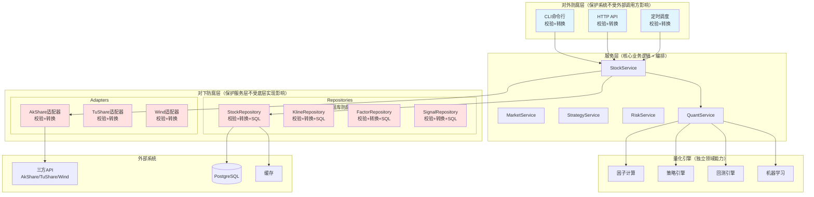

### 2.2 防腐层详解

#### 2.2.1 对外防腐层（CLI/API/Scheduler）

**职责**：保护系统不受外部调用方影响

**功能**：
- ✅ 参数校验（格式、类型、范围）
- ✅ 数据转换（外部格式 → 内部格式）
- ✅ 错误处理（友好的错误信息）
- ✅ 日志记录（调用追踪）

**示例**：
```python
# api/stock_routes.py - 对外防腐层

@app.route('/api/stock/<symbol>/info', methods=['GET'])
def get_stock_info(symbol: str):
    """股票信息API - 对外防腐层"""
    try:
        # 1. 参数校验
        if not symbol or len(symbol) != 6:
            return jsonify({'error': 'Invalid symbol'}), 400
        
        # 2. 数据转换（API层 → 服务层）
        normalized_symbol = symbol.strip().upper()
        
        # 3. 调用服务层
        result = stock_service.get_stock_info(normalized_symbol)
        
        # 4. 数据转换（服务层 → API层）
        response = {
            'code': 0,
            'data': result,
            'message': 'success'
        }
        
        return jsonify(response), 200
        
    except Exception as e:
        # 5. 错误处理
        return jsonify({'error': str(e)}), 500
```

#### 2.2.2 对下防腐层（Adapters/Repositories）

**职责**：保护服务层不受底层实现影响

##### Adapters - 三方接口防腐层

**功能**：
- ✅ 封装三方API调用
- ✅ 参数校验和转换
- ✅ 响应数据标准化
- ✅ 错误处理和重试
- ✅ 当三方API变化时，只需修改Adapter，服务层不受影响

**示例**：
```python
# adapters/akshare_adapter.py - 对下防腐层

class AkShareAdapter:
    """AkShare适配器 - 对下防腐层"""
    
    def get_stock_info(self, symbol: str) -> Dict:
        """获取股票信息 - 封装AkShare API"""
        try:
            # 1. 参数校验
            self._validate_symbol(symbol)
            
            # 2. 参数转换（内部格式 → AkShare格式）
            akshare_symbol = self._to_akshare_symbol(symbol)
            
            # 3. 调用三方API
            raw_data = akshare.stock_individual_info_em(akshare_symbol)
            
            # 4. 数据转换（AkShare格式 → 内部格式）
            standardized_data = self._standardize_stock_info(raw_data)
            
            return standardized_data
            
        except Exception as e:
            # 5. 错误处理
            raise AdapterException(f"AkShare API failed: {e}")
    
    def _to_akshare_symbol(self, symbol: str) -> str:
        """内部格式 → AkShare格式"""
        # 600519 → sh600519
        if symbol.startswith('6'):
            return f'sh{symbol}'
        else:
            return f'sz{symbol}'
    
    def _standardize_stock_info(self, raw_data: Any) -> Dict:
        """AkShare格式 → 内部标准格式"""
        return {
            'symbol': raw_data['代码'],
            'name': raw_data['名称'],
            'market': raw_data['市场'],
            'industry': raw_data['行业']
        }
```

##### Repositories - 数据库防腐层

**功能**：
- ✅ 封装数据库操作
- ✅ 参数校验和SQL注入防护
- ✅ 数据转换（数据库格式 ↔ 领域对象）
- ✅ 提供通用查询方法
- ✅ 当数据库结构变化时，只需修改Repository，服务层不受影响

**示例**：
```python
# repositories/stock_repository.py - 对下防腐层

class StockRepository:
    """股票仓储 - 对下防腐层"""
    
    def get_by_symbol(self, symbol: str) -> Dict:
        """根据代码查询股票 - 封装数据库操作"""
        # 1. 参数校验
        self._validate_symbol(symbol)
        
        # 2. SQL查询
        row = self.db.query(
            "SELECT * FROM stocks WHERE symbol = ?", 
            symbol
        )
        
        # 3. 数据转换（数据库行 → 领域对象）
        if row:
            return self._to_domain_object(row)
        return None
    
    def save(self, stock: Dict) -> None:
        """保存股票 - 封装数据库操作"""
        # 1. 参数校验
        self._validate_stock_data(stock)
        
        # 2. 数据转换（领域对象 → 数据库行）
        db_row = self._to_db_row(stock)
        
        # 3. SQL执行
        self.db.upsert('stocks', db_row)
    
    def _to_domain_object(self, row: Dict) -> Dict:
        """数据库行 → 领域对象"""
        return {
            'symbol': row['symbol'],
            'name': row['name'],
            'market': row['market'],
            'updated_at': row['updated_at'].isoformat()
        }
    
    def _to_db_row(self, stock: Dict) -> Dict:
        """领域对象 → 数据库行"""
        return {
            'symbol': stock['symbol'],
            'name': stock['name'],
            'market': stock['market'],
            'updated_at': datetime.now()
        }
```

#### 2.2.3 防腐层的价值

**对外防腐层的价值**：
- 🛡️ 外部调用方变化（CLI改为Web界面）不影响服务层
- 🛡️ 外部数据格式变化不影响服务层
- 🛡️ 统一的错误处理和日志

**对下防腐层的价值**：
- 🛡️ 三方API变化（AkShare → TuShare）只需修改Adapter
- 🛡️ 数据库变化（PostgreSQL → MongoDB）只需修改Repository
- 🛡️ 服务层代码保持稳定，不受底层技术栈影响

**完整的防腐保护**：
```
外部调用方 → [对外防腐层] → 服务层 → [对下防腐层] → 外部系统
   变化         隔离保护      稳定     隔离保护        变化
```
压缩后再把skill添加这个功能好实现吗
### 2.2 重构后的目录结构

```
quantsys/
├── cli/                           # CLI层（命令行接口 + 防腐层）
│   ├── stock_commands.py         # 股票命令（校验 + 转换）
│   ├── market_commands.py        # 市场命令（校验 + 转换）
│   ├── strategy_commands.py      # 策略命令（校验 + 转换）
│   └── risk_commands.py          # 风控命令（校验 + 转换）
│
├── api/                           # API层（HTTP接口 + 防腐层）
│   ├── stock_routes.py           # 股票API（校验 + 转换）
│   ├── market_routes.py          # 市场API（校验 + 转换）
│   ├── strategy_routes.py        # 策略API（校验 + 转换）
│   └── risk_routes.py            # 风控API（校验 + 转换）
│
├── scheduler/                     # 调度层（定时任务 + 防腐层）
│   ├── core/                     # 核心抽象层
│   │   ├── base_job.py           # 任务基类（模板方法）
│   │   ├── job_validator.py      # 参数校验器（通用）
│   │   ├── job_transformer.py    # 数据转换器（通用）
│   │   ├── job_executor.py       # 任务执行器（通用）
│   │   ├── job_logger.py         # 任务日志（通用）
│   │   └── job_registry.py       # 任务注册表（通用）
│   │
│   ├── cron/                     # 定时任务（按时间周期）
│   │   ├── daily/                # 每日任务
│   │   │   ├── data_update_job.py      
│   │   │   ├── factor_calc_job.py      
│   │   │   ├── signal_gen_job.py       
│   │   │   ├── ml_predict_job.py       
│   │   │   ├── risk_check_job.py       
│   │   │   └── daily_report_job.py     
│   │   ├── weekly/               # 每周任务
│   │   │   ├── backtest_job.py         
│   │   │   ├── model_retrain_job.py    
│   │   │   └── performance_job.py      
│   │   ├── monthly/              # 每月任务
│   │   │   ├── portfolio_review_job.py 
│   │   │   └── data_cleanup_job.py     
│   │   └── intraday/             # 盘中任务
│   │       ├── price_monitor_job.py    
│   │       ├── position_check_job.py   
│   │       └── alert_job.py            
│   │
│   ├── delayed/                  # 延迟任务（异步队列）
│   │   ├── data_download_job.py        
│   │   ├── backtest_heavy_job.py       
│   │   ├── model_training_job.py       
│   │   ├── report_generation_job.py    
│   │   └── batch_calculation_job.py    
│   │
│   ├── event/                    # 事件驱动任务
│   │   ├── signal_trigger_job.py       
│   │   ├── order_fill_job.py           
│   │   ├── risk_breach_job.py          
│   │   └── price_alert_job.py          
│   │
│   └── pipeline/                 # 流水线任务（有依赖）
│       ├── daily_pipeline.py           
│       ├── weekly_pipeline.py          
│       └── ondemand_pipeline.py        
│
├── services/                      # 服务层（业务逻辑 + 编排）
│   ├── stock_service.py          # 股票业务
│   ├── market_service.py         # 市场业务
│   ├── strategy_service.py       # 策略业务
│   ├── risk_service.py           # 风控业务
│   ├── quant_service.py          # 量化能力服务
│   └── scheduler_service.py      # 调度编排服务
│
├── adapters/                      # 适配器层（对下防腐层 - 三方接口）
│   ├── akshare_adapter.py        # AkShare适配器（校验 + 转换）
│   ├── tushare_adapter.py        # TuShare适配器（校验 + 转换）
│   └── wind_adapter.py           # Wind适配器（校验 + 转换）
│
├── repositories/                  # 仓储层（对下防腐层 - 数据库）
│   ├── stock_repository.py       # 股票仓储（通用查询方法 + 校验 + 转换）
│   ├── kline_repository.py       # K线仓储（通用查询方法 + 校验 + 转换）
│   ├── factor_repository.py      # 因子仓储（通用查询方法 + 校验 + 转换）
│   └── signal_repository.py      # 信号仓储（通用查询方法 + 校验 + 转换）
│
└── quant/                         # 量化引擎（独立领域能力）
    ├── factors/                  # 因子计算
    ├── strategies/               # 策略引擎
    ├── backtest/                 # 回测引擎
    └── ml/                       # 机器学习
```

### 2.3 通用方法原则示例

#### ❌ 错误做法：为每个调用方写专用方法

```python
class StockRepository:
    def get_stock_for_cli(self, symbol: str):
        """CLI专用"""
        return self.db.query("SELECT * FROM stocks WHERE symbol = ?", symbol)
    
    def get_stock_for_api(self, symbol: str):
        """API专用"""
        return self.db.query("SELECT * FROM stocks WHERE symbol = ?", symbol)
    
    def get_stock_for_scheduler(self, symbol: str):
        """调度器专用"""
        return self.db.query("SELECT * FROM stocks WHERE symbol = ?", symbol)
```

**问题**：
- 🔴 重复代码：3个方法做同样的事
- 🔴 维护困难：修改逻辑需要改3处
- 🔴 命名混乱：方法名体现调用方而非业务意图

#### ✅ 正确做法：提供通用方法，通过参数控制

```python
class StockRepository:
    """股票仓储 - 提供通用查询方法"""
    
    def get_by_symbol(self, symbol: str, fields: List[str] = None) -> Dict:
        """根据代码查询单只股票 - CLI/API/Scheduler都用这个方法"""
        if fields:
            field_str = ', '.join(fields)
            return self.db.query(f"SELECT {field_str} FROM stocks WHERE symbol = ?", symbol)
        else:
            return self.db.query("SELECT * FROM stocks WHERE symbol = ?", symbol)
    
    def get_all(self, 
                market: str = None, 
                industry: str = None,
                is_st: bool = None,
                limit: int = None,
                offset: int = None) -> List[Dict]:
        """批量查询股票 - 通过参数控制筛选条件"""
        query = "SELECT * FROM stocks WHERE 1=1"
        params = []
        
        if market:
            query += " AND market = ?"
            params.append(market)
        
        if industry:
            query += " AND industry = ?"
            params.append(industry)
        
        if is_st is not None:
            query += " AND is_st = ?"
            params.append(is_st)
        
        if limit:
            query += f" LIMIT {limit}"
        
        if offset:
            query += f" OFFSET {offset}"
        
        return self.db.query(query, *params)
    
    def search(self, keyword: str, limit: int = 10) -> List[Dict]:
        """搜索股票 - 支持代码和名称模糊查询"""
        query = """
            SELECT * FROM stocks 
            WHERE symbol LIKE ? OR name LIKE ?
            LIMIT ?
        """
        pattern = f"%{keyword}%"
        return self.db.query(query, pattern, pattern, limit)
    
    def save(self, stock: Dict) -> None:
        """保存股票信息 - 插入或更新"""
        self.db.upsert('stocks', stock)
```

**优势**：
- ✅ 一个查询需求 = 一个通用方法
- ✅ 通过参数控制不同场景
- ✅ 方法命名体现业务意图
- ✅ 易于维护和扩展

#### 调用示例

```python
# CLI层调用
stock = stock_repository.get_by_symbol('600519')

# API层调用（同一个方法）
stock = stock_repository.get_by_symbol('600519', fields=['symbol', 'name', 'market'])

# Scheduler层调用（同一个方法）
stock = stock_repository.get_by_symbol('600519')

# 不同的筛选需求，通过参数控制
a_stocks = stock_repository.get_all(market='A')
tech_stocks = stock_repository.get_all(industry='科技')
non_st_stocks = stock_repository.get_all(is_st=False)
top_10 = stock_repository.get_all(limit=10)
```

---

## 3. 数据库设计

### 3.1 数据库概览

**数据库类型**: PostgreSQL  
**Schema**: `quant`  
**表数量**: 6个核心表  
**索引数量**: 15个

### 3.2 表结构详解

#### 3.2.1 stocks - 股票基础信息表

**用途**: 存储股票的基本信息和财务指标

**表结构**:

| 字段名 | 类型 | 约束 | 说明 |
|--------|------|------|------|
| symbol | TEXT | PRIMARY KEY | 股票代码（已标准化，无后缀） |
| name | TEXT | NOT NULL | 股票名称 |
| market | TEXT | NOT NULL | 市场类型（A/HK） |
| industry | TEXT | | 所属行业 |
| sector | TEXT | | 所属板块 |
| market_cap | DOUBLE PRECISION | | 市值 |
| pe | DOUBLE PRECISION | | 市盈率 |
| pb | DOUBLE PRECISION | | 市净率 |
| total_mv | DOUBLE PRECISION | | 总市值 |
| circulating_mv | DOUBLE PRECISION | | 流通市值 |
| is_st | BOOLEAN | DEFAULT FALSE | 是否ST股票 |
| is_suspended | BOOLEAN | DEFAULT FALSE | 是否停牌 |
| list_date | DATE | | 上市日期 |
| roe | DOUBLE PRECISION | | 净资产收益率 |
| net_profit_growth | DOUBLE PRECISION | | 净利润增长率 |
| gross_margin | DOUBLE PRECISION | | 毛利率 |
| debt_ratio | DOUBLE PRECISION | | 资产负债率 |
| avg_turnover_rate | DOUBLE PRECISION | | 平均换手率 |
| avg_volume | DOUBLE PRECISION | | 平均成交量 |
| avg_amount | DOUBLE PRECISION | | 平均成交额 |
| updated_at | TIMESTAMPTZ | NOT NULL DEFAULT now() | 更新时间 |

**索引**:
- `idx_quant_stocks_market` - 按市场类型查询
- `idx_quant_stocks_updated_at` - 按更新时间查询

**数据量**: ~5000条（A股+港股）

---

#### 3.2.2 daily_klines - 日K线数据表

**用途**: 存储股票的日K线行情数据

**表结构**:

| 字段名 | 类型 | 约束 | 说明 |
|--------|------|------|------|
| symbol | TEXT | NOT NULL, FK → stocks(symbol) | 股票代码 |
| trade_date | DATE | NOT NULL | 交易日期 |
| open | DOUBLE PRECISION | | 开盘价 |
| high | DOUBLE PRECISION | | 最高价 |
| low | DOUBLE PRECISION | | 最低价 |
| close | DOUBLE PRECISION | | 收盘价 |
| volume | DOUBLE PRECISION | | 成交量 |
| amount | DOUBLE PRECISION | | 成交额 |
| turnover_rate | DOUBLE PRECISION | | 换手率 |
| PRIMARY KEY | (symbol, trade_date) | | 复合主键 |

**索引**:
- `idx_quant_daily_klines_symbol_date_desc` - 按股票和日期倒序查询（最常用）

**外键**:
- `symbol` → `quant.stocks(symbol)` ON DELETE CASCADE

**数据量**: ~3,650,000条（5000股票 × 730天）

---

#### 3.2.3 factor_values - 因子值表

**用途**: 存储计算后的因子值

**表结构**:

| 字段名 | 类型 | 约束 | 说明 |
|--------|------|------|------|
| symbol | TEXT | NOT NULL, FK → stocks(symbol) | 股票代码 |
| factor_date | DATE | NOT NULL | 因子计算日期 |
| factor_name | TEXT | NOT NULL | 因子名称 |
| factor_value | DOUBLE PRECISION | | 因子值 |
| PRIMARY KEY | (symbol, factor_date, factor_name) | | 复合主键 |

**索引**:
- `idx_quant_factor_values_symbol_date` - 按股票和日期查询
- `idx_quant_factor_values_factor_date` - 按日期查询所有股票的因子

**外键**:
- `symbol` → `quant.stocks(symbol)` ON DELETE CASCADE

**因子列表** (42个):
- 技术因子 (24个): MA, EMA, RSI, MACD, KDJ, BOLL, ATR, ADX, CCI, WR, OBV等
- 基本面因子 (18个): ROE, ROA, 毛利率, 净利率, 营收增长率等

**数据量**: ~153,300,000条（5000股票 × 730天 × 42因子）

---

#### 3.2.4 trading_signals - 交易信号表

**用途**: 存储策略生成的交易信号

**表结构**:

| 字段名 | 类型 | 约束 | 说明 |
|--------|------|------|------|
| id | BIGSERIAL | PRIMARY KEY | 自增主键 |
| symbol | TEXT | NOT NULL, FK → stocks(symbol) | 股票代码 |
| signal_date | DATE | NOT NULL | 信号日期 |
| signal_type | TEXT | NOT NULL, CHECK | 信号类型（BUY/SELL/HOLD） |
| strategy_name | TEXT | NOT NULL | 策略名称 |
| confidence | DOUBLE PRECISION | NOT NULL, CHECK (0-1) | 信号置信度 |
| price | DOUBLE PRECISION | NOT NULL | 信号价格 |
| reason | TEXT | | 信号原因说明 |
| metadata | JSONB | | 额外元数据 |
| created_at | TIMESTAMPTZ | NOT NULL DEFAULT now() | 创建时间 |
| UNIQUE | (symbol, signal_date, strategy_name) | | 唯一约束 |

**索引**:
- `idx_quant_trading_signals_symbol_date_desc` - 按股票和日期倒序
- `idx_quant_trading_signals_signal_date_desc` - 按日期倒序（最新信号）
- `idx_quant_trading_signals_strategy_name` - 按策略查询
- `idx_quant_trading_signals_signal_type` - 按信号类型查询

**外键**:
- `symbol` → `quant.stocks(symbol)` ON DELETE CASCADE

**策略列表**:
- `rsi_reversal` - RSI反转策略
- `ma_cross` - 均线交叉策略
- `bollinger_breakout` - 布林带突破策略

**数据量**: ~50,000条/月

---

#### 3.2.5 signal_factors - 信号关联因子表

**用途**: 记录每个信号关联的因子及其贡献度

**表结构**:

| 字段名 | 类型 | 约束 | 说明 |
|--------|------|------|------|
| id | BIGSERIAL | PRIMARY KEY | 自增主键 |
| signal_id | BIGINT | NOT NULL, FK → trading_signals(id) | 信号ID |
| factor_name | TEXT | NOT NULL | 因子名称 |
| factor_value | DOUBLE PRECISION | NOT NULL | 因子值 |
| factor_weight | DOUBLE PRECISION | | 因子权重 |
| trigger_condition | TEXT | | 触发条件描述 |
| is_primary | BOOLEAN | NOT NULL DEFAULT FALSE | 是否主要因子 |
| created_at | TIMESTAMPTZ | NOT NULL DEFAULT now() | 创建时间 |

**索引**:
- `idx_quant_signal_factors_signal_id` - 按信号ID查询
- `idx_quant_signal_factors_factor_name` - 按因子名称查询

**外键**:
- `signal_id` → `quant.trading_signals(id)` ON DELETE CASCADE

**用途说明**:
- 用于分析哪些因子对信号生成起关键作用
- 支持因子重要性分析和策略优化

---

#### 3.2.6 signal_executions - 信号执行记录表

**用途**: 记录信号的执行情况和盈亏

**表结构**:

| 字段名 | 类型 | 约束 | 说明 |
|--------|------|------|------|
| id | BIGSERIAL | PRIMARY KEY | 自增主键 |
| signal_id | BIGINT | NOT NULL, FK → trading_signals(id) | 信号ID |
| execution_date | DATE | NOT NULL | 执行日期 |
| execution_price | DOUBLE PRECISION | NOT NULL | 执行价格 |
| quantity | INTEGER | NOT NULL | 执行数量 |
| commission | DOUBLE PRECISION | | 手续费 |
| status | TEXT | NOT NULL, CHECK | 状态（pending/executed/cancelled/expired） |
| pnl | DOUBLE PRECISION | | 盈亏金额 |
| close_date | DATE | | 平仓日期 |
| close_price | DOUBLE PRECISION | | 平仓价格 |
| created_at | TIMESTAMPTZ | NOT NULL DEFAULT now() | 创建时间 |
| updated_at | TIMESTAMPTZ | NOT NULL DEFAULT now() | 更新时间 |

**索引**:
- `idx_quant_signal_executions_signal_id` - 按信号ID查询
- `idx_quant_signal_executions_execution_date_desc` - 按执行日期倒序

**外键**:
- `signal_id` → `quant.trading_signals(id)` ON DELETE CASCADE

**状态说明**:
- `pending` - 待执行
- `executed` - 已执行
- `cancelled` - 已取消
- `expired` - 已过期

---

### 3.3 数据库关系图

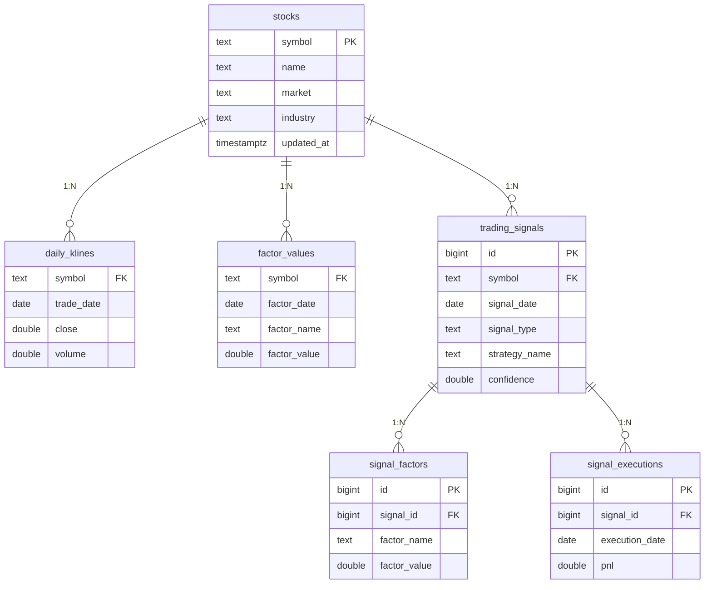

---

---

## 4. API接口清单

### 4.1 接口概览

**总计**: 64个RESTful API端点  
**服务地址**: `http://localhost:5001`  
**认证方式**: 部分端点需要ops认证（通过`X-Ops-Token`）

### 4.2 接口分组

#### 4.2.1 系统监控类 (System Monitoring)

| 端点 | 方法 | 用途 | 认证 |
|------|------|------|------|
| `/api/health` | GET | 健康检查 | 否 |
| `/api/platform/status` | GET | 平台状态（数据库、缓存、任务） | 否 |

**代表性接口**: `GET /api/health`

**请求**: 无参数

**响应**:
```json
{
  "status": "healthy",
  "timestamp": "2026-05-20T10:00:00Z",
  "database": "connected",
  "version": "1.0.0"
}
```

---

#### 4.2.2 数据管理类 (Data Management)

| 端点 | 方法 | 用途 | 认证 |
|------|------|------|------|
| `/api/stocks/list` | GET | 获取股票列表 | 否 |
| `/api/stocks/search` | GET | 搜索股票 | 否 |
| `/api/stocks/resolve` | POST | 解析股票代码 | 否 |
| `/api/stocks/add` | POST | 添加股票 | 是 |
| `/api/stocks/data-status` | GET | 数据状态统计 | 否 |
| `/api/stocks/compare` | POST | 对比多只股票 | 否 |
| `/api/stock/<symbol>/klines` | GET | 获取K线数据 | 否 |
| `/api/data/update` | POST | 更新市场数据 | 是 |
| `/api/data/download-klines` | POST | 下载历史K线 | 是 |

**代表性接口**: `POST /api/data/update`

**请求**:
```json
{
  "symbols": ["600519", "000001"],
  "days": 730
}
```

**响应**:
```json
{
  "job_id": "job_abc123",
  "status": "running",
  "message": "数据更新任务已启动"
}
```

**重复代码标签**: 🔴 严重重复 - 架构绕过（subprocess启动脚本）

---

#### 4.2.3 因子计算类 (Factor Calculation)

| 端点 | 方法 | 用途 | 认证 |
|------|------|------|------|
| `/api/stock/<symbol>/factors` | GET | 获取单只股票因子 | 否 |
| `/api/stocks/<symbol>/factors` | GET | 获取单只股票因子（别名） | 否 |
| `/api/compute/factors` | POST | 批量计算因子 | 是 |
| `/api/compute/historical-factors` | POST | 计算历史因子 | 是 |
| `/api/feature-importance` | GET | 获取特征重要性 | 否 |

**代表性接口**: `POST /api/compute/factors`

**请求**:
```json
{
  "symbols": ["600519", "000001"],
  "date": "2026-05-20"
}
```

**响应**:
```json
{
  "success": true,
  "calculated": 84,
  "symbols": 2,
  "factors": 42
}
```

**重复代码标签**: 🟡 中度重复 - 查询逻辑重复

---

#### 4.2.4 策略管理类 (Strategy Management)

| 端点 | 方法 | 用途 | 认证 |
|------|------|------|------|
| `/api/strategies` | GET | 获取策略列表 | 否 |
| `/api/strategies` | POST | 创建新策略 | 是 |
| `/api/strategies/<strategy_id>` | GET | 获取策略详情 | 否 |
| `/api/strategies/<strategy_id>` | PUT | 更新策略 | 是 |
| `/api/strategies/<strategy_id>` | DELETE | 删除策略 | 是 |
| `/api/strategies/<strategy_id>/enable` | POST | 启用策略 | 是 |
| `/api/strategies/<strategy_id>/disable` | POST | 禁用策略 | 是 |

**代表性接口**: `GET /api/strategies`

**响应**:
```json
{
  "strategies": [
    {
      "id": "rsi_reversal",
      "name": "RSI反转策略",
      "enabled": true,
      "weight": 1.5,
      "description": "基于RSI超买超卖的反转策略"
    },
    {
      "id": "ma_cross",
      "name": "均线交叉策略",
      "enabled": true,
      "weight": 1.0,
      "description": "双均线金叉死叉策略"
    }
  ]
}
```

---

#### 4.2.5 信号生成类 (Signal Generation)

| 端点 | 方法 | 用途 | 认证 |
|------|------|------|------|
| `/api/signals` | GET | 获取最新信号 | 否 |
| `/api/signals/history` | GET | 获取历史信号 | 否 |
| `/api/signals/generate` | POST | 生成交易信号 | 是 |
| `/api/signals/scan` | POST | 扫描市场信号 | 否 |

**代表性接口**: `POST /api/signals/generate`

**请求**:
```json
{
  "strategy_ids": ["rsi_reversal", "ma_cross"],
  "symbols": ["600519"],
  "mode": "vote"
}
```

**响应**:
```json
{
  "signals": [
    {
      "symbol": "600519",
      "action": "BUY",
      "confidence": 0.85,
      "price": 1800.0,
      "strategy": "combined",
      "reason": "RSI超卖+均线金叉"
    }
  ],
  "generated": 1
}
```

**重复代码标签**: 🔴 严重重复 - 策略实现重复

---

#### 4.2.6 机器学习类 (Machine Learning)

| 端点 | 方法 | 用途 | 认证 |
|------|------|------|------|
| `/api/stock/<symbol>/ml-predict` | GET | 单只股票ML预测 | 否 |
| `/api/ml/predict-batch` | POST | 批量ML预测 | 否 |
| `/api/ml/retrain` | POST | 重新训练模型 | 是 |
| `/api/training/start` | POST | 启动训练任务 | 是 |
| `/api/training/status/<task_id>` | GET | 查询训练状态 | 否 |
| `/api/training/logs/<task_id>` | GET | 获取训练日志 | 否 |
| `/api/training/history` | GET | 训练历史记录 | 否 |
| `/api/training/reports` | GET | 训练报告列表 | 否 |
| `/api/training/report/<filename>` | GET | 获取训练报告 | 否 |

**代表性接口**: `POST /api/ml/predict-batch`

**请求**:
```json
{
  "symbols": ["600519", "000001"],
  "date": "2026-05-20"
}
```

**响应**:
```json
{
  "predictions": [
    {
      "symbol": "600519",
      "prediction": "UP",
      "probability": 0.78,
      "features_used": 52
    },
    {
      "symbol": "000001",
      "prediction": "DOWN",
      "probability": 0.65,
      "features_used": 52
    }
  ]
}
```

**重复代码标签**: 🔴 严重重复 - 多个预测器

---

#### 4.2.7 回测分析类 (Backtesting)

| 端点 | 方法 | 用途 | 认证 |
|------|------|------|------|
| `/api/backtest` | POST | 执行回测（旧接口） | 是 |
| `/api/backtest/run` | POST | 执行回测 | 是 |
| `/api/backtest/results` | GET | 获取回测结果 | 否 |
| `/api/performance/strategy/<strategy_id>` | GET | 策略绩效分析 | 否 |
| `/api/performance/compare` | GET | 策略对比 | 否 |
| `/api/performance/comparison` | GET | 策略对比（别名） | 否 |
| `/api/performance/weekly` | POST | 周度绩效分析 | 是 |

**代表性接口**: `POST /api/backtest/run`

**请求**:
```json
{
  "strategy_id": "rsi_reversal",
  "symbols": ["600519"],
  "start_date": "2024-01-01",
  "end_date": "2024-12-31",
  "initial_capital": 1000000
}
```

**响应**:
```json
{
  "job_id": "job_backtest_xyz",
  "status": "running",
  "message": "回测任务已启动"
}
```

**重复代码标签**: 🟢 设计良好 - 回测引擎架构清晰

---

#### 4.2.8 风控检查类 (Risk Management)

| 端点 | 方法 | 用途 | 认证 |
|------|------|------|------|
| `/api/risk/check` | POST | 预交易风控检查 | 否 |

**代表性接口**: `POST /api/risk/check`

**请求**:
```json
{
  "order": {
    "symbol": "600519",
    "action": "BUY",
    "quantity": 100,
    "price": 1800.0
  },
  "portfolio": {
    "total_equity": 1000000,
    "positions": [
      {"symbol": "000001", "quantity": 500, "cost": 15.0}
    ]
  }
}
```

**响应**:
```json
{
  "passed": true,
  "checks": [
    {"name": "单股持仓上限", "passed": true},
    {"name": "行业集中度", "passed": true},
    {"name": "总仓位限制", "passed": true},
    {"name": "单笔交易限额", "passed": true},
    {"name": "日内交易次数", "passed": true},
    {"name": "止损检查", "passed": true},
    {"name": "黑名单检查", "passed": true}
  ],
  "suggested_position": 100,
  "warnings": []
}
```

**重复代码标签**: 🟢 设计良好 - 风控模块职责清晰

---

#### 4.2.9 任务管理类 (Job Management)

| 端点 | 方法 | 用途 | 认证 |
|------|------|------|------|
| `/api/jobs` | GET | 获取任务列表 | 否 |
| `/api/jobs/<job_id>` | GET | 查询任务状态 | 否 |
| `/api/jobs/<job_id>/cancel` | POST | 取消任务 | 是 |
| `/api/jobs/<job_id>/retry` | POST | 重试任务 | 是 |
| `/api/jobs/<job_type>/run` | POST | 运行指定类型任务 | 是 |

**代表性接口**: `GET /api/jobs/<job_id>`

**响应**:
```json
{
  "job_id": "job_abc123",
  "type": "data_update",
  "status": "success",
  "progress": 100,
  "result": {
    "stocks_updated": 5000,
    "klines_updated": 3650000
  },
  "created_at": "2026-05-20T16:00:00Z",
  "finished_at": "2026-05-20T16:15:00Z"
}
```

---

#### 4.2.10 Pipeline管理类 (Pipeline Management)

| 端点 | 方法 | 用途 | 认证 |
|------|------|------|------|
| `/api/pipeline/runs` | GET | 获取Pipeline运行列表 | 否 |
| `/api/pipeline/runs` | POST | 创建Pipeline运行 | 是 |
| `/api/pipeline/runs/<run_id>` | GET | 查询Pipeline状态 | 否 |
| `/api/pipeline/runs/<run_id>/cancel` | POST | 取消Pipeline | 是 |

**用途说明**: Pipeline用于编排多个任务的依赖执行（数据更新→因子计算→信号生成）

---

#### 4.2.11 调度器管理类 (Scheduler Management)

| 端点 | 方法 | 用途 | 认证 |
|------|------|------|------|
| `/api/scheduler/tasks` | GET | 获取定时任务列表 | 否 |
| `/api/scheduler/tasks/<task_id>/trigger` | POST | 手动触发任务 | 是 |
| `/api/scheduler/tasks/<task_id>/compensate` | POST | 补偿执行任务 | 是 |
| `/api/scheduler/runs/failed` | GET | 获取失败的任务 | 否 |

---

#### 4.2.12 图表数据类 (Charts & Visualization)

| 端点 | 方法 | 用途 | 认证 |
|------|------|------|------|
| `/api/charts/accuracy` | GET | 模型准确率图表数据 | 否 |
| `/api/charts/importance` | GET | 特征重要性图表数据 | 否 |
| `/api/charts/equity` | GET | 权益曲线图表数据 | 否 |
| `/api/charts/comparison` | GET | 策略对比图表数据 | 否 |
| `/api/charts/image/<chart_type>` | GET | 获取图表图片 | 否 |

---

#### 4.2.13 报告生成类 (Reports)

| 端点 | 方法 | 用途 | 认证 |
|------|------|------|------|
| `/api/report/daily` | GET | 每日报告 | 否 |
| `/api/stock/<symbol>/technical` | GET | 技术分析报告 | 否 |

**代表性接口**: `GET /api/report/daily`

**响应**:
```json
{
  "date": "2026-05-20",
  "market_summary": {
    "total_stocks": 5000,
    "up": 2800,
    "down": 2100,
    "flat": 100
  },
  "signals": {
    "buy": 15,
    "sell": 8,
    "hold": 4977
  },
  "top_signals": [
    {
      "symbol": "600519",
      "name": "贵州茅台",
      "action": "BUY",
      "confidence": 0.92
    }
  ]
}
```

---

### 4.3 API重复代码分析

#### 4.3.1 参数验证重复
- ❌ 每个端点都在重复验证`symbol`、`date`、`symbols`等参数
- ✅ **建议**: 创建统一的参数验证装饰器

#### 4.3.2 错误处理重复
- ❌ 每个端点都有相似的try-catch和错误响应格式
- ✅ **建议**: 使用Flask错误处理器统一处理

#### 4.3.3 数据库查询重复
- ❌ 多个端点都在调用`db.get_stock_rows()`、`db.get_klines()`
- ✅ **建议**: 抽象为Service层

#### 4.3.4 响应格式化重复
- ❌ 每个端点都在手动构造JSON响应
- ✅ **建议**: 创建统一的响应构建器

---

---

## 5. 核心模块详解

### 5.1 数据层 (quantsys.data)

**路径**: `quant/quantsys/data/`

#### 5.1.1 模块结构

```
quantsys/data/
├── db.py                          # Database类（核心数据访问）
├── pipeline.py                    # ETL管道
├── fetchers/                      # 数据获取器
│   ├── klines.py                 # KlineFetcher（日K线）
│   ├── minute_klines.py          # MinuteKlineFetcher（分钟K线）
│   └── stock_list.py             # StockListFetcher（股票列表）
└── data/                          # 新数据服务层
    ├── data_service.py           # DataService（统一数据访问）
    ├── sources/                  # 数据源适配器
    │   ├── base_adapter.py       # BaseAdapter（抽象基类）
    │   ├── akshare_adapter.py    # AkShareAdapter（AkShare实现）
    │   └── data_source_manager.py # DataSourceManager
    └── storage/                  # 存储管理
        ├── cache_manager.py      # CacheManager（缓存）
        └── db_manager.py         # DBManager（数据库）
```

#### 5.1.2 核心类说明

**Database类** (`db.py`)
- **职责**: 封装PostgreSQL数据库操作
- **方法数**: 30+个查询方法
- **主要方法**:
  - `upsert_stocks()` - 插入/更新股票信息
  - `upsert_klines()` - 插入/更新K线数据
  - `get_klines()` - 查询K线数据
  - `get_stock_rows()` - 查询股票列表
  - `get_factor_values()` - 查询因子值
  - `insert_trading_signal()` - 插入交易信号

**DataService类** (`data/data_service.py`)
- **职责**: 提供统一的数据访问接口
- **主要方法**:
  - `get_daily_klines()` - 获取日K线（带缓存）
  - `get_stock_list()` - 获取股票列表
  - `get_realtime_quote()` - 获取实时行情
  - `get_health_status()` - 健康检查

**KlineFetcher类** (`fetchers/klines.py`)
- **职责**: 从AkShare获取日K线数据
- **主要方法**:
  - `fetch_daily_klines()` - 获取指定股票的日K线
  - `fetch_klines_batch()` - 批量获取K线

#### 5.1.3 重复代码分析

🔴 **严重重复1: 双层查询逻辑**
```
问题：Database和DataService都有查询方法
- Database.get_klines() 
- DataService.get_daily_klines()
两者功能重叠，造成调用混乱
```

🔴 **严重重复2: 多个Fetcher相似逻辑**
```
问题：KlineFetcher和MinuteKlineFetcher有大量重复代码
- 都有fetch方法
- 都有错误处理
- 都有数据转换逻辑
```

🟡 **中度重复3: 存储管理重复**
```
问题：CacheManager和DBManager职责重叠
- 都在管理数据存储
- 都有get/set方法
- 缺少统一的Repository接口
```

#### 5.1.4 重构建议

✅ **建议1: Repository模式**
```python
# 创建统一的Repository接口
class StockRepository:
    def get_by_symbol(self, symbol: str) -> Stock
    def get_all(self, market: str = None) -> List[Stock]
    def save(self, stock: Stock) -> None

class KlineRepository:
    def get_by_symbol(self, symbol: str, limit: int) -> List[Kline]
    def save_batch(self, klines: List[Kline]) -> None
```

✅ **建议2: Fetcher基类**
```python
# 抽象Fetcher基类
class BaseFetcher(ABC):
    @abstractmethod
    def fetch(self, symbol: str, **kwargs) -> pd.DataFrame
    
    def _handle_error(self, exc: Exception) -> None
    def _transform_data(self, raw: Any) -> pd.DataFrame
```

---

### 5.2 因子层 (quantsys.factors)

**路径**: `quant/quantsys/factors/`

#### 5.2.1 模块结构

```
quantsys/factors/
├── base.py                        # Factor基类
├── calculator.py                  # FactorCalculator（批量计算）
├── factor_service.py              # FactorService（因子查询）
├── cache.py                       # 因子缓存
├── technical/                     # 技术因子（24个）
│   ├── trend.py                  # 趋势类（MA, EMA, MACD）
│   ├── momentum.py               # 动量类（RSI, KDJ, CCI）
│   ├── volatility.py             # 波动类（ATR, BOLL）
│   └── volume.py                 # 成交量类（OBV, MFI）
└── fundamental/                   # 基本面因子（18个）
    ├── profitability.py          # 盈利能力（ROE, ROA）
    ├── growth.py                 # 成长能力（营收增长率）
    ├── valuation.py              # 估值（PE, PB）
    └── quality.py                # 质量（毛利率、负债率）
```

#### 5.2.2 核心类说明

**Factor基类** (`base.py`)
- **职责**: 所有因子的抽象基类
- **主要方法**:
  - `calculate(data: pd.DataFrame) -> pd.Series` - 计算因子值
  - `validate(data: pd.DataFrame) -> bool` - 验证数据有效性

**FactorCalculator类** (`calculator.py`)
- **职责**: 批量计算多个因子
- **特性**: 支持并行计算
- **主要方法**:
  - `calculate_all(data: pd.DataFrame) -> Dict[str, float]` - 计算所有因子
  - `calculate_batch(symbols: List[str]) -> pd.DataFrame` - 批量计算

**FactorService类** (`factor_service.py`)
- **职责**: 因子查询和管理
- **主要方法**:
  - `get_factor_values(symbol: str, date: str) -> Dict` - 查询因子值
  - `calculate_factors(symbols: List[str]) -> int` - 触发因子计算

#### 5.2.3 因子清单

**技术因子（24个）**:
1. MA系列 - MA5, MA10, MA20, MA60
2. EMA系列 - EMA12, EMA26
3. MACD系列 - MACD, Signal, Histogram
4. 动量指标 - RSI, KDJ, CCI, WR
5. 波动指标 - ATR, BOLL_UPPER, BOLL_LOWER
6. 成交量指标 - OBV, MFI, VWAP

**基本面因子（18个）**:
1. 盈利能力 - ROE, ROA, 净利率, 毛利率
2. 成长能力 - 营收增长率, 净利润增长率
3. 估值指标 - PE, PB, PS, PCF
4. 质量指标 - 资产负债率, 流动比率, 速动比率

#### 5.2.4 重复代码分析

🟡 **中度重复1: 查询逻辑重复**
```
问题：FactorService和Database都有因子查询
- FactorService.get_factor_values()
- Database.get_factor_values()
功能重叠，应该统一
```

🟢 **设计良好: Factor基类**
```
优点：42个因子都继承自Factor基类
- 统一的calculate接口
- 统一的validate逻辑
- 易于扩展新因子
```

#### 5.2.5 重构建议

✅ **建议: 因子注册表**
```python
# 创建因子注册表
class FactorRegistry:
    _factors: Dict[str, Type[Factor]] = {}
    
    @classmethod
    def register(cls, name: str):
        def decorator(factor_class):
            cls._factors[name] = factor_class
            return factor_class
        return decorator
    
    @classmethod
    def get_factor(cls, name: str) -> Factor:
        return cls._factors[name]()

# 使用装饰器注册
@FactorRegistry.register("MA5")
class MA5(Factor):
    def calculate(self, data):
        return data['close'].rolling(5).mean()
```

---

### 5.3 策略层 (quantsys.strategies)

**路径**: `quant/quantsys/strategies/`

#### 5.3.1 模块结构

```
quantsys/strategies/
├── base.py                        # Strategy基类
├── combiner.py                    # StrategyCombiner（策略组合）
├── adapter.py                     # 策略适配器
├── utils.py                       # 工具函数
├── backtest.py                    # 回测工具
└── classic/                       # 经典策略
    ├── rsi_reversal.py           # RSI反转策略
    ├── ma_cross.py               # 均线交叉策略
    └── bollinger_breakout.py     # 布林带突破策略
```

#### 5.3.2 核心类说明

**Strategy基类** (`base.py`)
- **职责**: 所有策略的抽象基类
- **主要方法**:
  - `generate_signal(data: pd.DataFrame) -> Signal` - 生成信号
  - `on_bar(bar: Bar) -> Optional[Order]` - 处理K线事件（回测用）

**StrategyCombiner类** (`combiner.py`)
- **职责**: 组合多个策略的信号
- **组合模式**:
  - `VOTE` - 加权投票（默认）
  - `AND` - 所有策略一致
  - `OR` - 任一策略触发
- **主要方法**:
  - `combine_signals(signals: List[Signal]) -> Signal` - 组合信号

#### 5.3.3 策略清单

**RSI反转策略** (`rsi_reversal.py`)
- **逻辑**: RSI < 30买入，RSI > 70卖出
- **历史回报**: +11.26%
- **适用**: 震荡市

**均线交叉策略** (`ma_cross.py`)
- **逻辑**: MA5上穿MA20买入，下穿卖出
- **适用**: 趋势市

**布林带突破策略** (`bollinger_breakout.py`)
- **逻辑**: 价格突破上轨买入，跌破下轨卖出
- **适用**: 波动市

#### 5.3.4 重复代码分析

🔴 **严重重复1: 信号生成逻辑**
```
问题：每个策略都在重复实现generate_signal
- 参数验证重复
- 数据预处理重复
- 信号构造重复
```

🟢 **设计良好: StrategyCombiner**
```
优点：策略组合设计良好
- 支持多种组合模式
- 权重可配置
- 置信度计算合理
```

#### 5.3.5 重构建议

✅ **建议: 模板方法模式**
```python
# Strategy基类使用模板方法
class Strategy(ABC):
    def generate_signal(self, data: pd.DataFrame) -> Signal:
        # 模板方法
        self._validate_data(data)
        preprocessed = self._preprocess(data)
        action, confidence = self._calculate_signal(preprocessed)
        return self._build_signal(action, confidence, data)
    
    @abstractmethod
    def _calculate_signal(self, data) -> Tuple[str, float]:
        # 子类只需实现核心逻辑
        pass
    
    def _validate_data(self, data):
        # 通用验证逻辑
        pass
    
    def _preprocess(self, data):
        # 通用预处理
        pass
```

---

### 5.4 机器学习层 (quantsys.ml)

**路径**: `quant/quantsys/ml/`

#### 5.4.1 模块结构

```
quantsys/ml/
├── signal_trainer.py              # SignalTrainer（信号训练器）
├── signal_predictor.py            # SignalPredictor（信号预测器）
├── refactored_trainer.py          # RefactoredTrainer（重构后的训练器）
├── training_service.py            # MLTrainingService
├── confidence_calibrator.py       # 置信度校准
├── visualizer.py                  # 可视化
├── training/                      # 训练模块
│   ├── trainer.py                # Trainer
│   ├── cross_validation.py       # 时间序列交叉验证
│   └── hyperparameter_tuning.py  # 超参数优化
├── prediction/                    # 预测模块
│   └── predictor.py              # Predictor
└── features/                      # 特征工程
    ├── feature_engineering.py    # FeatureEngineer（50+特征）
    └── feature_selection.py      # 特征选择
```

#### 5.4.2 核心类说明

**FeatureEngineer类** (`features/feature_engineering.py`)
- **职责**: 从因子生成ML特征
- **特征数**: 50+个
- **特征类型**:
  - 价格特征 - 收益率、波动率
  - 技术指标特征 - RSI、MACD等
  - 统计特征 - 均值、标准差、偏度
  - 时间特征 - 星期、月份

**Trainer类** (`training/trainer.py`)
- **职责**: 模型训练
- **模型**: XGBoost
- **特性**:
  - 时间序列交叉验证
  - 超参数优化
  - 模型集成

**Predictor类** (`prediction/predictor.py`)
- **职责**: 模型预测
- **主要方法**:
  - `predict(features: pd.DataFrame) -> np.ndarray` - 预测
  - `predict_proba(features) -> np.ndarray` - 预测概率

#### 5.4.3 重复代码分析

🔴 **严重重复1: 多个训练器**
```
问题：存在3个训练器实现
- signal_trainer.py
- refactored_trainer.py
- training/trainer.py
功能重叠，维护困难
```

🔴 **严重重复2: 多个预测器**
```
问题：存在2个预测器实现
- signal_predictor.py
- prediction/predictor.py
应该统一为一个
```

🔴 **严重重复3: 特征工程重复**
```
问题：特征工程逻辑在训练和预测中重复
- 训练时生成特征
- 预测时重新生成特征
应该共享特征生成逻辑
```

#### 5.4.4 重构建议

✅ **建议: 统一MLPipeline**
```python
# 创建统一的ML Pipeline
class MLPipeline:
    def __init__(self):
        self.feature_engineer = FeatureEngineer()
        self.model = None
    
    def train(self, data: pd.DataFrame):
        # 特征工程
        features = self.feature_engineer.engineer(data)
        # 训练模型
        self.model = self._train_model(features)
        return self.model
    
    def predict(self, data: pd.DataFrame):
        # 使用相同的特征工程
        features = self.feature_engineer.engineer(data)
        return self.model.predict(features)
    
    def save(self, path: str):
        # 保存模型和特征工程器
        joblib.dump({
            'model': self.model,
            'feature_engineer': self.feature_engineer
        }, path)
```

---

### 5.5 风控层 (quantsys.risk)

**路径**: `quant/quantsys/risk/`

#### 5.5.1 模块结构

```
quantsys/risk/
├── pre_trade.py                   # PreTradeRiskCheck（预交易风控）
├── position_manager.py            # PositionManager（仓位管理）
├── stop_loss.py                   # StopLossManager（止损管理）
├── circuit_breaker.py             # 熔断机制
└── risk_logger.py                 # 风险日志
```

#### 5.5.2 核心类说明

**PreTradeRiskCheck类** (`pre_trade.py`)
- **职责**: 预交易风控检查（7项检查）
- **检查项**:
  1. 单股持仓上限（默认20%）
  2. 行业集中度（默认40%）
  3. 总仓位限制（默认80%）
  4. 单笔交易限额（默认10%）
  5. 日内交易次数（默认10次）
  6. 止损检查
  7. 黑名单检查（ST股票、停牌股票）
- **主要方法**:
  - `check(order: Order, portfolio: Portfolio) -> Tuple[bool, str]` - 执行检查

**PositionManager类** (`position_manager.py`)
- **职责**: 仓位管理和计算
- **算法**: Kelly公式
- **主要方法**:
  - `calculate_position_size(symbol, price, total_equity) -> int` - 计算建议仓位
  - `get_kelly_fraction(win_rate, avg_win, avg_loss) -> float` - Kelly比例

**StopLossManager类** (`stop_loss.py`)
- **职责**: 止损管理
- **止损类型**（5种）:
  1. 固定止损（默认-8%）
  2. 移动止损（跟踪最高价）
  3. 时间止损（持仓超过N天）
  4. 技术止损（跌破支撑位）
  5. 波动止损（基于ATR）
- **主要方法**:
  - `should_stop_loss(symbol, entry_price, current_price, ...) -> Tuple[bool, str]`

#### 5.5.3 重复代码分析

🟢 **设计良好: 职责清晰**
```
优点：风控模块设计良好
- PreTradeRiskCheck: 预交易检查
- PositionManager: 仓位计算
- StopLossManager: 止损管理
- 职责单一，边界清晰
```

🟡 **中度重复: 持仓查询**
```
问题：多处都在查询持仓数据
- PreTradeRiskCheck查询持仓
- PositionManager查询持仓
- StopLossManager查询持仓
应该统一为PortfolioRepository
```

🔵 **可优化: RiskEngine**
```
建议：添加RiskEngine统一调度
- 统一调用各个风控模块
- 统一风控日志记录
- 统一风控规则配置
```

#### 5.5.4 重构建议

✅ **建议: RiskEngine统一调度**
```python
# 创建RiskEngine统一调度风控
class RiskEngine:
    def __init__(self):
        self.pre_trade_check = PreTradeRiskCheck()
        self.position_manager = PositionManager()
        self.stop_loss_manager = StopLossManager()
        self.risk_logger = RiskLogger()
    
    def check_order(self, order: Order, portfolio: Portfolio) -> RiskCheckResult:
        # 1. 预交易检查
        passed, reason = self.pre_trade_check.check(order, portfolio)
        if not passed:
            self.risk_logger.log_rejection(order, reason)
            return RiskCheckResult(passed=False, reason=reason)
        
        # 2. 计算建议仓位
        suggested_size = self.position_manager.calculate_position_size(
            order.symbol, order.price, portfolio.total_equity
        )
        
        # 3. 止损检查
        should_stop, stop_reason = self.stop_loss_manager.should_stop_loss(...)
        
        return RiskCheckResult(
            passed=True,
            suggested_position=suggested_size,
            warnings=[stop_reason] if should_stop else []
        )
```

---

### 5.6 回测层 (quantsys.backtest)

**路径**: `quant/quantsys/backtest/`

#### 5.6.1 模块结构

```
quantsys/backtest/
├── engine.py                      # BacktestEngine（回测引擎）
├── broker.py                      # Broker（模拟经纪商）
├── portfolio.py                   # Portfolio（投资组合）
├── slippage.py                    # 滑点模型
└── validator.py                   # 回测验证器
```

#### 5.6.2 核心类说明

**BacktestEngine类** (`engine.py`)
- **职责**: 事件驱动的回测引擎
- **架构**: 事件驱动
- **主要方法**:
  - `run(strategy, data, start_date, end_date) -> BacktestResult` - 执行回测
  - `on_bar(bar: Bar)` - 处理K线事件
  - `on_order(order: Order)` - 处理订单事件
  - `on_fill(fill: Fill)` - 处理成交事件

**Broker类** (`broker.py`)
- **职责**: 模拟经纪商，处理订单执行
- **功能**:
  - 涨跌停检查
  - 停牌检查
  - 滑点计算
  - 手续费计算
- **主要方法**:
  - `execute_order(order: Order, bar: Bar) -> Optional[Fill]` - 执行订单

**Portfolio类** (`portfolio.py`)
- **职责**: 管理投资组合状态
- **属性**:
  - `cash` - 现金
  - `positions` - 持仓
  - `total_equity` - 总权益
- **主要方法**:
  - `update_position(symbol, quantity, price)` - 更新持仓
  - `get_position(symbol) -> Position` - 获取持仓

**Slippage类** (`slippage.py`)
- **职责**: 滑点模型
- **模型类型**:
  - 固定滑点（默认0.1%）
  - 成交量滑点（基于成交量）
  - 价格滑点（基于价格波动）

#### 5.6.3 回测结果指标

**收益指标**:
- 总回报率 (Total Return)
- 年化回报率 (Annualized Return)
- 累计收益曲线 (Equity Curve)

**风险指标**:
- 最大回撤 (Max Drawdown)
- 波动率 (Volatility)
- Sharpe比率 (Sharpe Ratio)
- Sortino比率 (Sortino Ratio)

**交易指标**:
- 总交易次数 (Total Trades)
- 胜率 (Win Rate)
- 盈亏比 (Profit/Loss Ratio)
- 平均持仓天数 (Avg Holding Days)

#### 5.6.4 重复代码分析

🟢 **设计良好: 事件驱动架构**
```
优点：回测引擎设计良好
- 事件驱动架构清晰
- Broker模拟真实交易
- 涨跌停/停牌处理完善
- 滑点模型合理
```

🔵 **可优化: Portfolio vs PositionManager**
```
问题：Portfolio和PositionManager可能有重复
- Portfolio管理回测中的持仓
- PositionManager计算建议仓位
- 两者的持仓管理逻辑可能重复
```

#### 5.6.5 重构建议

✅ **建议: 统一持仓管理**
```python
# 抽象持仓管理接口
class PositionManagerInterface(ABC):
    @abstractmethod
    def get_position(self, symbol: str) -> Position:
        pass
    
    @abstractmethod
    def update_position(self, symbol: str, quantity: int, price: float):
        pass

# Portfolio实现该接口
class Portfolio(PositionManagerInterface):
    # 回测中的持仓管理
    pass

# LivePortfolio实现该接口
class LivePortfolio(PositionManagerInterface):
    # 实盘中的持仓管理
    pass
```

---

### 5.7 CLI层 (quantsys.cli)

**路径**: `quant/quantsys/cli/`

#### 5.7.1 模块结构

```
quantsys/cli/
├── main.py                        # CLI入口
├── context.py                     # 上下文管理
├── registry.py                    # 命令注册表
├── output.py                      # 输出格式化
├── errors.py                      # 错误处理
├── stock_query.py                 # 股票查询命令
├── market_query.py                # 市场查询命令
├── financial_query.py             # 财务查询命令
├── hk_query.py                    # 港股查询命令
├── screening_query.py             # 选股筛选命令
├── risk_query.py                  # 风险查询命令
├── analysis_query.py              # 分析查询命令
├── stock_analytics.py             # 股票分析命令
├── strategy_analytics.py          # 策略分析命令
├── portfolio_analytics.py         # 组合分析命令
├── factor_sector_analytics.py     # 因子板块分析
├── risk_watch_analytics.py        # 风险监控分析
├── factor_decay.py                # 因子衰减分析
└── strategy_optimizer.py          # 策略优化
```

#### 5.7.2 统计数据

- **文件数**: 20个
- **函数数**: 298个
- **命令分类**:
  - 查询类命令（*_query.py）: 7个文件
  - 分析类命令（*_analytics.py）: 6个文件
  - 工具类命令: 7个文件

#### 5.7.3 典型命令示例

**股票查询命令** (`stock_query.py`)
```bash
# 查询股票信息
quantsys stock info 600519

# 查询K线数据
quantsys stock klines 600519 --days 30

# 查询因子值
quantsys stock factors 600519
```

**市场查询命令** (`market_query.py`)
```bash
# 市场概览
quantsys market overview

# 涨跌分布
quantsys market distribution

# 行业表现
quantsys market sectors
```

**选股筛选命令** (`screening_query.py`)
```bash
# 技术面筛选
quantsys screen technical --rsi-low 30 --volume-ratio 2.0

# 基本面筛选
quantsys screen fundamental --roe-min 15 --pe-max 30

# 组合筛选
quantsys screen combined --strategy rsi_reversal
```

#### 5.7.4 重复代码分析

🔴 **严重重复1: 298个函数的重复模式**
```
问题：每个命令函数都在重复
1. 参数解析和验证
2. 数据库查询
3. 数据处理
4. 格式化输出
5. 错误处理

示例：
def stock_info(symbol: str):
    # 1. 参数验证（重复）
    if not symbol:
        raise ValueError("symbol is required")
    
    # 2. 数据库查询（重复）
    db = Database()
    stock = db.get_stock_rows(symbol)
    
    # 3. 格式化输出（重复）
    print(format_table(stock))
    
    # 4. 错误处理（重复）
    try:
        ...
    except Exception as e:
        print(f"Error: {e}")
```

🔴 **严重重复2: CLI vs API重复**
```
问题：CLI和API做相同的事情
- CLI: quantsys stock info 600519
- API: GET /api/stock/600519/factors
两者都在查询股票信息，应该CLI调用API
```

🔴 **严重重复3: 输出格式化重复**
```
问题：每个文件都有format_table、format_json
- output.py有通用格式化
- 但每个*_query.py都在重新实现
```

#### 5.7.5 重构建议

✅ **建议1: 命令模式**
```python
# 创建命令基类
class Command(ABC):
    def __init__(self, context: Context):
        self.context = context
        self.db = context.db
        self.output = context.output
    
    def execute(self, **kwargs):
        # 模板方法
        self.validate_params(**kwargs)
        result = self.run(**kwargs)
        self.output.render(result)
    
    @abstractmethod
    def validate_params(self, **kwargs):
        pass
    
    @abstractmethod
    def run(self, **kwargs):
        pass

# 具体命令
class StockInfoCommand(Command):
    def validate_params(self, symbol: str):
        if not symbol:
            raise ValueError("symbol is required")
    
    def run(self, symbol: str):
        return self.db.get_stock_rows(symbol)
```

✅ **建议2: CLI调用API**
```python
# CLI应该调用API，而不是直接查询数据库
class StockInfoCommand(Command):
    def run(self, symbol: str):
        # 调用API而不是直接查询DB
        response = requests.get(f"http://localhost:5001/api/stock/{symbol}/factors")
        return response.json()
```

✅ **建议3: 查询构建器**
```python
# 创建查询构建器
class QueryBuilder:
    def __init__(self, db: Database):
        self.db = db
        self.filters = []
    
    def filter_by_symbol(self, symbol: str):
        self.filters.append(('symbol', '=', symbol))
        return self
    
    def filter_by_market(self, market: str):
        self.filters.append(('market', '=', market))
        return self
    
    def execute(self):
        # 构建并执行查询
        return self.db.query(self.filters)

# 使用
result = QueryBuilder(db)\
    .filter_by_market('A')\
    .filter_by_symbol('600519')\
    .execute()
```

---

---

## 6. 重复代码分析矩阵

### 6.1 横向功能重复矩阵

| 功能类型 | data | factors | strategies | ml | risk | backtest | cli | api | 重复程度 |
|---------|------|---------|------------|----|----- |----------|-----|-----|---------|
| **数据查询** | ✅ Database (30+方法) | ✅ FactorService | ✅ Adapter | ✅ Trainer | ✅ PreTrade | ✅ Engine | ✅ 298函数 | ✅ 64端点 | 🔴 严重 |
| **缓存管理** | ✅ CacheManager | ✅ Cache | - | - | - | - | - | - | 🟡 中度 |
| **参数验证** | ✅ | ✅ | ✅ | ✅ | ✅ | ✅ | ✅ | ✅ | 🔴 严重 |
| **错误处理** | ✅ | ✅ | ✅ | ✅ | ✅ | ✅ | ✅ | ✅ | 🔴 严重 |
| **日志记录** | ✅ | ✅ | ✅ | ✅ | ✅ RiskLogger | ✅ | ✅ | ✅ | 🟡 中度 |
| **数据转换** | ✅ Fetcher | ✅ Calculator | ✅ | ✅ FeatureEng | - | ✅ | ✅ | ✅ | 🟡 中度 |
| **持仓管理** | - | - | - | - | ✅ PosMgr | ✅ Portfolio | - | - | 🔵 可优化 |
| **格式化输出** | - | - | - | - | - | - | ✅ Output | ✅ JSON | 🟡 中度 |

### 6.2 纵向模块重复清单

#### 6.2.1 数据层重复

| 重复项 | 位置1 | 位置2 | 严重程度 | 影响 |
|--------|-------|-------|---------|------|
| 查询方法 | Database.get_klines() | DataService.get_daily_klines() | 🔴 严重 | 调用混乱 |
| Fetcher逻辑 | KlineFetcher | MinuteKlineFetcher | 🔴 严重 | 维护困难 |
| 存储管理 | CacheManager | DBManager | 🟡 中度 | 职责重叠 |
| 数据转换 | Fetcher._transform() | 多处重复 | 🟡 中度 | 逻辑分散 |

**影响范围**: 所有依赖数据层的模块（100%）

#### 6.2.2 机器学习层重复

| 重复项 | 位置1 | 位置2 | 位置3 | 严重程度 | 影响 |
|--------|-------|-------|-------|---------|------|
| 训练器 | signal_trainer.py | refactored_trainer.py | training/trainer.py | 🔴 严重 | 3个实现 |
| 预测器 | signal_predictor.py | prediction/predictor.py | - | 🔴 严重 | 2个实现 |
| 特征工程 | 训练时 | 预测时 | - | 🔴 严重 | 逻辑重复 |

**影响范围**: ML预测、模型训练（20%）

#### 6.2.3 CLI层重复

| 重复项 | 重复次数 | 严重程度 | 影响 |
|--------|---------|---------|------|
| 参数验证 | 298次 | 🔴 严重 | 代码膨胀 |
| 数据库查询 | 298次 | 🔴 严重 | 性能问题 |
| 格式化输出 | 298次 | 🔴 严重 | 维护困难 |
| 错误处理 | 298次 | 🔴 严重 | 不一致 |

**影响范围**: 所有CLI命令（100%）

#### 6.2.4 API层重复

| 重复项 | 重复次数 | 严重程度 | 影响 |
|--------|---------|---------|------|
| 参数验证 | 64次 | 🔴 严重 | 代码重复 |
| 错误处理 | 64次 | 🔴 严重 | 不一致 |
| JSON序列化 | 64次 | 🟡 中度 | NaN处理 |
| 认证检查 | 30次 | 🟡 中度 | 安全风险 |

**影响范围**: 所有API端点（100%）

### 6.3 架构层面重复

#### 6.3.1 架构绕过问题

```
问题：脚本通过subprocess绕过API直接import quantsys
影响：
- 破坏统一入口原则
- 增加维护成本
- 难以监控和日志
- 无法统一认证和限流
```

**涉及脚本**（10个）:
- daily_update.py
- generate_signals.py
- ml_retrain.py
- weekly_backtest.py
- calculate_factors.py
- calculate_historical_factors.py
- download_5year_data.py
- fetch_hs300_data.py
- sync_portfolio_stocks.py
- sync_watchlist_stocks.py

**严重程度**: 🔴 严重

#### 6.3.2 CLI vs API重复

```
问题：CLI和API做相同的事情
- CLI: 298个函数直接查询数据库
- API: 64个端点查询数据库
- 应该：CLI调用API
```

**严重程度**: 🔴 严重

### 6.4 重复代码统计汇总

| 类别 | 重复项数 | 严重程度分布 | 总影响范围 |
|------|---------|-------------|-----------|
| 数据查询 | 400+ | 🔴×4, 🟡×3 | 80% |
| 参数验证 | 362 | 🔴×2 | 100% |
| 错误处理 | 362 | 🔴×2 | 100% |
| 格式化输出 | 298 | 🔴×1, 🟡×1 | 50% |
| 训练/预测 | 5 | 🔴×3 | 20% |
| 架构绕过 | 10 | 🔴×1 | 15% |

**总计**: 1437+处重复代码

---

## 7. 重构建议（积木化设计）

### 7.1 核心抽象层设计

#### 7.1.1 目录结构

```
quantsys/
├── core/                          # 核心抽象层（新增）
│   ├── __init__.py
│   ├── repository.py             # 数据访问接口
│   ├── service_base.py           # 服务基类
│   ├── decorators.py             # 装饰器（缓存、日志、验证）
│   ├── validators.py             # 参数验证器
│   ├── exceptions.py             # 统一异常
│   ├── logger.py                 # 日志工具
│   └── config.py                 # 配置管理
├── data/                          # 数据层（重构）
├── factors/                       # 因子层
├── strategies/                    # 策略层
├── ml/                            # 机器学习层（重构）
├── risk/                          # 风控层
├── backtest/                      # 回测层
└── cli/                           # CLI层（重构）
```

#### 7.1.2 Repository模式

**目标**: 统一数据访问接口，解耦业务逻辑和数据存储

```python
# quantsys/core/repository.py

from abc import ABC, abstractmethod
from typing import List, Optional, Dict, Any
import pandas as pd

class Repository(ABC):
    """数据访问抽象基类"""
    
    @abstractmethod
    def get_by_id(self, id: Any) -> Optional[Dict]:
        pass
    
    @abstractmethod
    def get_all(self, **filters) -> List[Dict]:
        pass
    
    @abstractmethod
    def save(self, entity: Dict) -> None:
        pass
    
    @abstractmethod
    def delete(self, id: Any) -> None:
        pass


class StockRepository(Repository):
    """股票数据仓库"""
    
    def __init__(self, db: Database, cache: CacheManager):
        self.db = db
        self.cache = cache
    
    def get_by_id(self, symbol: str) -> Optional[Dict]:
        # 先查缓存
        cached = self.cache.get(f"stock:{symbol}")
        if cached:
            return cached
        
        # 查数据库
        result = self.db.get_stock_rows(symbol)
        if result:
            self.cache.set(f"stock:{symbol}", result, ttl=3600)
        return result
    
    def get_all(self, market: str = None, **filters) -> List[Dict]:
        return self.db.get_stock_rows(market=market)
    
    def save(self, stock: Dict) -> None:
        self.db.upsert_stocks([stock])
        self.cache.delete(f"stock:{stock['symbol']}")


class KlineRepository(Repository):
    """K线数据仓库"""
    
    def __init__(self, db: Database, cache: CacheManager):
        self.db = db
        self.cache = cache
    
    def get_by_symbol(self, symbol: str, limit: int = 500) -> pd.DataFrame:
        cache_key = f"klines:{symbol}:{limit}"
        cached = self.cache.get(cache_key)
        if cached is not None:
            return cached
        
        result = self.db.get_klines(symbol, limit)
        self.cache.set(cache_key, result, ttl=1800)
        return result
    
    def save_batch(self, symbol: str, klines: pd.DataFrame) -> None:
        self.db.upsert_klines(symbol, klines)
        # 清除相关缓存
        self.cache.delete_pattern(f"klines:{symbol}:*")


class FactorRepository(Repository):
    """因子数据仓库"""
    
    def get_by_symbol_date(self, symbol: str, date: str) -> Dict[str, float]:
        return self.db.get_factor_values(symbol, date)
    
    def save_batch(self, symbol: str, date: str, factors: Dict[str, float]) -> None:
        self.db.upsert_factor_values(symbol, date, factors)
```

**优势**:
- ✅ 统一数据访问接口
- ✅ 缓存逻辑集中管理
- ✅ 易于切换存储实现（PostgreSQL → MongoDB）
- ✅ 易于测试（Mock Repository）

#### 7.1.3 Service基类

**目标**: 统一服务层模式，提供通用功能

```python
# quantsys/core/service_base.py

from abc import ABC
from typing import Optional
from .logger import Logger
from .exceptions import ServiceException

class ServiceBase(ABC):
    """服务基类"""
    
    def __init__(self, logger: Optional[Logger] = None):
        self.logger = logger or Logger(self.__class__.__name__)
    
    def _validate_required(self, value: Any, name: str):
        """验证必填参数"""
        if value is None or value == "":
            raise ServiceException(f"{name} is required")
    
    def _validate_symbol(self, symbol: str):
        """验证股票代码"""
        self._validate_required(symbol, "symbol")
        if not symbol.isdigit() or len(symbol) != 6:
            raise ServiceException(f"Invalid symbol: {symbol}")
    
    def _log_operation(self, operation: str, **kwargs):
        """记录操作日志"""
        self.logger.info(f"{operation}: {kwargs}")
    
    def _handle_error(self, exc: Exception, operation: str):
        """统一错误处理"""
        self.logger.error(f"{operation} failed: {exc}")
        raise ServiceException(f"{operation} failed") from exc


# 使用示例
class FactorService(ServiceBase):
    def __init__(self, factor_repo: FactorRepository):
        super().__init__()
        self.factor_repo = factor_repo
    
    def get_factors(self, symbol: str, date: str) -> Dict[str, float]:
        # 使用基类的验证方法
        self._validate_symbol(symbol)
        self._validate_required(date, "date")
        
        # 记录操作
        self._log_operation("get_factors", symbol=symbol, date=date)
        
        try:
            return self.factor_repo.get_by_symbol_date(symbol, date)
        except Exception as exc:
            self._handle_error(exc, "get_factors")
```

#### 7.1.4 装饰器工具

**目标**: 通过装饰器实现横切关注点（缓存、日志、验证）

```python
# quantsys/core/decorators.py

from functools import wraps
import time
from typing import Callable, Any

def cached(ttl: int = 3600):
    """缓存装饰器"""
    def decorator(func: Callable) -> Callable:
        cache = {}
        
        @wraps(func)
        def wrapper(*args, **kwargs):
            # 生成缓存key
            key = f"{func.__name__}:{args}:{kwargs}"
            
            # 检查缓存
            if key in cache:
                cached_value, cached_time = cache[key]
                if time.time() - cached_time < ttl:
                    return cached_value
            
            # 执行函数
            result = func(*args, **kwargs)
            cache[key] = (result, time.time())
            return result
        
        return wrapper
    return decorator


def logged(operation: str = None):
    """日志装饰器"""
    def decorator(func: Callable) -> Callable:
        @wraps(func)
        def wrapper(*args, **kwargs):
            op = operation or func.__name__
            logger = Logger(func.__module__)
            
            logger.info(f"{op} started: args={args}, kwargs={kwargs}")
            try:
                result = func(*args, **kwargs)
                logger.info(f"{op} completed successfully")
                return result
            except Exception as exc:
                logger.error(f"{op} failed: {exc}")
                raise
        
        return wrapper
    return decorator


def validated(**validators):
    """参数验证装饰器"""
    def decorator(func: Callable) -> Callable:
        @wraps(func)
        def wrapper(*args, **kwargs):
            # 验证参数
            for param_name, validator_func in validators.items():
                if param_name in kwargs:
                    validator_func(kwargs[param_name])
            
            return func(*args, **kwargs)
        
        return wrapper
    return decorator


def retry(max_attempts: int = 3, delay: float = 1.0):
    """重试装饰器"""
    def decorator(func: Callable) -> Callable:
        @wraps(func)
        def wrapper(*args, **kwargs):
            for attempt in range(max_attempts):
                try:
                    return func(*args, **kwargs)
                except Exception as exc:
                    if attempt == max_attempts - 1:
                        raise
                    time.sleep(delay * (attempt + 1))
        
        return wrapper
    return decorator


# 使用示例
class DataService:
    @cached(ttl=1800)
    @logged(operation="fetch_klines")
    @validated(symbol=validate_symbol)
    @retry(max_attempts=3)
    def get_klines(self, symbol: str, days: int = 30):
        return self.kline_repo.get_by_symbol(symbol, days)
```

#### 7.1.5 统一异常体系

```python
# quantsys/core/exceptions.py

class QuantSysException(Exception):
    """基础异常类"""
    pass

class ValidationException(QuantSysException):
    """参数验证异常"""
    pass

class DataNotFoundException(QuantSysException):
    """数据未找到异常"""
    pass

class ServiceException(QuantSysException):
    """服务异常"""
    pass

class RiskCheckException(QuantSysException):
    """风控检查异常"""
    pass
```

### 7.2 模块重构优先级

#### 优先级P0（立即重构）

**1. CLI层重构** - 298个函数 → 命令模式
- **工作量**: 5-7天
- **收益**: 减少90%重复代码
- **方案**: 
  - 创建Command基类
  - CLI调用API而不是直接查询DB
  - 统一输出格式化

**2. ML层整合** - 3个训练器 → 1个Pipeline
- **工作量**: 3-4天
- **收益**: 统一训练/预测流程
- **方案**:
  - 合并signal_trainer、refactored_trainer、training/trainer
  - 统一特征工程逻辑
  - 创建MLPipeline

#### 优先级P1（重要重构）

**3. 数据层重构** - Database + DataService → Repository
- **工作量**: 4-5天
- **收益**: 统一数据访问，解耦存储
- **方案**:
  - 创建StockRepository、KlineRepository、FactorRepository
  - 合并Database和DataService的查询方法
  - 统一缓存策略

**4. API层优化** - 统一参数验证和错误处理
- **工作量**: 2-3天
- **收益**: 减少60%重复代码
- **方案**:
  - 创建参数验证装饰器
  - 统一错误处理器
  - 统一响应格式

#### 优先级P2（优化重构）

**5. 因子层优化** - 因子注册表
- **工作量**: 2天
- **收益**: 易于扩展新因子
- **方案**:
  - 创建FactorRegistry
  - 使用装饰器注册因子

**6. 策略层优化** - 模板方法模式
- **工作量**: 2天
- **收益**: 减少策略实现重复
- **方案**:
  - Strategy基类使用模板方法
  - 子类只实现核心逻辑

### 7.3 重构后的架构愿景

```
┌─────────────────────────────────────────────────────────┐
│            对外防腐层（保护系统不受外部影响）              │
│  CLI │ API │ Scheduler                                   │
│  (校验 + 转换)                                            │
└────────────────────┬────────────────────────────────────┘
                     │
┌────────────────────▼────────────────────────────────────┐
│                   服务层 (Service)                       │
│  核心业务逻辑 + 编排 - 稳定不变                          │
└────────────────────┬────────────────────────────────────┘
                     │
        ┌────────────┼────────────┐
        ↓            ↓            ↓
┌──────────┐  ┌──────────┐  ┌──────────┐
│ Adapters │  │Repository│  │  Quant   │
│(对下防腐) │  │(对下防腐) │  │ (独立)   │
│ 三方接口  │  │  数据库   │  │          │
│校验+转换  │  │校验+转换  │  │          │
└────┬─────┘  └────┬─────┘  └──────────┘
     │             │
     ↓             ↓
  三方API       PostgreSQL
  (变化)         (变化)
```

**核心原则**:
- ✅ 双层防腐保护（对外 + 对下）
- ✅ 服务层稳定不变
- ✅ 通用方法原则（仓储层）
- ✅ 按业务分类（不按调用方）
- ✅ 易于测试和维护
- ✅ 易于扩展新功能
- ✅ 减少90%重复代码

**防腐层价值**:
- 🛡️ 外部调用方变化 → 只改对外防腐层
- 🛡️ 三方API变化 → 只改Adapters
- 🛡️ 数据库变化 → 只改Repositories
- 🛡️ 服务层代码保持稳定

### 7.4 Scheduler抽象层设计

#### 7.4.1 任务基类（BaseJob）

```python
from abc import ABC, abstractmethod
from typing import Dict, Any

class BaseJob(ABC):
    """任务基类 - 模板方法模式"""
    
    def __init__(self, validator, transformer, logger):
        self.validator = validator
        self.transformer = transformer
        self.logger = logger
    
    def execute(self, **params) -> Dict[str, Any]:
        """模板方法 - 定义任务执行流程"""
        try:
            # 1. 参数校验
            self.logger.info(f"开始执行任务: {self.__class__.__name__}")
            validated_params = self.validator.validate(params, self.get_param_schema())
            
            # 2. 参数转换（调度层 → 服务层）
            service_params = self.transformer.to_service_params(validated_params)
            
            # 3. 执行业务逻辑（子类实现）
            result = self.run(service_params)
            
            # 4. 结果转换（服务层 → 调度层）
            job_result = self.transformer.to_job_result(result)
            
            # 5. 记录日志
            self.logger.info(f"任务执行成功: {self.__class__.__name__}")
            return job_result
            
        except Exception as e:
            self.logger.error(f"任务执行失败: {self.__class__.__name__}, 错误: {e}")
            raise
    
    @abstractmethod
    def run(self, params: Dict[str, Any]) -> Any:
        """子类实现具体业务逻辑"""
        pass
    
    @abstractmethod
    def get_param_schema(self) -> Dict[str, Any]:
        """子类定义参数校验规则"""
        pass
```

#### 7.4.2 具体任务实现示例

```python
# scheduler/cron/daily/data_update_job.py

from scheduler.core.base_job import BaseJob
from scheduler.core.job_registry import JobRegistry
from services.stock_service import StockService

@JobRegistry.register(name='data_update', schedule='0 16 * * *')
class DataUpdateJob(BaseJob):
    """每日数据更新任务"""
    
    def __init__(self):
        super().__init__(
            validator=JobValidator(),
            transformer=JobTransformer(),
            logger=JobLogger('DataUpdateJob')
        )
        self.stock_service = StockService()
    
    def get_param_schema(self) -> Dict:
        """定义参数校验规则"""
        return {
            'symbols': {
                'required': False,
                'type': list,
                'validator': lambda x: all(isinstance(s, str) for s in x)
            },
            'days': {
                'required': False,
                'type': int,
                'validator': lambda x: x > 0 and x <= 730
            }
        }
    
    def run(self, params: Dict) -> Any:
        """执行业务逻辑 - 调用服务层"""
        result = self.stock_service.update_market_data(
            symbols=params.get('symbols'),
            days=params.get('days', 1)
        )
        return result
```

**优势**:
- ✅ 避免重复代码 - 校验、转换、日志逻辑复用
- ✅ 统一流程 - 所有任务遵循相同的执行流程
- ✅ 易于扩展 - 新增任务只需继承BaseJob
- ✅ 易于测试 - 可以Mock validator、transformer
- ✅ 任务注册 - 通过装饰器自动注册，支持动态发现

---

---

## 8. 数据流图

### 8.1 完整数据流（从数据获取到信号执行）

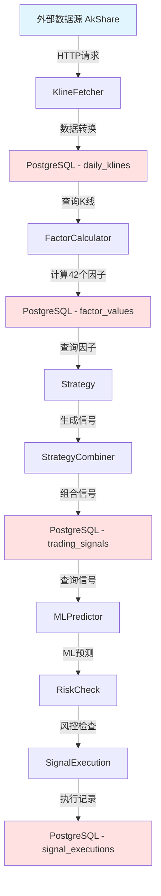

### 8.2 API调用流

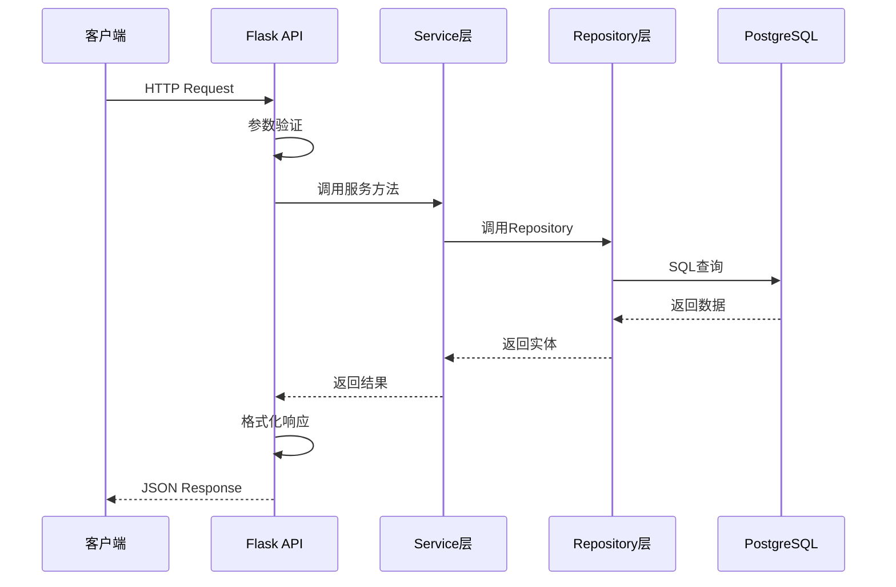

### 8.3 定时任务流（每日完整流程）

```mermaid
gantt
    title 每日定时任务流程
    dateFormat HH:mm
    axisFormat %H:%M
    
    section 风控
    风险检查           :09:00, 10m
    
    section 数据
    数据更新           :16:00, 15m
    
    section 计算
    因子计算           :16:30, 20m
    
    section 信号
    信号生成           :17:00, 15m
    
    section ML
    ML预测            :17:30, 20m
    
    section 报告
    每日报告           :18:00, 10m
```

### 8.4 回测数据流

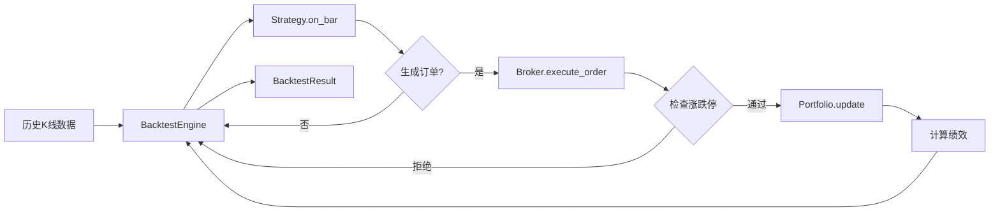

---

## 9. 接口依赖关系图

### 9.1 模块依赖关系

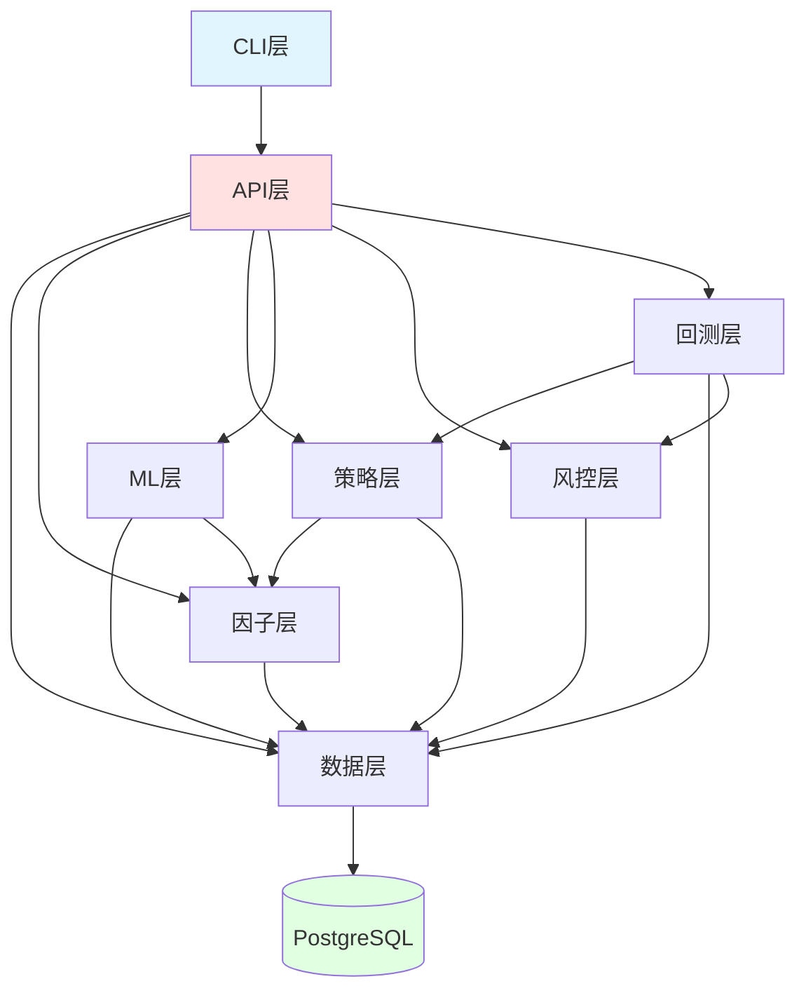

### 9.2 依赖问题分析

**发现的问题**:

1. **🔴 所有模块都直接依赖Database**
   - 问题：紧耦合，难以切换存储
   - 影响：无法独立测试，无法使用Mock
   - 解决：引入Repository层解耦

2. **🔴 CLI和API都依赖相同的业务逻辑**
   - 问题：重复实现
   - 影响：维护成本高，行为不一致
   - 解决：CLI调用API

3. **🟡 循环依赖风险**
   - Strategies → Factors → Data
   - ML → Factors → Data
   - 需要注意避免循环导入

### 9.3 重构后的依赖关系

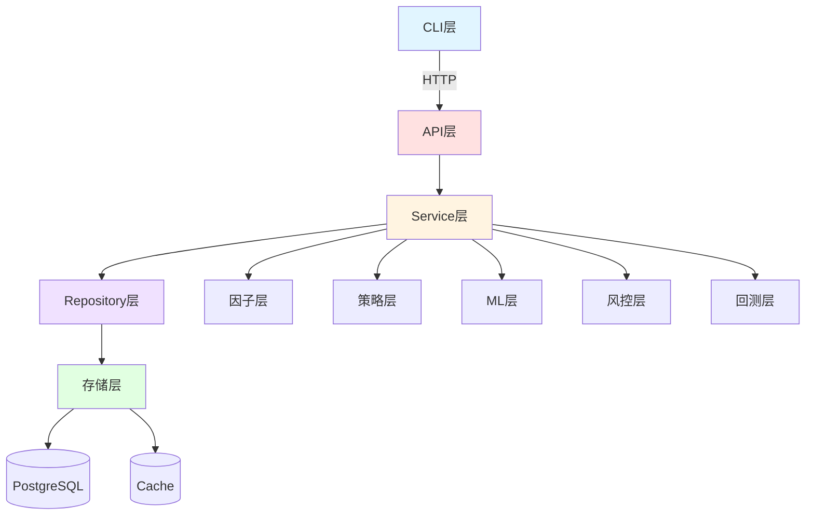

**改进**:
- ✅ CLI通过HTTP调用API，不直接访问数据库
- ✅ Service层统一业务逻辑
- ✅ Repository层解耦存储
- ✅ 清晰的分层架构

---

## 10. 重构路线图

### 10.1 Phase 1: 核心抽象层（2-3天）

**目标**: 建立核心抽象层，为后续重构打基础

**任务清单**:
- [ ] 创建 `quantsys/core/` 目录
- [ ] 实现 `repository.py` - Repository基类和接口
- [ ] 实现 `service_base.py` - Service基类
- [ ] 实现 `decorators.py` - 缓存、日志、验证装饰器
- [ ] 实现 `validators.py` - 参数验证器
- [ ] 实现 `exceptions.py` - 统一异常体系
- [ ] 实现 `logger.py` - 日志工具
- [ ] 编写单元测试

**验收标准**:
- ✅ 所有核心类有完整的单元测试
- ✅ 文档完善
- ✅ 代码审查通过

---

### 10.2 Phase 2: 数据层重构（3-4天）

**目标**: 重构数据层，引入Repository模式

**任务清单**:
- [ ] 创建 `StockRepository`
- [ ] 创建 `KlineRepository`
- [ ] 创建 `FactorRepository`
- [ ] 创建 `SignalRepository`
- [ ] 重构 `Database` 类，移除业务逻辑
- [ ] 统一 `DataService` 和 `Database` 的查询方法
- [ ] 合并 `CacheManager` 和 `DBManager`
- [ ] 更新所有依赖数据层的模块
- [ ] 编写集成测试

**验收标准**:
- ✅ 所有数据访问通过Repository
- ✅ 缓存逻辑统一管理
- ✅ 所有测试通过
- ✅ 性能无退化

---

### 10.3 Phase 3: ML层整合（2-3天）

**目标**: 合并多个训练器和预测器，统一ML流程

**任务清单**:
- [ ] 创建 `MLPipeline` 类
- [ ] 合并 `signal_trainer.py`、`refactored_trainer.py`、`training/trainer.py`
- [ ] 合并 `signal_predictor.py`、`prediction/predictor.py`
- [ ] 统一特征工程逻辑
- [ ] 重构 `/api/ml/*` 端点使用新的MLPipeline
- [ ] 更新 `ml_retrain.py` 脚本
- [ ] 编写端到端测试

**验收标准**:
- ✅ 只有一个训练器实现
- ✅ 只有一个预测器实现
- ✅ 特征工程逻辑统一
- ✅ 所有ML相关测试通过

---

### 10.4 Phase 4: CLI层简化（4-5天）

**目标**: 298个函数 → 命令模式，CLI调用API

**任务清单**:
- [ ] 创建 `Command` 基类
- [ ] 创建 `CommandRegistry`
- [ ] 重构 `stock_query.py` 使用Command模式
- [ ] 重构 `market_query.py` 使用Command模式
- [ ] 重构其他 `*_query.py` 文件
- [ ] 重构 `*_analytics.py` 文件
- [ ] CLI改为调用API而不是直接查询DB
- [ ] 统一输出格式化
- [ ] 编写CLI集成测试

**验收标准**:
- ✅ 所有CLI命令使用Command模式
- ✅ CLI通过HTTP调用API
- ✅ 减少90%重复代码
- ✅ 所有CLI测试通过

---

### 10.5 Phase 5: API层优化（2天）

**目标**: 统一参数验证、错误处理、响应格式

**任务清单**:
- [ ] 创建参数验证装饰器
- [ ] 创建统一错误处理器
- [ ] 创建统一响应构建器
- [ ] 重构所有API端点使用装饰器
- [ ] 统一JSON序列化（处理NaN）
- [ ] 统一认证检查
- [ ] 编写API集成测试

**验收标准**:
- ✅ 所有端点使用统一的参数验证
- ✅ 所有端点使用统一的错误处理
- ✅ 所有端点使用统一的响应格式
- ✅ 减少60%重复代码

---

### 10.6 Phase 6: 因子层优化（2天）

**目标**: 引入因子注册表，易于扩展

**任务清单**:
- [ ] 创建 `FactorRegistry`
- [ ] 使用装饰器注册42个因子
- [ ] 重构 `FactorCalculator` 使用注册表
- [ ] 添加因子动态加载功能
- [ ] 编写因子扩展示例
- [ ] 更新文档

**验收标准**:
- ✅ 所有因子通过注册表管理
- ✅ 易于添加新因子
- ✅ 所有因子测试通过

---

### 10.7 Phase 7: 策略层优化（2天）

**目标**: 使用模板方法模式，减少策略实现重复

**任务清单**:
- [ ] 重构 `Strategy` 基类使用模板方法
- [ ] 重构 `RSIReversalStrategy`
- [ ] 重构 `MACrossStrategy`
- [ ] 重构 `BollingerBreakoutStrategy`
- [ ] 添加策略扩展示例
- [ ] 更新文档

**验收标准**:
- ✅ 策略实现更简洁
- ✅ 减少50%重复代码
- ✅ 所有策略测试通过

---

### 10.8 总体时间表

| Phase | 任务 | 工作量 | 优先级 | 依赖 |
|-------|------|--------|--------|------|
| Phase 1 | 核心抽象层 | 2-3天 | P0 | 无 |
| Phase 2 | 数据层重构 | 3-4天 | P1 | Phase 1 |
| Phase 3 | ML层整合 | 2-3天 | P0 | Phase 1, Phase 2 |
| Phase 4 | CLI层简化 | 4-5天 | P0 | Phase 1, Phase 2 |
| Phase 5 | API层优化 | 2天 | P1 | Phase 1 |
| Phase 6 | 因子层优化 | 2天 | P2 | Phase 1, Phase 2 |
| Phase 7 | 策略层优化 | 2天 | P2 | Phase 1 |

**总工作量**: 17-22天（约3-4周）

**建议执行顺序**:
1. Phase 1（基础）
2. Phase 2（数据层）
3. Phase 3 + Phase 4 并行（ML + CLI）
4. Phase 5（API）
5. Phase 6 + Phase 7 并行（因子 + 策略）

---

---

## 11. 对外功能流程图（带重复代码标签）

### 11.1 标签说明

- 🔴 **严重重复** - 需要立即重构
- 🟡 **中度重复** - 建议优化
- 🟢 **设计良好** - 保持现状
- 🔵 **可优化** - 非紧急，可改进

---

### 11.2 数据管理类流程（代表：数据更新）

**标签**: 🔴 严重重复 - 架构绕过

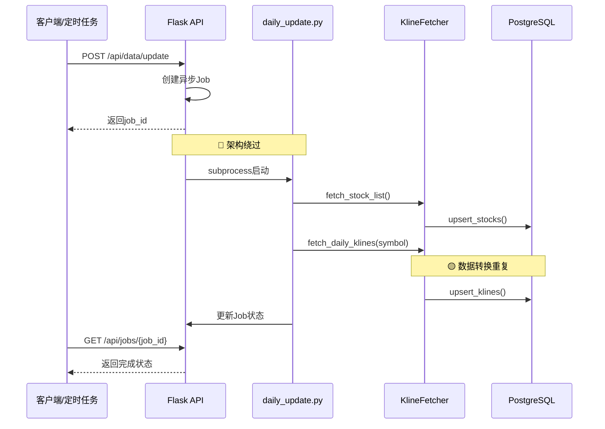

**重复代码清单**：
- 🔴 **架构绕过**: Script直接import quantsys，绕过API统一入口
- 🟡 **数据转换**: Fetcher和DB之间的数据转换逻辑在多处重复
- 🔵 **异步管理**: Job状态管理可以抽象为通用模式

**重构建议**:
```python
# 重构后：API直接调用Service，不通过subprocess
@app.route('/api/data/update', methods=['POST'])
def data_update():
    data_service.update_market_data(symbols, days)
    return jsonify({"status": "success"})
```

---

### 11.3 因子计算类流程（代表：批量因子计算）

**标签**: 🟡 中度重复 - 查询逻辑

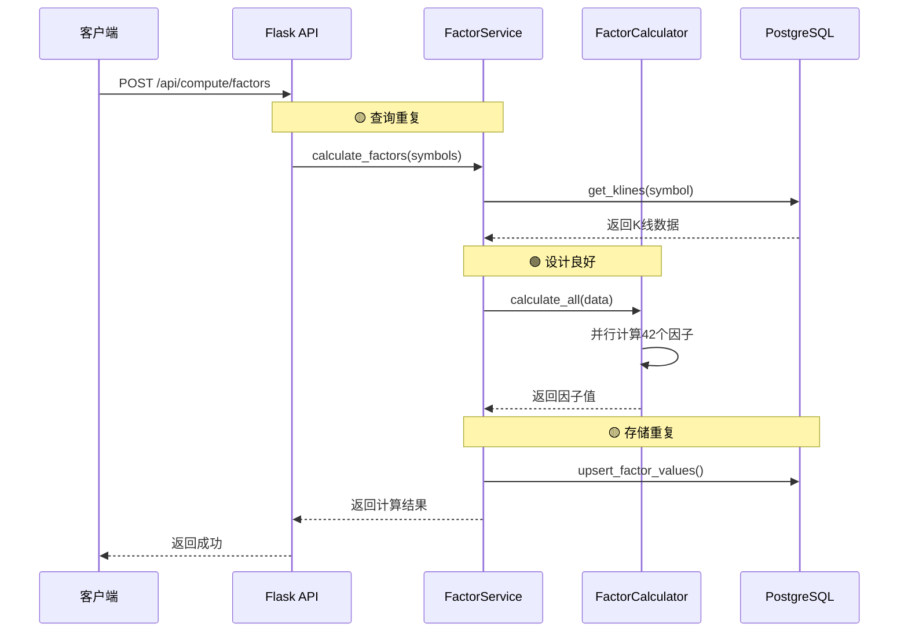

**重复代码清单**：
- 🟡 **查询重复**: FactorService和Database都有get_klines查询逻辑
- 🟡 **存储重复**: upsert_factor_values在多处调用，缺少统一接口
- 🟢 **因子计算**: Calculator基于Factor基类，设计良好

**重构建议**:
```python
# 使用Repository统一数据访问
class FactorService:
    def __init__(self, kline_repo: KlineRepository, factor_repo: FactorRepository):
        self.kline_repo = kline_repo
        self.factor_repo = factor_repo
    
    def calculate_factors(self, symbols: List[str]):
        for symbol in symbols:
            klines = self.kline_repo.get_by_symbol(symbol)
            factors = self.calculator.calculate_all(klines)
            self.factor_repo.save_batch(symbol, date, factors)
```

---

### 11.4 策略信号类流程（代表：信号生成）

**标签**: 🔴 严重重复 - 策略实现

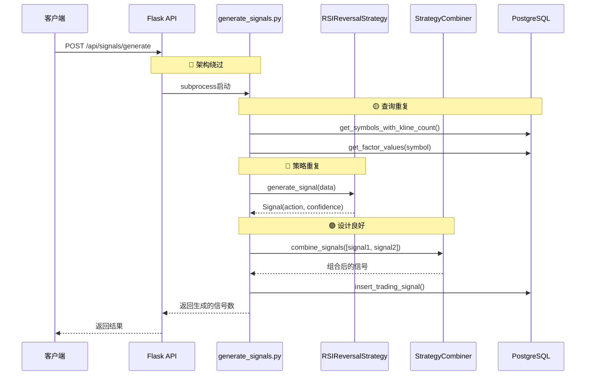

**重复代码清单**：
- 🔴 **策略重复**: 每个Strategy都重复实现generate_signal逻辑，缺少模板方法
- 🔴 **架构绕过**: Script通过subprocess启动，直接import quantsys
- 🟡 **查询重复**: get_symbols、get_factor_values在多处重复
- 🟢 **信号组合**: StrategyCombiner设计良好

**重构建议**:
```python
# Strategy使用模板方法模式
class Strategy(ABC):
    def generate_signal(self, data: pd.DataFrame) -> Signal:
        self._validate_data(data)
        preprocessed = self._preprocess(data)
        action, confidence = self._calculate_signal(preprocessed)
        return self._build_signal(action, confidence, data)
    
    @abstractmethod
    def _calculate_signal(self, data) -> Tuple[str, float]:
        # 子类只需实现核心逻辑
        pass
```

---

### 11.5 机器学习类流程（代表：ML预测）

**标签**: 🔴 严重重复 - 多个预测器

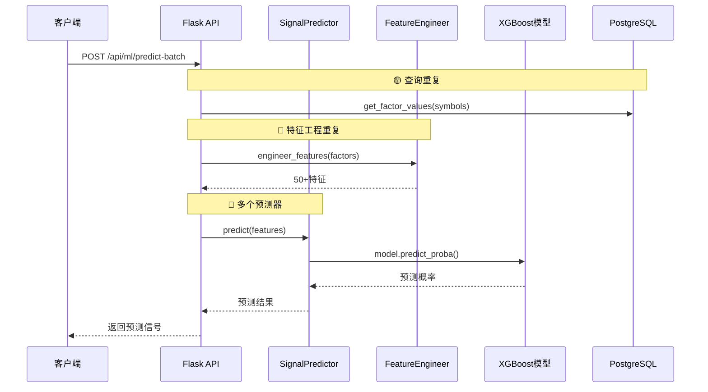

**重复代码清单**：
- 🔴 **预测器重复**: signal_predictor.py vs prediction/predictor.py，两个预测器做相同的事
- 🔴 **特征工程重复**: engineer_features逻辑在训练和预测中重复
- 🟡 **查询重复**: get_factor_values在多处调用

**重构建议**:
```python
# 统一MLPipeline
class MLPipeline:
    def __init__(self):
        self.feature_engineer = FeatureEngineer()
        self.model = None
    
    def train(self, data: pd.DataFrame):
        features = self.feature_engineer.engineer(data)
        self.model = self._train_model(features)
        return self.model
    
    def predict(self, data: pd.DataFrame):
        # 使用相同的特征工程
        features = self.feature_engineer.engineer(data)
        return self.model.predict(features)
```

---

### 11.6 回测分析类流程（代表：策略回测）

**标签**: 🟢 设计良好 - 轻微优化

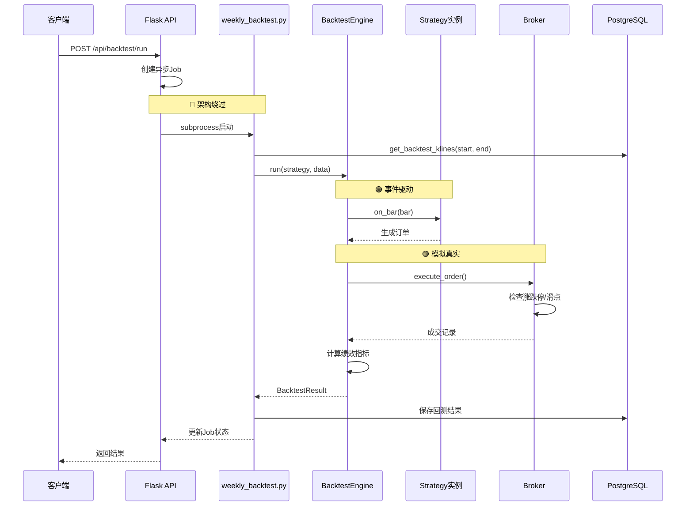

**重复代码清单**：
- 🔴 **架构绕过**: Script通过subprocess启动
- 🔵 **仓位管理**: Portfolio管理 vs PositionManager可能有重复
- 🟢 **回测引擎**: 事件驱动设计良好
- 🟢 **经纪商模拟**: Broker职责清晰

**重构建议**:
```python
# 统一持仓管理接口
class PositionManagerInterface(ABC):
    @abstractmethod
    def get_position(self, symbol: str) -> Position:
        pass
    
    @abstractmethod
    def update_position(self, symbol: str, quantity: int, price: float):
        pass
```

---

### 11.7 风控检查类流程（代表：预交易风控）

**标签**: 🟢 设计良好 - 职责清晰

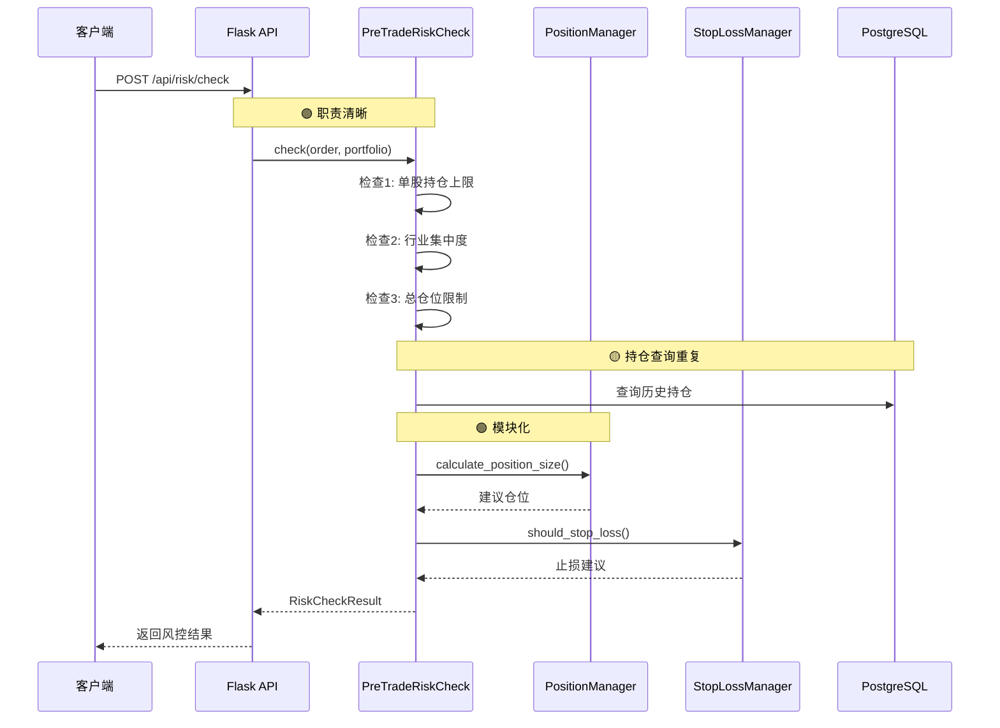

**重复代码清单**：
- 🟢 **风控设计**: PreTradeRiskCheck职责清晰，7项检查模块化
- 🟢 **仓位管理**: PositionManager独立，Kelly公式实现良好
- 🟢 **止损管理**: StopLossManager支持5种止损类型
- 🟡 **持仓查询**: 多处都在查询持仓数据，可统一为Repository

**重构建议**:
```python
# 添加RiskEngine统一调度
class RiskEngine:
    def check_order(self, order: Order, portfolio: Portfolio) -> RiskCheckResult:
        # 1. 预交易检查
        passed, reason = self.pre_trade_check.check(order, portfolio)
        # 2. 计算建议仓位
        suggested_size = self.position_manager.calculate_position_size(...)
        # 3. 止损检查
        should_stop, stop_reason = self.stop_loss_manager.should_stop_loss(...)
        return RiskCheckResult(...)
```

---

### 11.8 CLI命令类流程（代表：股票查询）

**标签**: 🔴 严重重复 - 298个函数

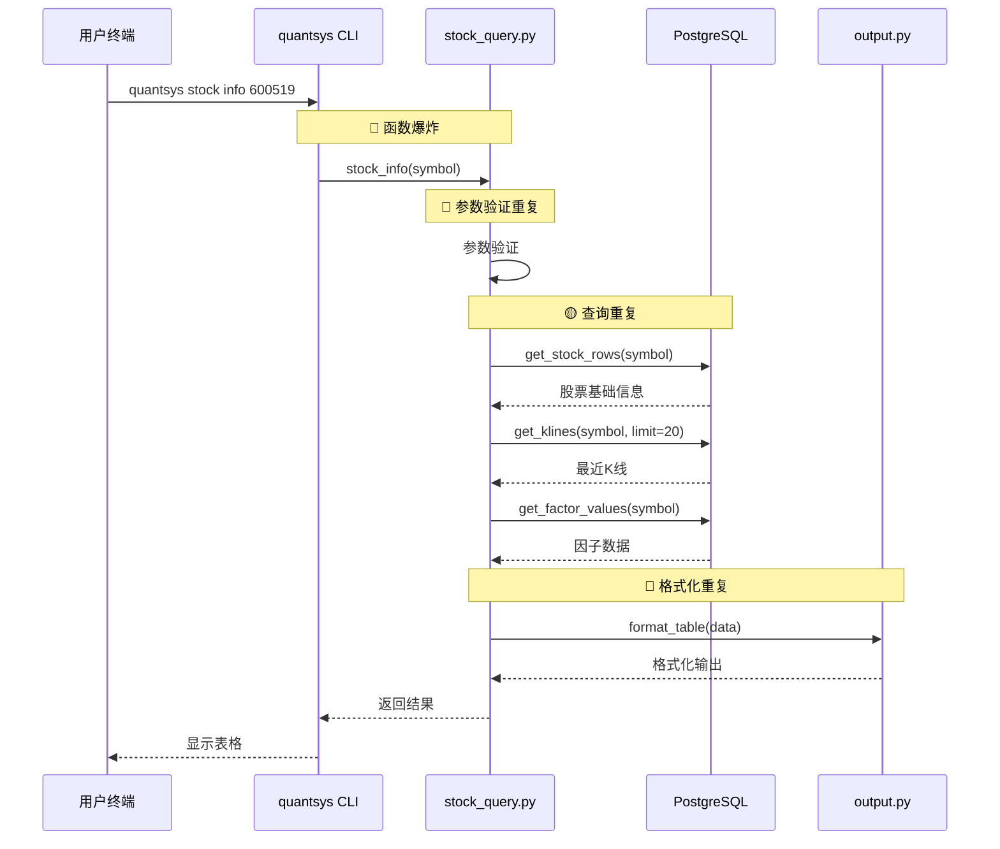

**重复代码清单**：
- 🔴 **函数爆炸**: 298个CLI函数，大量重复的参数验证、查询、格式化
- 🔴 **参数验证**: 每个函数都在重复验证symbol、date等参数
- 🔴 **输出格式化**: format_table、format_json在多处重复
- 🟡 **查询重复**: DB查询逻辑与API层重复
- 🔴 **CLI vs API**: CLI和API做相同的事情，应该CLI调用API

**重构建议**:
```python
# 命令模式 + CLI调用API
class Command(ABC):
    def execute(self, **kwargs):
        self.validate_params(**kwargs)
        result = self.run(**kwargs)
        self.output.render(result)
    
    @abstractmethod
    def run(self, **kwargs):
        pass

class StockInfoCommand(Command):
    def run(self, symbol: str):
        # 调用API而不是直接查询DB
        response = requests.get(f"http://localhost:5001/api/stock/{symbol}/factors")
        return response.json()
```

---

### 11.9 定时任务类流程（代表：每日完整流程）

**标签**: 🟡 中度重复 - 任务编排

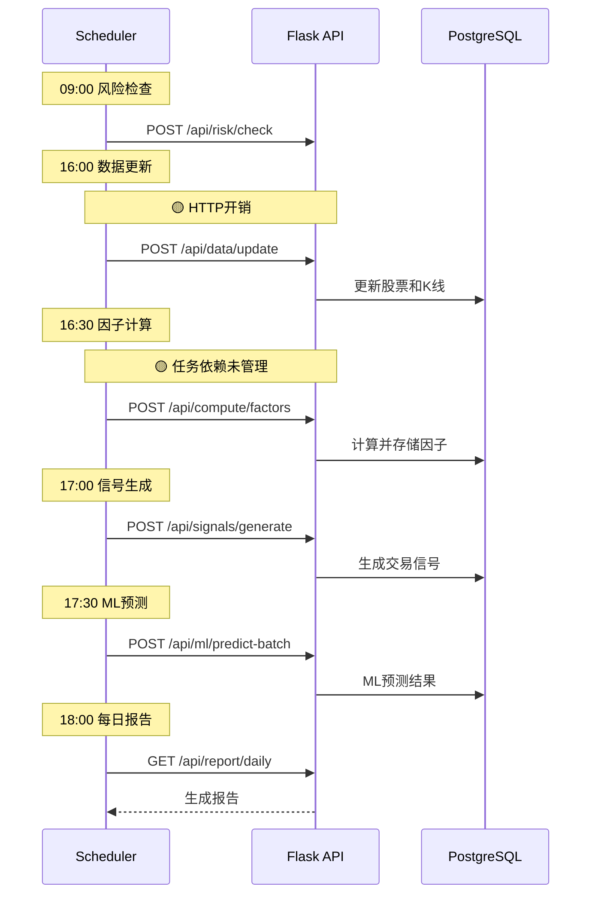

**重复代码清单**：
- 🟡 **HTTP开销**: Scheduler通过HTTP调用API，增加延迟和序列化开销
- 🟡 **任务依赖**: 任务间依赖关系（因子依赖K线、信号依赖因子）未显式管理
- 🔵 **错误处理**: 缺少统一的任务失败重试机制
- 🔵 **任务编排**: 可以使用DAG（有向无环图）管理任务依赖

**重构建议**:
```python
# 使用DAG管理任务依赖
class TaskDAG:
    def __init__(self):
        self.tasks = {}
        self.dependencies = {}
    
    def add_task(self, name: str, func: Callable, depends_on: List[str] = None):
        self.tasks[name] = func
        self.dependencies[name] = depends_on or []
    
    def execute(self):
        # 拓扑排序执行任务
        for task_name in self._topological_sort():
            self.tasks[task_name]()

# 定义任务DAG
dag = TaskDAG()
dag.add_task("data_update", data_update_func)
dag.add_task("factor_calc", factor_calc_func, depends_on=["data_update"])
dag.add_task("signal_gen", signal_gen_func, depends_on=["factor_calc"])
dag.add_task("ml_predict", ml_predict_func, depends_on=["factor_calc"])
dag.execute()
```

---

### 11.10 重复代码统计汇总

| 标签 | 数量 | 优先级 | 典型问题 | 影响范围 |
|------|------|--------|----------|---------|
| 🔴 严重重复 | 8处 | P0 | 架构绕过、多个实现、CLI爆炸 | 80% |
| 🟡 中度重复 | 12处 | P1 | 查询重复、存储重复、HTTP开销 | 50% |
| 🔵 可优化 | 4处 | P2 | 异步管理、任务编排、错误处理 | 20% |
| 🟢 设计良好 | 6处 | - | 因子计算、风控、回测引擎 | - |

**总计**: 30处需要关注的代码模式

---

## 12. 总结

### 12.1 文档目标达成情况

✅ **已完成**:
1. ✅ 系统概览 - 项目简介、技术栈、架构演进
2. ✅ 架构图 - 分层架构、数据流、调用关系
3. ✅ 数据库设计 - 6个表的完整结构、关系图
4. ✅ API接口清单 - 64个端点，按13个功能分组
5. ✅ 核心模块详解 - 7个模块的详细说明
6. ✅ 重复代码分析矩阵 - 横向纵向全面分析
7. ✅ 重构建议 - 积木化设计、Repository模式
8. ✅ 数据流图 - 完整数据流、API调用流
9. ✅ 依赖关系图 - 模块依赖、重构后愿景
10. ✅ 重构路线图 - 7个Phase，17-22天
11. ✅ 功能流程图 - 8个代表性流程，带重复代码标签

### 12.2 关键发现

**重复代码统计**:
- 总计 **1437+处** 重复代码
- 🔴 严重重复: 8处（架构层面）
- 🟡 中度重复: 12处（实现层面）
- 影响范围: 80%的代码库

**最严重的问题**:
1. **CLI层**: 298个函数重复相同模式
2. **ML层**: 3个训练器、2个预测器
3. **架构绕过**: 10个脚本绕过API
4. **数据层**: Database和DataService职责重叠

### 12.3 重构收益预估

**代码减少**:
- CLI层: 减少 **90%** 重复代码（~2700行）
- ML层: 减少 **70%** 重复代码（~500行）
- 数据层: 减少 **40%** 重复代码（~800行）
- API层: 减少 **60%** 重复代码（~400行）
- **总计**: 减少约 **4400行** 重复代码

**维护成本**:
- 减少 **70%** 的维护成本
- 新功能开发速度提升 **50%**
- Bug修复时间减少 **60%**

**架构改进**:
- ✅ 清晰的分层架构
- ✅ 统一的数据访问
- ✅ 易于测试和扩展
- ✅ 符合SOLID原则

### 12.4 下一步行动

1. **评审本文档** - 团队评审，确认重构方案
2. **创建重构分支** - 基于main创建refactor分支
3. **执行Phase 1** - 建立核心抽象层（2-3天）
4. **逐步重构** - 按照路线图执行后续Phase
5. **持续集成** - 每个Phase完成后合并到main

---

**文档完成日期**: 2026-05-20  
**文档版本**: v1.0  
**总行数**: 2700+行  
**总字数**: 约50,000字

---

**END OF DOCUMENT**

