# Agent-DH 架构设计文档

**日期**: 2026-08-18
**状态**: 设计阶段
**作者**: AI Assistant
**审核**: 待审核

---

## 目录

1. [概述](#概述)
2. [设计目标](#设计目标)
3. [架构设计](#架构设计)
4. [技术选型](#技术选型)
5. [技术路线图](#技术路线图)
6. [风险管理](#风险管理)
7. [附录](#附录)

---

## 概述

### 背景

PI Investment 系统当前使用 `agent-ts` 作为 AI 投资顾问的核心组件。随着业务发展，现有架构面临以下挑战：

1. **可扩展性不足** - 单一 Agent 难以支持复杂的并行任务处理
2. **插件化能力弱** - 工具注册和管理缺乏统一规范
3. **多 Agent 协作缺失** - 无法支持 Master-Worker 分布式架构
4. **技术栈老化** - 基于 pi-coding-agent SDK，难以跟进最新的 AI 技术

### 决策

经过充分调研和讨论，决定采用 **DeepSeek Harness (DSH)** 架构重构 Agent 系统，创建新项目 `agent-dh`。

**核心决策**：
- ✅ 完全采用 DSH 插件架构（基于 Cordis）
- ✅ 复用 DSH 核心包（npm 安装，非源码复制）
- ✅ 自定义 agent-loop 插件（替换 DSH 默认 loop，集成 Agent OS 上报）
- ✅ Agent OS 作为注册中心（Agent Registry + Task Router）
- ✅ 双轨运行（agent-ts 保持运行，agent-dh 逐步替换）
- ✅ 全新开始（不迁移历史数据）
- ✅ 独立 Client SDK（agent-dh-client）

---

## 设计目标

### 短期目标（3 个月）

1. ✅ 搭建 DSH 框架基础
2. ✅ 实现 agent-dh-client（连接 quantsys-v2 和 agent-os）
3. ✅ 迁移核心投资工具（20-30 个）
4. ✅ 实现 Agent OS Worker（接收任务并执行）
5. ✅ 双轨运行验证

### 中期目标（6 个月）

1. ✅ 迁移所有工具（110 个）
2. ✅ 实现完整的 Agent OS 集成
3. ✅ 性能优化和稳定性测试
4. ✅ 生产环境切换

### 长期目标（12 个月）

1. ✅ 支持多 Agent 协作（Master-Worker）
2. ✅ 实现 Agent 间通信
3. ✅ 支持水平扩展
4. ✅ 建立插件生态

---

## 架构设计

### 1. 系统架构图

```mermaid
graph TB
    subgraph "External Systems"
        User[👤 User]
        Feishu[📱 Feishu]
        Cron[⏰ Cron Scheduler]
    end

    subgraph "PI Investment System"
        subgraph "Frontend Layer"
            WebUI[🌐 web-frontend<br/>Vue 3 Dashboard<br/>Port: 3001]
        end

        subgraph "Agent Layer"
            direction TB

            subgraph "agent-dh (New DSH Architecture)"
                DHCLI[🚀 CLI Entry<br/>apps/cli]

                subgraph "Core Plugins (DSH)"
                    DSHAgent[agent<br/>agent-loop<br/>session<br/>tools<br/>llm]
                end

                subgraph "Custom Plugins"
                    InvPlugin[📊 investment<br/>行情/股票池/策略]
                    IntelPlugin[🧠 intelligence<br/>进化/盯盘/博弈]
                    TradePlugin[💼 trading<br/>账户/筹码/订单]
                    OSPlugin[⚙️ agent-os<br/>调度/记忆/通知工具]
                    WorkerPlugin[🔌 agent-os-worker<br/>任务消费者]
                end

                DHCLI --> DSHAgent
                DHCLI --> InvPlugin
                DHCLI --> IntelPlugin
                DHCLI --> TradePlugin
                DHCLI --> OSPlugin
                DHCLI --> WorkerPlugin
            end

            subgraph "agent-ts (Legacy - Keep Running)"
                LegacyAgent[🤖 agent-ts<br/>Current Agent<br/>Port: 3002]
            end
        end

        subgraph "Client Layer"
            DHClient[📦 agent-dh-client<br/>TypeScript SDK]
            OSClient[📦 agent-os-client<br/>TypeScript SDK]
        end

        subgraph "Service Layer"
            AgentOS[⚙️ agent-os<br/>Go Backend<br/>Port: 8080]

            subgraph "Agent OS Services"
                Scheduler[Scheduler<br/>任务调度]
                Memory[Memory<br/>记忆存储]
                Decision[Decision<br/>决策记录]
                Notification[Notification<br/>通知推送]
                Resource[Resource<br/>资源管理]
                SkillHub[Skill Hub<br/>技能管理]
            end

            AgentOS --> Scheduler
            AgentOS --> Memory
            AgentOS --> Decision
            AgentOS --> Notification
            AgentOS --> Resource
            AgentOS --> SkillHub

            QuantsysV2[📊 quantsys-v2<br/>Python Backend<br/>Port: 5001 REST<br/>Port: 5003 WebSocket]

            subgraph "Quantsys V2 Services"
                DataAPI[Data APIs<br/>行情/财务/因子]
                StrategyAPI[Strategy APIs<br/>策略/回测/优化]
                PoolAPI[Pool APIs<br/>股票池/战场评估]
                TradeAPI[Trade APIs<br/>交易/持仓/订单]
                MLAPI[ML APIs<br/>模型训练/预测]
                WatchAPI[Watch APIs<br/>盯盘规则/事件]
            end

            QuantsysV2 --> DataAPI
            QuantsysV2 --> StrategyAPI
            QuantsysV2 --> PoolAPI
            QuantsysV2 --> TradeAPI
            QuantsysV2 --> MLAPI
            QuantsysV2 --> WatchAPI
        end

        subgraph "Data Layer"
            PG[(PostgreSQL<br/>quant_investment<br/>Port: 5432)]
            Redis[(Redis<br/>Cache & Queue<br/>Port: 6379)]
        end
    end

    %% Agent DH 使用 Client
    InvPlugin -.->|uses| DHClient
    IntelPlugin -.->|uses| DHClient
    TradePlugin -.->|uses| DHClient
    OSPlugin -.->|uses| OSClient
    WorkerPlugin -.->|uses| OSClient

    %% Client 连接服务
    DHClient -->|HTTP/WS| QuantsysV2
    OSClient -->|HTTP| AgentOS

    %% Agent OS 触发 Agent DH
    Scheduler -->|Push Task| Redis
    Redis -->|Consume Task| WorkerPlugin

    %% Agent DH 上报结果
    WorkerPlugin -->|Update Execution| OSClient
    OSClient -->|HTTP| Scheduler

    %% Legacy Agent 继续运行
    LegacyAgent -.->|uses| OSClient
    LegacyAgent -.->|HTTP| QuantsysV2

    %% Agent OS 访问数据
    AgentOS -->|Query| PG
    AgentOS -->|Queue| Redis

    %% Quantsys V2 访问数据
    QuantsysV2 -->|Store/Query| PG
    QuantsysV2 -->|Cache| Redis

    %% Frontend 查询
    WebUI -->|HTTP| QuantsysV2
    WebUI -->|HTTP| AgentOS

    %% External 触发
    Cron -->|Trigger| Scheduler
    User -->|Send Message| Feishu
    Feishu -->|Webhook| AgentOS
    AgentOS -->|Notify| Feishu
    Feishu -->|Push| User
    User -->|Monitor| WebUI

    style DHCLI fill:#e1f5ff,stroke:#0066cc,stroke-width:3px
    style WorkerPlugin fill:#ffebee,stroke:#f44336,stroke-width:2px
    style DHClient fill:#f3e5f5,stroke:#9c27b0,stroke-width:2px
    style OSClient fill:#f3e5f5,stroke:#9c27b0,stroke-width:2px
    style AgentOS fill:#fff4e1,stroke:#ff9800,stroke-width:2px
    style QuantsysV2 fill:#e8f5e9,stroke:#4caf50,stroke-width:2px
    style Redis fill:#fff3cd,stroke:#ffc107,stroke-width:2px
    style LegacyAgent fill:#f5f5f5,stroke:#9e9e9e,stroke-width:2px,stroke-dasharray: 5 5
```



### 2. 项目结构

```
pi-investment/
├── agent-dh/                    # 新的 DSH 架构 agent
│   ├── packages/
│   │   ├── investment-agent-loop/  # 自定义 Agent Loop（替换 DSH 默认）
│   │   │   ├── package.json     # @pi-investment/agent-dh-plugin-investment-agent-loop
│   │   │   ├── src/
│   │   │   │   ├── index.ts     # 插件入口
│   │   │   │   ├── agent-loop.ts       # InvestmentAgentLoop（集成 OS 注册）
│   │   │   │   ├── agent.ts            # InvestmentAgent（自定义控制流）
│   │   │   │   ├── decision-tracker.ts # 决策跟踪
│   │   │   │   ├── risk-guard.ts       # 风控守卫
│   │   │   │   ├── registry-client.ts  # Registry 客户端（注册/心跳）
│   │   │   │   └── types.ts
│   │   │   └── cordis.yml
│   │   │
│   │   ├── investment/          # 投资工具插件包
│   │   │   ├── package.json     # @pi-investment/agent-dh-plugin-investment
│   │   │   ├── src/
│   │   │   │   ├── index.ts     # export default plugin
│   │   │   │   ├── tools/       # 工具实现
│   │   │   │   │   ├── quote-tool.ts
│   │   │   │   │   ├── kline-tool.ts
│   │   │   │   │   ├── pool-tool.ts
│   │   │   │   │   ├── strategy-tool.ts
│   │   │   │   │   └── ...
│   │   │   │   └── types.ts
│   │   │   └── cordis.yml       # 插件配置
│   │   │
│   │   ├── intelligence/        # 智能工具插件包
│   │   │   ├── package.json     # @pi-investment/agent-dh-plugin-intelligence
│   │   │   ├── src/
│   │   │   │   ├── index.ts
│   │   │   │   ├── tools/
│   │   │   │   │   ├── evolution-tool.ts
│   │   │   │   │   ├── watch-tool.ts
│   │   │   │   │   ├── game-tool.ts
│   │   │   │   │   └── ...
│   │   │   │   └── types.ts
│   │   │   └── cordis.yml
│   │   │
│   │   ├── trading/             # 交易工具插件包
│   │   │   ├── package.json     # @pi-investment/agent-dh-plugin-trading
│   │   │   ├── src/
│   │   │   │   ├── index.ts
│   │   │   │   ├── tools/
│   │   │   │   │   ├── account-tool.ts
│   │   │   │   │   ├── chip-tool.ts
│   │   │   │   │   ├── order-tool.ts
│   │   │   │   │   └── ...
│   │   │   │   └── types.ts
│   │   │   └── cordis.yml
│   │   │
│   │   ├── agent-os/            # Agent OS 工具插件包
│   │   │   ├── package.json     # @pi-investment/agent-dh-plugin-agent-os
│   │   │   ├── src/
│   │   │   │   ├── index.ts
│   │   │   │   ├── tools/
│   │   │   │   │   ├── scheduler-tool.ts
│   │   │   │   │   ├── memory-tool.ts
│   │   │   │   │   ├── decision-tool.ts
│   │   │   │   │   ├── notification-tool.ts
│   │   │   │   │   └── resource-tool.ts
│   │   │   │   └── types.ts
│   │   │   └── cordis.yml
│   │   │
│   │   └── agent-os-worker/     # Agent OS Worker 插件包
│   │       ├── package.json     # @pi-investment/agent-dh-plugin-agent-os-worker
│   │       ├── src/
│   │       │   ├── index.ts
│   │       │   ├── task-consumer.ts       # 任务消费者
│   │       │   ├── task-executor.ts       # 任务执行器
│   │       │   ├── session-manager.ts     # Session 管理器
│   │       │   └── types.ts
│   │       └── cordis.yml
│   │
│   ├── apps/
│   │   └── cli/
│   │       ├── index.ts         # CLI 启动入口
│   │       └── package.json
│   │
│   ├── skills/                  # 技能定义（复用现有）
│   │   ├── stock-analysis.md
│   │   ├── strategy-dev.md
│   │   └── ...
│   │
│   ├── package.json             # 依赖 DSH npm 包 + 插件包
│   ├── pnpm-workspace.yaml      # pnpm workspace 配置
│   ├── tsconfig.json            # TypeScript 配置
│   └── README.md                # 项目说明
│
├── agent-dh-client/             # Client SDK
│   ├── src/
│   │   ├── client.ts            # AgentDHClient 主入口
│   │   ├── http/
│   │   │   └── client.ts        # HTTP client 基础设施
│   │   ├── quantsys/
│   │   │   ├── client.ts        # QuantsysV2 client
│   │   │   └── types.ts
│   │   ├── agent-os/
│   │   │   ├── client.ts        # AgentOS client（复用 agent-os-client）
│   │   │   └── types.ts
│   │   └── types.ts             # 公共类型定义
│   ├── tests/
│   ├── package.json
│   └── tsconfig.json
│
├── agent-os/                    # 现有 Agent OS（需扩展）
│   ├── internal/
│   │   ├── registry/            # 新增：Agent Registry
│   │   │   ├── registry.go      # 注册中心
│   │   │   ├── task_router.go   # 任务路由器
│   │   │   ├── load_balancer.go # 负载均衡器
│   │   │   └── health_checker.go # 健康检查器
│   │   └── ...
│   └── migrations/
│       └── xxx_add_agent_registry.sql  # 新增：Registry 表
│
├── agent-os-client/             # 现有 Agent OS Client（需扩展）
│   ├── src/
│   │   ├── registry/            # 新增：Registry client
│   │   │   ├── client.ts
│   │   │   └── types.ts
│   │   └── ...
│   └── ...
│
├── agent-ts/                    # 现有 agent（保持运行，双轨）
├── quantsys-v2/                 # 现有量化后端（不变）
└── web-frontend/                # 现有前端（不变）
```

### 3. 核心流程

#### 3.1 Agent 注册流程（新增）

```
Agent DH 启动
  → 加载 investment-agent-loop 插件
    → 创建 Agent Loop
      → 创建 Agent
        → **注册到 Agent OS Registry**
          → POST /api/v1/registry/agents/register
            {
              agent_id: "worker-1",
              type: "worker",
              capabilities: ["data-analysis", "backtest"],
              status: "idle",
              metadata: {provider, model, version}
            }
        → 启动心跳（每 30 秒）
          → POST /api/v1/registry/agents/heartbeat
        → Agent 就绪，等待任务
```

#### 3.2 任务分配流程（新增）

```
定时任务/用户消息触发
  → Agent OS Scheduler
    → Task Router 查询可用 Agent
      → GET /api/v1/registry/agents/available
        ?capabilities=data-analysis&status=idle
      → Load Balancer 选择 Agent（最少负载优先）
        → 返回 agent_id: "worker-1"
    → 更新 Agent 状态为 busy
      → POST /api/v1/registry/agents/update-status
    → 推送任务到 Redis 队列
      → XADD task:worker-1
```

#### 3.3 工具调用流程

```
User Request
  → Agent DH (Custom Agent Loop)
    → Tool Plugin (e.g., investment/quote-tool)
      → AgentDHClient.quantsys.getQuote('600519')
        → HTTP GET → quantsys-v2:5001/api/quote/600519
          → PostgreSQL 查询
            → 返回行情数据
```

#### 3.4 任务执行流程

```
Agent DH Worker Plugin (消费任务)
  → 从 Redis 队列拉取任务
    → XREADGROUP GROUP worker-1-group task:worker-1
  → 创建 Agent Session
    → ctx.agents.create()
      → 触发 investment-agent-loop
        → 执行自定义控制流
          → 前置检查（风控）
          → 注入投资上下文
          → 执行 LLM 循环
          → 后置处理（决策记录）
  → 上报执行结果到 Agent OS
    → AgentOSClient.scheduler.updateExecution()
  → 更新 Agent 状态为 idle
    → POST /api/v1/registry/agents/update-status
```

#### 3.5 健康检查流程（新增）

```
Agent OS Health Checker (每分钟运行)
  → 查询超过 90 秒未心跳的 Agent
    → SELECT * FROM agents 
      WHERE last_heartbeat_at < NOW() - INTERVAL '90 seconds'
  → 标记为 offline
    → UPDATE agents SET status = 'offline'
  → 触发告警（可选）
    → 通知管理员
```

#### 3.6 Agent 间通信流程（未来）

```
Master Agent
  → 分解任务
    → 查询可用 Worker
      → GET /api/v1/registry/agents/available
        ?capabilities=data-analysis&status=idle
    → 发布子任务到 Worker Queue (Redis)
      → Worker Agent 消费任务
        → 执行任务
          → 上报进度到 Master Queue (Redis)
            → Master Agent 汇总结果
              → 上报到 Agent OS
```

---

## 技术选型

### 1. 核心技术栈

| 技术 | 版本 | 用途 | 备注 |
|------|------|------|------|
| Node.js | >= 22.0.0 | 运行时 | 与 DSH 保持一致 |
| TypeScript | ^5.9.0 | 开发语言 | 严格模式 |
| pnpm | ^11.7.0 | 包管理 | 与 DSH 保持一致 |
| Cordis | ^0.1.0-rc.6 | 插件框架 | DSH 核心依赖 |
| Redis | >= 7.0 | 消息队列/缓存 | 已有基础设施 |
| PostgreSQL | >= 14 | 数据库 | 已有基础设施 |

### 2. DSH 核心包

```json
{
  "dependencies": {
    "@deepseek-ai/cordis": "^0.1.0-rc.6",
    "@deepseek-ai/dsh-agent": "^0.1.0-rc.6",
    "@deepseek-ai/dsh-session": "^0.1.0-rc.6",
    "@deepseek-ai/dsh-tools": "^0.1.0-rc.6",
    "@deepseek-ai/dsh-llm": "^0.1.0-rc.6",
    "@deepseek-ai/dsh-shell": "^0.1.0-rc.6",
    "@deepseek-ai/dsh-fs": "^0.1.0-rc.6",
    "@deepseek-ai/dsh-skill": "^0.1.0-rc.6",
    "@deepseek-ai/dsh-web": "^0.1.0-rc.6",
    "@deepseek-ai/dsh-compaction": "^0.1.0-rc.6"
  }
}
```

**注意：** 不使用 `@deepseek-ai/dsh-agent-loop`，我们将实现自定义的 `investment-agent-loop` 插件。

### 3. Agent OS 扩展

#### 3.1 Agent Registry 数据模型

```sql
-- agents 表（Agent 注册信息）
CREATE TABLE agents (
  id SERIAL PRIMARY KEY,
  agent_id VARCHAR(255) UNIQUE NOT NULL,
  session_id VARCHAR(255),
  type VARCHAR(50) NOT NULL,              -- 'master' | 'worker'
  capabilities JSONB NOT NULL,            -- ["data-analysis", "backtest"]
  status VARCHAR(50) NOT NULL,            -- 'idle' | 'busy' | 'error' | 'offline'
  endpoint VARCHAR(512),                  -- Agent 的访问地址（未来用于直接调用）
  current_task_id VARCHAR(255),
  current_task_description TEXT,
  metadata JSONB,                         -- {provider, model, version, ...}
  load_factor INTEGER DEFAULT 0,          -- 负载因子（当前任务数）
  registered_at TIMESTAMP DEFAULT NOW(),
  last_heartbeat_at TIMESTAMP,
  created_at TIMESTAMP DEFAULT NOW(),
  updated_at TIMESTAMP DEFAULT NOW()
);

-- agent_heartbeats 表（心跳历史）
CREATE TABLE agent_heartbeats (
  id SERIAL PRIMARY KEY,
  agent_id VARCHAR(255) NOT NULL,
  status VARCHAR(50),
  current_task_id VARCHAR(255),
  load_factor INTEGER,
  timestamp TIMESTAMP DEFAULT NOW(),
  FOREIGN KEY (agent_id) REFERENCES agents(agent_id) ON DELETE CASCADE
);

-- agent_capabilities 表（能力定义）
CREATE TABLE agent_capabilities (
  id SERIAL PRIMARY KEY,
  capability_name VARCHAR(100) UNIQUE NOT NULL,
  description TEXT,
  created_at TIMESTAMP DEFAULT NOW()
);

-- 索引
CREATE INDEX idx_agents_status ON agents(status);
CREATE INDEX idx_agents_type ON agents(type);
CREATE INDEX idx_agents_capabilities ON agents USING GIN(capabilities);
CREATE INDEX idx_agents_last_heartbeat ON agents(last_heartbeat_at);
CREATE INDEX idx_heartbeats_agent_id ON agent_heartbeats(agent_id);
CREATE INDEX idx_heartbeats_timestamp ON agent_heartbeats(timestamp);
```

#### 3.2 Agent Registry API

**注册 Agent**
```typescript
POST /api/v1/registry/agents/register
{
  "agent_id": "agent-worker-1",
  "session_id": "session-123",
  "type": "worker",
  "capabilities": ["data-analysis", "kline-analysis"],
  "endpoint": "http://localhost:3002",
  "metadata": {
    "provider": "deepseek",
    "model": "deepseek-v4-flash",
    "version": "0.1.0"
  }
}
```

**查询可用 Agent**
```typescript
GET /api/v1/registry/agents/available?capabilities=data-analysis&status=idle

Response:
{
  "success": true,
  "agents": [
    {
      "agent_id": "agent-worker-1",
      "type": "worker",
      "capabilities": ["data-analysis"],
      "status": "idle",
      "load_factor": 0
    }
  ]
}
```

**更新状态**
```typescript
POST /api/v1/registry/agents/update-status
{
  "agent_id": "agent-worker-1",
  "status": "busy",
  "current_task_id": "task-456",
  "load_factor": 1
}
```

**心跳**
```typescript
POST /api/v1/registry/agents/heartbeat
{
  "agent_id": "agent-worker-1",
  "status": "busy",
  "current_task_id": "task-456",
  "load_factor": 1
}
```

### 4. 开发工具

| 工具 | 用途 | 备注 |
|------|------|------|
| tsdown | 构建工具 | 与 DSH 一致 |
| vitest | 测试框架 | 与 DSH 一致 |
| tsx | 开发时运行 | 快速迭代 |
| ioredis | Redis 客户端 | 消息队列 |
| axios | HTTP 客户端 | Client SDK |

### 5. 部署工具

| 工具 | 用途 | 备注 |
|------|------|------|
| PM2 | 进程管理 | 生产环境 |
| Docker | 容器化 | 可选 |
| launchd | macOS 服务管理 | 开发环境 |

---

## 技术路线图

### Phase 1: 框架搭建（Week 1-2）

**目标：** 搭建 DSH 框架基础，跑通最小流程

**任务：**
1. 初始化 agent-dh 项目结构
   - 创建 pnpm workspace
   - 配置 TypeScript
   - 配置 tsdown 构建

2. 安装 DSH 核心依赖
   - 添加 DSH npm 包到 package.json（不包含 dsh-agent-loop）
   - 验证版本兼容性

3. 实现自定义 investment-agent-loop 插件
   - 实现 InvestmentAgentLoop（集成 OS 注册）
   - 实现 InvestmentAgent（自定义控制流）
   - 实现 Registry 客户端（注册/心跳）

4. 实现 CLI 启动入口
   - 创建 apps/cli/index.ts
   - 实现 Cordis App 初始化
   - 加载自定义 agent-loop 插件

5. 集成 DSH 核心插件
   - 注册 agent/session/tools/llm 插件（不加载默认 agent-loop）
   - 配置 LLM provider（DeepSeek）
   - 实现简单的 "Hello World" Agent

**验收标准：**
- ✅ 能够启动 agent-dh CLI
- ✅ Agent 启动时自动注册到 Agent OS Registry
- ✅ Agent 定期发送心跳到 Agent OS
- ✅ 能够执行简单的对话
- ✅ 能够调用 DSH 内置工具（shell/fs）

**交付物：**
```
agent-dh/
├── packages/
│   └── investment-agent-loop/
│       ├── src/
│       │   ├── index.ts
│       │   ├── agent-loop.ts
│       │   ├── agent.ts
│       │   ├── registry-client.ts
│       │   └── types.ts
│       └── package.json
├── apps/cli/index.ts          # 可运行的 CLI
├── package.json               # DSH 依赖配置
├── pnpm-workspace.yaml
├── tsconfig.json
└── README.md                  # 启动说明
```

---

### Phase 2: Agent OS Registry（Week 3）

**目标：** 扩展 Agent OS，实现 Agent Registry 功能

**任务：**
1. 创建数据库表
   - agents 表（Agent 注册信息）
   - agent_heartbeats 表（心跳历史）
   - agent_capabilities 表（能力定义）

2. 实现 Agent Registry 服务
   - registry.go（注册中心）
   - 实现注册/注销/查询/更新状态接口

3. 实现 Task Router
   - task_router.go（任务路由器）
   - 根据能力和负载选择 Agent

4. 实现 Load Balancer
   - load_balancer.go（负载均衡器）
   - 支持多种策略（最少负载/轮询/随机）

5. 实现 Health Checker
   - health_checker.go（健康检查器）
   - 定期检查心跳超时的 Agent

6. 扩展 agent-os-client
   - 添加 Registry client
   - 实现注册/心跳/查询接口

**验收标准：**
- ✅ Agent OS 能够接收 Agent 注册
- ✅ Agent OS 能够接收心跳并更新状态
- ✅ Agent OS 能够查询可用 Agent
- ✅ Health Checker 能够标记离线 Agent
- ✅ Task Router 能够根据能力选择 Agent

**交付物：**
```
agent-os/
├── internal/
│   └── registry/
│       ├── registry.go
│       ├── task_router.go
│       ├── load_balancer.go
│       └── health_checker.go
├── migrations/
│   └── xxx_add_agent_registry.sql
└── api/
    └── registry_handler.go

agent-os-client/
├── src/
│   └── registry/
│       ├── client.ts
│       └── types.ts
```

---

### Phase 3: Client SDK（Week 4）

**目标：** 实现 agent-dh-client，连接后端服务

**任务：**
1. 初始化 agent-dh-client 项目
   - 创建独立 npm 包
   - 配置 TypeScript

2. 实现 HTTP client 基础设施
   - 参考 agent-os-client 的 BaseHTTPClient
   - 实现请求拦截器（鉴权、错误处理）
   - 实现响应拦截器（数据解包）

3. 实现 QuantsysV2 client
   - 封装 REST API（quote/kline/financial/strategy/pool/trade）
   - 封装 WebSocket client（实时推送）
   - 类型定义

4. 实现 AgentOS client
   - 复用 agent-os-client（包含 Registry client）
   - 添加 Agent DH 特定方法

5. 编写单元测试
   - Mock HTTP 请求
   - 测试覆盖率 > 80%

**验收标准：**
- ✅ 能够调用 quantsys-v2 API（如 getQuote）
- ✅ 能够调用 agent-os API（如 updateExecution）
- ✅ 能够调用 Registry API（如 register/heartbeat）
- ✅ 单元测试覆盖率 > 80%

**交付物：**
```
agent-dh-client/
├── src/
│   ├── client.ts              # AgentDHClient 主入口
│   ├── http/client.ts         # HTTP client 基础设施
│   ├── quantsys/client.ts     # QuantsysV2 client
│   ├── agent-os/client.ts     # AgentOS client（复用）
│   └── types.ts               # 类型定义
├── tests/
├── package.json
└── tsconfig.json
```

---

### Phase 4: 核心工具插件（Week 5-6）

**目标：** 实现 10-20 个核心投资工具

**任务：**
1. 实现 investment 插件包
   - quote-tool（实时行情）
   - kline-tool（K线数据）
   - financial-tool（财务数据）
   - pool-list-tool（股票池列表）
   - strategy-list-tool（策略列表）

2. 实现 intelligence 插件包
   - evolution-status-tool（进化状态）
   - watch-list-tool（盯盘规则列表）

3. 实现 trading 插件包
   - account-info-tool（账户信息）
   - position-list-tool（持仓列表）

4. 编写工具测试
   - 每个工具独立测试
   - Mock agent-dh-client

**验收标准：**
- ✅ 每个工具能够独立运行
- ✅ 工具能够调用 agent-dh-client
- ✅ 工具返回结构化数据
- ✅ 测试覆盖率 > 70%

**交付物：**
```
agent-dh/packages/
├── investment/
│   ├── src/
│   │   ├── index.ts           # 插件入口
│   │   ├── tools/
│   │   │   ├── quote-tool.ts
│   │   │   ├── kline-tool.ts
│   │   │   └── ...
│   │   └── types.ts
│   └── package.json
├── intelligence/
└── trading/
```

---

### Phase 5: Agent OS 集成（Week 7）

**目标：** 实现 Agent OS Worker，接收并执行任务

**任务：**
1. 实现 agent-os-worker 插件
   - 创建插件入口
   - 注册到 Cordis App

2. 实现任务消费者
   - 连接 Redis
   - 从 task-queue 拉取任务（Redis Streams）
   - 支持 Consumer Group

3. 实现任务执行器
   - 创建 Agent session
   - 执行任务（调用 prompt）
   - 处理错误

4. 实现结果上报
   - 更新 execution 状态（completed/failed）
   - 上报结果到 agent-os

5. 集成测试
   - 端到端测试（定时任务 → 执行 → 上报）

**验收标准：**
- ✅ agent-dh 能够从 Redis 队列拉取任务
- ✅ 能够创建 Agent session 并执行任务
- ✅ 能够上报执行结果到 agent-os
- ✅ 端到端测试通过

**交付物：**
```
agent-dh/packages/agent-os-worker/
├── src/
│   ├── index.ts               # 插件入口
│   ├── task-consumer.ts       # 任务消费者
│   ├── task-executor.ts       # 任务执行器
│   └── session-manager.ts     # Session 管理器
└── package.json
```

---

### Phase 6: 工具迁移（Week 8-13）

**目标：** 迁移剩余的 90+ 工具

**任务：**
1. 按优先级迁移工具
   - P0: 数据访问工具（20个）
     - data_fetch_quote, data_fetch_kline, data_fetch_financial, ...
   - P1: 策略工具（30个）
     - strategy_create, strategy_execute, strategy_backtest, ...
   - P2: 分析工具（25个）
     - factor_analysis, pool_battlefield, opponent_behavior, ...
   - P3: 其他工具（15个）
     - notification_send, scheduler_manage, ...

2. 每周迁移 15-20 个工具
3. 保持测试覆盖率 > 70%
4. 更新文档

**验收标准：**
- ✅ 所有工具迁移完成
- ✅ 测试通过率 > 95%
- ✅ 文档完整

---

### Phase 7: 生产切换（Week 14-15）

**目标：** 双轨运行，逐步切换流量

**任务：**
1. 部署 agent-dh 到生产环境
   - 配置 PM2 或 systemd
   - 配置环境变量
   - 配置日志

2. 配置灰度发布
   - 10% 流量 → 观察 3 天
   - 50% 流量 → 观察 3 天
   - 100% 流量 → 观察 7 天

3. 监控运行状态
   - 错误率
   - 响应时间
   - 资源使用

4. 验证数据一致性
   - 对比 agent-ts 和 agent-dh 的执行结果
   - 验证数据完整性

5. 逐步停用 agent-ts
   - 停止新任务注册
   - 等待现有任务完成
   - 下线 agent-ts

**验收标准：**
- ✅ agent-dh 稳定运行 1 周
- ✅ 无数据丢失或错误
- ✅ 性能指标达标（响应时间 < 2s，成功率 > 99%）
- ✅ agent-ts 可以安全停用

---

## 风险管理

### 风险 1: DSH API 变更

**影响：** DSH 还在 developer preview，API 可能破坏

**概率：** 高

**缓解措施：**
- 锁定版本号（package.json 中使用 exact version）
- 定期评估升级成本
- 建立抽象层，隔离 DSH API 变更

### 风险 2: 工具迁移工作量

**影响：** 110 个工具迁移需要大量时间

**概率：** 中

**缓解措施：**
- 按优先级分批迁移
- 先迁移核心工具（20-30 个）
- 使用代码生成工具辅助迁移

### 风险 3: 双轨运行成本

**影响：** 需要同时维护两套系统

**概率：** 高

**缓解措施：**
- 明确切换时间表（14 周）
- 尽快完成迁移
- 减少 agent-ts 的新功能开发

### 风险 4: 性能问题

**影响：** 新架构可能存在性能瓶颈

**概率：** 中

**缓解措施：**
- 提前进行性能测试
- 预留优化时间（Phase 6 后）
- 建立性能监控

### 风险 5: 团队学习成本

**影响：** 团队需要学习 DSH 和 Cordis

**概率：** 高

**缓解措施：**
- 提供培训和文档
- 参考 DSH 官方示例
- 建立内部最佳实践

---

## 附录

### A. 参考资料

1. [DeepSeek Harness GitHub](https://github.com/deepseek-ai/deepseek-harness)
2. [DSH Architecture Documentation](/Volumes/ORICO/doc/github/deepseek-harness/docs/architecture.md)
3. [Cordis Framework](https://github.com/cordiverse/cordis)
4. [Agent OS Client SDK](/Users/yunpeng/pi-investment/agent-os-client)

### B. 端口分配

| 服务 | 端口 | 用途 |
|------|------|------|
| agent-dh | 3002 | Webhook 接收 agent-os 任务（未来） |
| agent-os | 8080 | HTTP API（调度/记忆/决策/通知） |
| quantsys-v2 | 5001 | REST API（数据/策略/交易） |
| quantsys-v2 | 5003 | WebSocket（实时推送） |
| web-frontend | 3001 | Vite dev server |
| PostgreSQL | 5432 | 数据库 |
| Redis | 6379 | 缓存/消息队列 |

### C. 环境变量

```bash
# LLM Provider
DEEPSEEK_API_KEY=sk-...
DEEPSEEK_BASE_URL=https://api.deepseek.com/v1
MODEL_ID=deepseek-v4-flash

# Backend Services
QUANTSYS_V2_API_URL=http://127.0.0.1:5001
AGENT_OS_BASE_URL=http://127.0.0.1:8080

# Redis
REDIS_HOST=127.0.0.1
REDIS_PORT=6379

# Agent DH
AGENT_ID=fin-agent-dh
AGENT_KIND=fin
```

### D. 开发命令

```bash
# 安装依赖
cd agent-dh
pnpm install

# 开发模式
pnpm dev

# 构建
pnpm build

# 测试
pnpm test

# 启动 CLI
pnpm cli

# 启动 Worker
pnpm worker
```

### E. 插件开发规范

#### 插件入口模板

```typescript
// packages/<plugin-name>/src/index.ts
import { Context } from '@deepseek-ai/cordis';
import { AgentDHClient } from '@pi-investment/agent-dh-client';
import { Tool1 } from './tools/tool1.js';
import { Tool2 } from './tools/tool2.js';

/**
 * Plugin Description
 */
export default function pluginName(ctx: Context, config: { client: AgentDHClient }) {
  ctx.effect(() => {
    // 创建工具实例
    const tools = [
      new Tool1(config.client),
      new Tool2(config.client),
    ];

    // 注册工具
    const disposers = tools.map(tool => ctx.tools.register(tool));

    // 返回清理函数
    return () => disposers.forEach(dispose => dispose());
  });
}
```

#### 工具实现模板

```typescript
// packages/<plugin-name>/src/tools/<tool-name>.ts
import { Tool } from '@deepseek-ai/dsh-tools';
import { AgentDHClient } from '@pi-investment/agent-dh-client';

export class MyTool implements Tool {
  name = 'my_tool';
  description = 'Tool description';

  schema = {
    type: 'object',
    properties: {
      param1: {
        type: 'string',
        description: 'Parameter description',
      },
    },
    required: ['param1'],
  };

  constructor(private client: AgentDHClient) {}

  async execute(args: { param1: string }) {
    // 调用 client API
    const result = await this.client.quantsys.someApi(args.param1);

    // 返回结构化结果
    return {
      success: true,
      data: result,
    };
  }
}
```

---

## 变更历史

| 日期 | 版本 | 变更内容 | 作者 |
|------|------|----------|------|
| 2026-08-18 | 0.1.0 | 初始版本 | AI Assistant |

---

## 审核记录

| 日期 | 审核人 | 状态 | 备注 |
|------|--------|------|------|
| 待审核 | - | - | - |

---

**文档结束**
